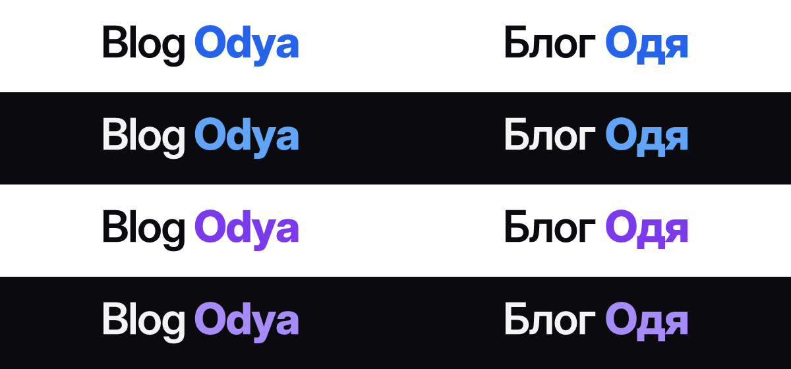
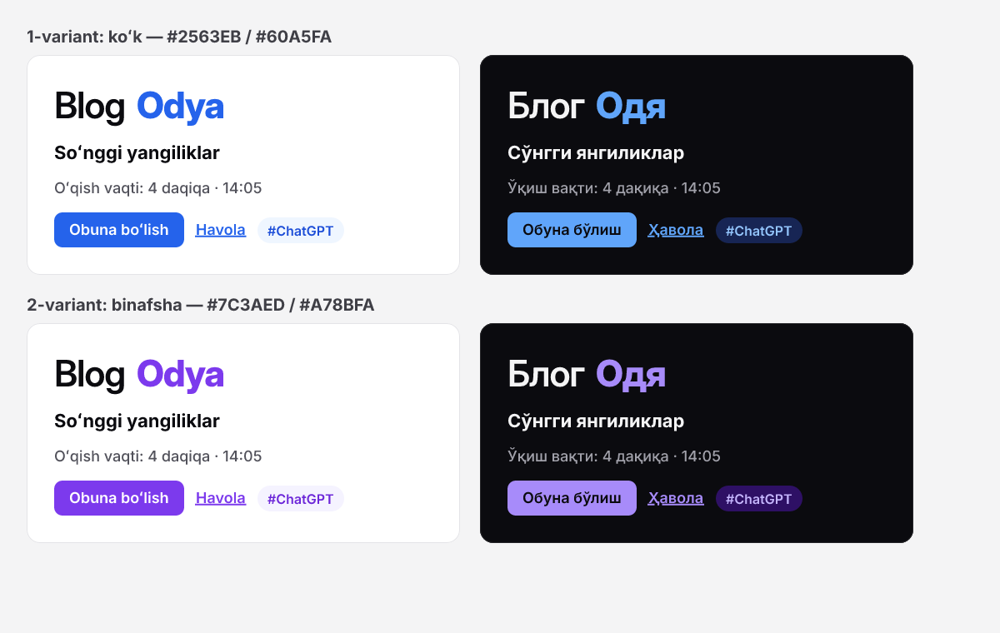
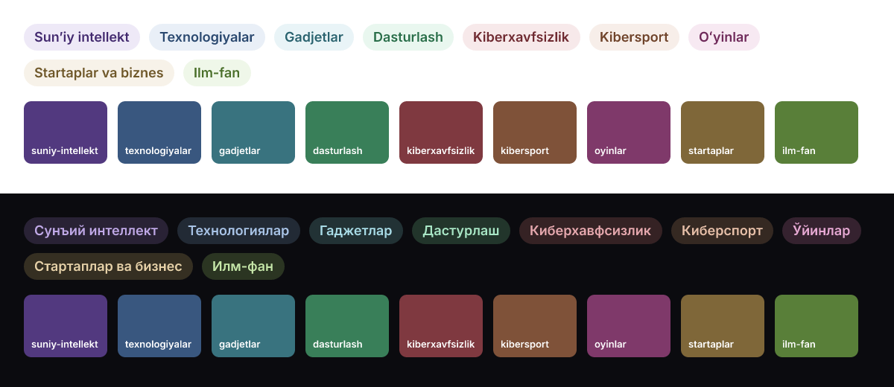
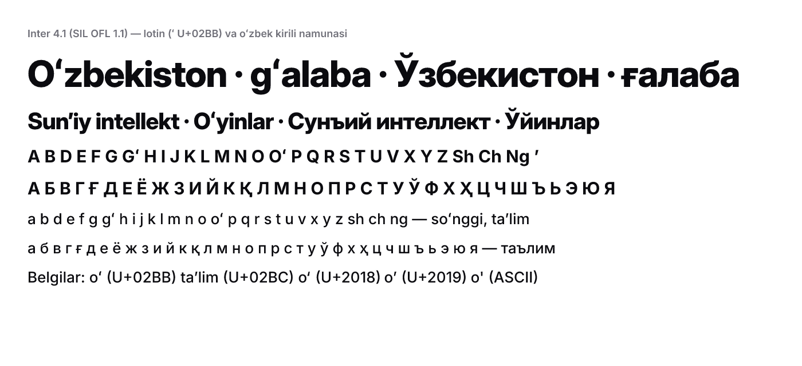
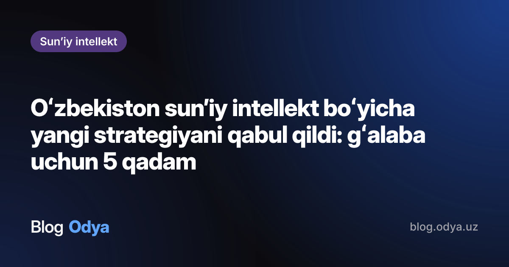
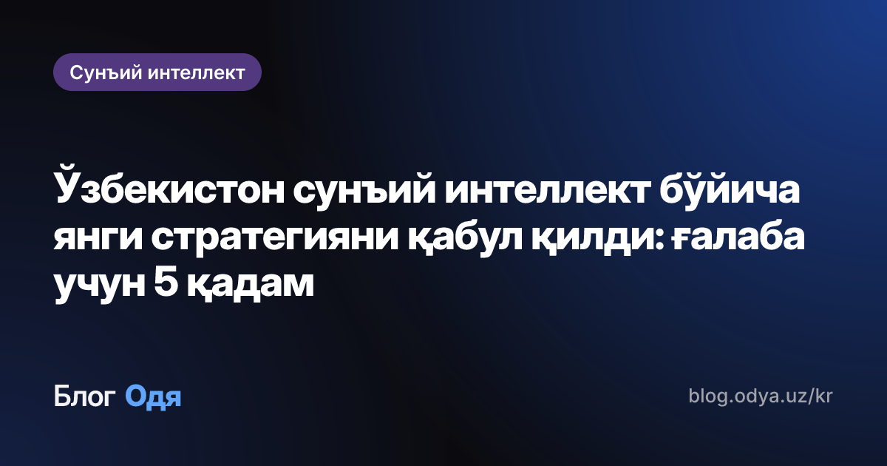
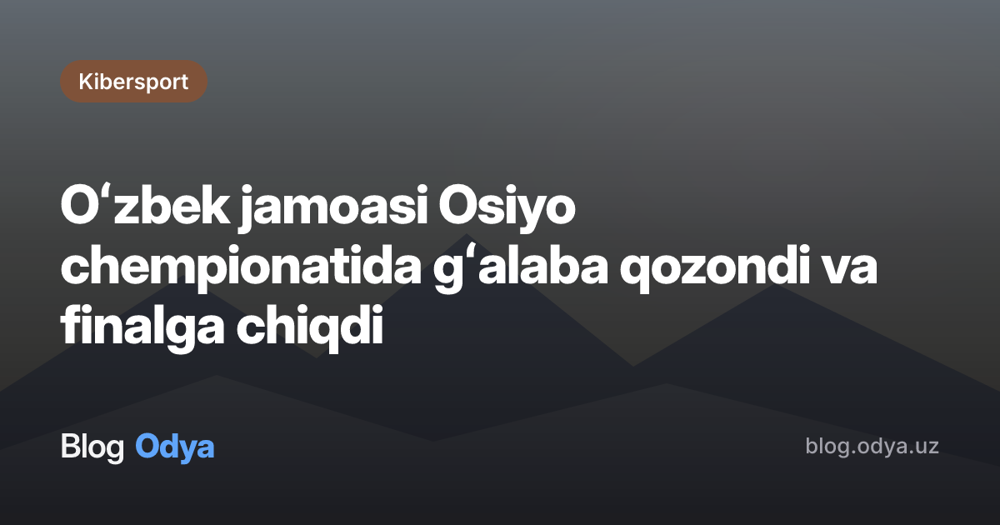
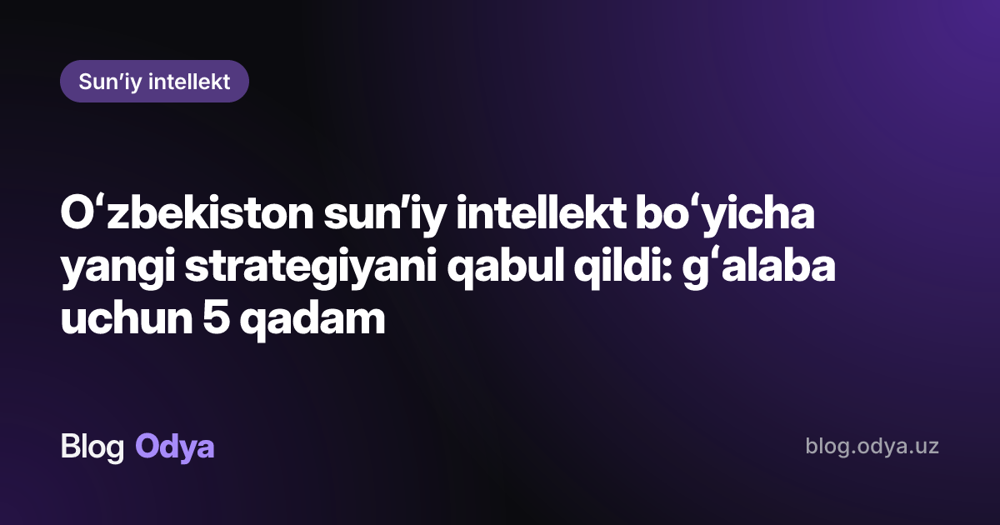

# Blog Odya — brend to'plami

Asos: [TZ.md](../../docs/TZ.md) §12.1, §12.2, §10.4. Vazifa: M0-06 / OBLOG-7.

Logo yo'q — **matnli wordmark** "Blog **Odya**" (kirillda "Блог **Одя**"): birinchi so'z — asosiy matn rangida (600), ikkinchisi — aksent rangida va qalin (800). Kvadrat belgi — "O" monogrammasi (favicon, ilova ikonkalari), Telegram avatarlarida — "BO" / "БО".

> **Aksent tanlovi:** egasi ikki variantdan birini tanlaydi (pastda yonma-yon). Tanlov bo'lmaguncha **1-variant (ko'k)** ishlatiladi — `tokens.json` → `"activeAccent": "blue"`.

## Tarkib

```
design/brand/
├── README.md                 — shu hujjat
├── tokens.json               — rang/shrift tokenlari (manba, Tailwind uchun)
├── tokens.css                — CSS o'zgaruvchilari (tokens.json dan generatsiya)
├── wordmark/                 — SVG wordmark (matn konturga aylantirilgan)
│   ├── wordmark-{latn|cyrl}-light-{blue|violet}.svg   — och fon uchun
│   ├── wordmark-{latn|cyrl}-dark-{blue|violet}.svg    — qorong'i fon uchun
│   └── wordmark-{latn|cyrl}-mono.svg                  — currentColor (bir rangli)
├── icons/{blue|violet}/      — favicon to'plami
│   ├── icon.svg              — asosiy kvadrat belgi (SVG favicon)
│   ├── icon-512.png, icon-192.png         — web manifest
│   ├── icon-maskable-512.png              — manifest "maskable"
│   ├── apple-touch-icon.png  — 180×180, burchaklari to'liq (iOS o'zi yumaloqlaydi)
│   ├── favicon-32.png, favicon-16.png
│   └── favicon.ico           — 16 + 32 + 48
├── telegram/                 — kanal avatarlari 640×640 (PNG + SVG manba)
│   └── avatar-{latn|cyrl}-{blue|violet}.{png,svg}
├── og/                       — OG rasm namunalari 1200×630 (satori = next/og dvigateli)
├── previews/                 — ko'rib chiqish rasmlari (variantlar, kategoriyalar, shrift)
├── fonts/OFL.txt             — Inter litsenziyasi (SIL OFL 1.1)
└── scripts/                  — generatsiya skriptlari (build.mjs, contrast.mjs, fonts.mjs)
```

## 1. Wordmark



| Fayl                           | Qayerda                                         |
| ------------------------------ | ----------------------------------------------- |
| `wordmark-latn-light-blue.svg` | Header, light rejim, lotin (`/…`)               |
| `wordmark-latn-dark-blue.svg`  | Header, dark rejim, lotin                       |
| `wordmark-cyrl-light-blue.svg` | Header, light rejim, kirill (`/kr/…`)           |
| `wordmark-cyrl-dark-blue.svg`  | Header, dark rejim, kirill                      |
| `wordmark-*-mono.svg`          | Footer, bir rangli joylar (`fill=currentColor`) |
| `*-violet.svg`                 | 2-variant tanlansa                              |

Qoidalar:

- Shrift: **Inter Display** — "Blog" SemiBold 600, "Odya" ExtraBold 800; harf oralig'i −0.025em; so'zlar orasi 0.24em. Matn **konturga aylantirilgan** — SVG o'rnatilgan shriftga bog'liq emas.
- Lotin va kirill fayllarining `viewBox` balandligi bir xil — header'da `height` bilan joylashtirilsa, bazaviy chiziq bir joyda turadi.
- Header'da balandligi: mobil 22–24 px, desktop 28 px. Minimal balandlik — 16 px.
- Atrofidagi bo'sh joy — kamida "O" harfi balandligining yarmi.
- Ranglarni o'zgartirmang, cho'zmang, soya/gradient qo'shmang. Rangli yoki rasmli fonda — `mono` variant (oq yoki qora).
- Ekran o'quvchilar uchun: `` (kirillda `alt="Блог Одя"`). SVG ichida `<title>` bor.

## 2. Kvadrat belgi va favicon

| O'lcham    | Fayl                               | Next.js (App Router) joyi                        |
| ---------- | ---------------------------------- | ------------------------------------------------ |
| SVG        | `icon.svg`                         | `app/icon.svg`                                   |
| 16, 32, 48 | `favicon.ico`                      | `app/favicon.ico`                                |
| 180        | `apple-touch-icon.png`             | `app/apple-icon.png`                             |
| 192, 512   | `icon-192.png`, `icon-512.png`     | `public/` + `app/manifest.ts` (`purpose: 'any'`) |
| 512        | `icon-maskable-512.png`            | `public/` + manifest (`purpose: 'maskable'`)     |
| 16, 32     | `favicon-16.png`, `favicon-32.png` | kerak bo'lsa `<link rel="icon" sizes>`           |

- Belgi: oq **"O"** (Inter ExtraBold) aksent-600 fonda, burchak radiusi 22%. "О" lotin va kirillda bir xil — favicon ikkala yozuvga umumiy.
- 16/32 px uchun harf kattaroq (70%) — kichik o'lchamda ham o'qiladi.
- Qaysi aksent tanlansa, `icons/<aksent>/` dagi fayllar ishlatiladi.

## 3. Telegram kanal avatarlari

| Kanal        | Fayl                                   |
| ------------ | -------------------------------------- |
| Lotin kanal  | `telegram/avatar-latn-blue.png` — "BO" |
| Kirill kanal | `telegram/avatar-cyrl-blue.png` — "БО" |

640×640 PNG, aksent gradient (500 → 700) fonda oq monogramma. Telegram avatarni doira qilib kesadi — monogramma markazdagi doira ichida (chetidan ≥ 20% bo'sh joy). Kanal yuklashda PNG'ning o'zi ishlatiladi (M0-03, egasi).

## 4. Palitra

### 4.1. Aksent: ikki variant (egasi tanlaydi)



| Token                               | 1-variant: ko'k (**joriy**) | 2-variant: binafsha    |
| ----------------------------------- | --------------------------- | ---------------------- |
| Light `accent`                      | `#2563EB` (blue-600)        | `#7C3AED` (violet-600) |
| Light `accentHover`                 | `#1D4ED8`                   | `#6D28D9`              |
| Light `accentFg` (tugma matni)      | `#FFFFFF`                   | `#FFFFFF`              |
| Light `accentSoft` / `accentSoftFg` | `#EFF6FF` / `#1D4ED8`       | `#F5F3FF` / `#6D28D9`  |
| Dark `accent`                       | `#60A5FA` (blue-400)        | `#A78BFA` (violet-400) |
| Dark `accentHover`                  | `#93C5FD`                   | `#C4B5FD`              |
| Dark `accentFg` (tugma matni)       | `#0B0B0F`                   | `#0B0B0F`              |
| Dark `accentSoft` / `accentSoftFg`  | `#172554` / `#93C5FD`       | `#2E1065` / `#C4B5FD`  |

Dark rejimda aksent 400 tonga ko'tariladi (600 qorong'i fonda kontrastdan o'tmaydi — tugmada matn qora `#0B0B0F`). To'liq 50–950 shkalalar — `tokens.json` → `color.accent`.

**Variantni almashtirish:** `tokens.json` da `"activeAccent": "violet"` → `node scripts/build.mjs` (tokens.css qayta yoziladi); ilovada `icons/violet/` va `*-violet.svg` fayllari olinadi. Runtime'da solishtirish uchun `<html data-accent="violet">` ham ishlaydi (`tokens.css`).

### 4.2. Neytral asos

| Rol                       | Light     | Dark      |
| ------------------------- | --------- | --------- |
| `bg`                      | `#FFFFFF` | `#0B0B0F` |
| `surface`                 | `#FAFAFA` | `#18181B` |
| `surfaceMuted`            | `#F4F4F5` | `#27272A` |
| `border`                  | `#E4E4E7` | `#27272A` |
| `text`                    | `#0B0B0F` | `#F4F4F5` |
| `textMuted`               | `#52525B` | `#A1A1AA` |
| `textSubtle` (vaqt, meta) | `#71717A` | `#8B8B94` |

Dark `textSubtle` uchun `#71717A` kontrastdan o'tmadi (4.06:1) — `#8B8B94` (neutral-450) kiritildi.

### 4.3. Kategoriya ranglari (9 ta, §10.4)



Yumshoq, kam to'yingan ranglar; hamma kategoriyada bir xil yorug'lik — faqat ton (hue) farq qiladi. `solid` — OG chip va rasmsiz kartochka placeholder'i (ustida oq matn); `light`/`dark` — sayt ichidagi chip (fon + matn).

| #   | Slug              | Nomi (lotin / kirill)                       | Ton | `solid`   | Light bg / fg         | Dark bg / fg          |
| --- | ----------------- | ------------------------------------------- | --- | --------- | --------------------- | --------------------- |
| 1   | `suniy-intellekt` | Sun'iy intellekt / Сунъий интеллект         | 262 | `#52397F` | `#EEE9F7` / `#432A6F` | `#292235` / `#BFA8E6` |
| 2   | `texnologiyalar`  | Texnologiyalar / Технологиялар              | 214 | `#39577F` | `#E9EFF7` / `#2A486F` | `#222A35` / `#A8C3E6` |
| 3   | `gadjetlar`       | Gadjetlar / Гаджетлар                       | 190 | `#39737F` | `#E9F4F7` / `#2A636F` | `#223235` / `#A8DBE6` |
| 4   | `dasturlash`      | Dasturlash / Дастурлаш                      | 148 | `#397F59` | `#E9F7EF` / `#2A6F4A` | `#22352B` / `#A8E6C5` |
| 5   | `kiberxavfsizlik` | Kiberxavfsizlik / Киберхавфсизлик           | 354 | `#7F3940` | `#F7E9EA` / `#6F2A31` | `#352224` / `#E6A8AE` |
| 6   | `kibersport`      | Kibersport / Киберспорт                     | 22  | `#7F5239` | `#F7EEE9` / `#6F432A` | `#352922` / `#E6BFA8` |
| 7   | `oyinlar`         | O'yinlar / Ўйинлар                          | 318 | `#7F396A` | `#F7E9F2` / `#6F2A5A` | `#35222F` / `#E6A8D3` |
| 8   | `startaplar`      | Startaplar va biznes / Стартаплар ва бизнес | 40  | `#7F6739` | `#F7F2E9` / `#6F582A` | `#352F22` / `#E6D1A8` |
| 9   | `ilm-fan`         | Ilm-fan / Илм-фан                           | 92  | `#597F39` | `#EFF7E9` / `#4A6F2A` | `#2B3522` / `#C5E6A8` |

Seed (`packages/shared/seed/categories.json`, M0-04) `color` maydonini qoldirgan — unga `solid` qiymati yoziladi (hex); chip ranglari slug bo'yicha `tokens.css` dan olinadi (`--cat-<slug>-bg`, `--cat-<slug>-fg`, `--cat-<slug>-solid`).

### 4.4. Tailwind

`tokens.json` — yagona manba. Tailwind v4 uchun `tokens.css` ni ulab, `@theme inline` orqali utilitalarga bog'lash tavsiya etiladi:

```css
@import './tokens.css';

@theme inline {
  --color-bg: var(--color-bg);
  --color-fg: var(--color-text);
  --color-muted: var(--color-text-muted);
  --color-accent: var(--color-accent);
  --color-accent-fg: var(--color-accent-fg);
  --font-sans: var(--font-sans);
}
```

Dark rejim: `<html class="dark">` yoki `data-theme="dark"` (TZ §12.3 — cookie, FOUC'siz).

## 5. Shrift

**Inter 4.1** (rsms/inter, SIL OFL 1.1) tanlandi:

- Lotin kengaytirilgan va **o'zbek kirili to'liq**: `ʻ` (U+02BB), `ʼ` (U+02BC), `Ўў Ққ Ғғ Ҳҳ` — `scripts/fonts.mjs` har generatsiyada glif borligini tekshiradi.
- Matn/UI uchun juda o'qimli, katta sarlavhalar uchun optik o'lchamli **Inter Display** (bitta oila, `opsz` o'qi) — The Verge uslubidagi qalin sarlavhalar (§12.2) uchun mos.
- Google Fonts'da bor → `next/font/google` bilan self-hosted, alohida hisob/CDN kerak emas. Manrope'da ham kirill bor, lekin optik o'lcham va og'irliklar tanlovi torroq.



`next/font` (M1-04/M1-05):

```ts
import { Inter } from 'next/font/google'

export const inter = Inter({
  subsets: ['latin', 'latin-ext', 'cyrillic', 'cyrillic-ext'], // Ққ Ғғ Ҳҳ — cyrillic-ext da
  axes: ['opsz'], // sarlavhalarda Inter Display ko'rinishi
  display: 'swap',
  variable: '--font-sans',
})
```

- Og'irliklar: matn 400, UI/meta 500, chip/tugma 600, sarlavhalar 700–800 (`font-variation-settings: 'opsz' 32`).
- Matnda ASCII apostrof (`o'`) o'rniga `oʻ` (U+02BB) va `ʼ` (U+02BC) ishlatilishi tavsiya etiladi — namunada farq ko'rinadi.

## 6. OG rasm shabloni (1200×630, `next/og`)

| Lotin (gradient fon)                            | Kirill (gradient fon)                        |
| ----------------------------------------------- | -------------------------------------------- |
|               |           |
| **Muqova rasm + qorong'i qatlam**               | **2-variant (binafsha)**                     |
|  |  |

Namunalar `satori` (next/og ichidagi dvigatel) bilan xuddi shu shriftlar bilan chizilgan — `scripts/build.mjs` → `ogElement()` tayyor maket sifatida ko'chiriladi.

### Joylashuv

| Element              | Qiymat                                                                                                                                                  |
| -------------------- | ------------------------------------------------------------------------------------------------------------------------------------------------------- |
| Kanvas               | 1200×630, ichki chekinish 72 px; ustun, `justify-content: space-between`                                                                                |
| Kategoriya chip      | Yuqori chap. Inter 600, 26 px; `padding: 10px 22px`; `border-radius: 9999px`; fon — kategoriya `solid`, matn oq                                         |
| Sarlavha             | Inter Display 800, oq; `line-height: 1.12`; `letter-spacing: -0.025em`; maks. kenglik 1056 px; **maks. 3 qator** (`lineClamp: 3`, oxiri "…")            |
| Sarlavha o'lchami    | uzunlikka qarab: ≤ 50 belgi — 72 px; ≤ 80 — 64 px; ≤ 110 — 56 px; undan uzun — 48 px                                                                    |
| Wordmark             | Pastki chap. Inter Display 40 px: "Blog" 600 `#F4F4F5` + "Odya" 800 aksent (dark `accent`), oraliq 11 px                                                |
| Domen                | Pastki o'ng. Inter 500, 26 px, `#A1A1AA`: `blog.odya.uz` / `blog.odya.uz/kr`                                                                            |
| Fon A (muqovasiz)    | `#0B0B0F` + `radial-gradient(circle at 100% 0%, accent-600 @ 55% → shaffof 62%)` + `radial-gradient(circle at 0% 100%, accent-900 @ 40% → shaffof 45%)` |
| Fon B (muqova bilan) | Muqova rasm `cover` + `linear-gradient(180deg, rgba(11,11,15,.60) 0%, .78 45%, .92 100%)`                                                               |

Kirill versiya (`/kr/…`) — chip va sarlavha kirillda, wordmark "Блог Одя", domen `blog.odya.uz/kr`.

### `next/og` uchun eslatmalar (M1-06)

- Shriftlar: satori **WOFF2 va variable shriftni qo'llamaydi** — statik TTF kerak: `Inter-Medium.ttf`, `Inter-SemiBold.ttf`, `InterDisplay-SemiBold.ttf`, `InterDisplay-ExtraBold.ttf` (Inter 4.1 relizi, `extras/ttf/`). Ularni `apps/web` ichiga qo'yib, `fs.readFile` bilan yuklash (runtime `nodejs`).
- Barcha matn elementlarida `display: flex` bo'lishi shart (satori talabi); sarlavha — `display: block` + `lineClamp: 3`.
- Muqova rasm URL'i R2'dan; yuklanmasa — Fon A.

```tsx
// app/(frontend)/[category]/[slug]/opengraph-image.tsx — eskiz
export const size = { width: 1200, height: 630 }
export const contentType = 'image/png'
// return new ImageResponse(<Og title={post.title} category={post.category} script="latn" />, {
//   ...size,
//   fonts: [
//     { name: 'Inter', data: semibold, weight: 600 },
//     { name: 'Inter Display', data: displayExtraBold, weight: 800 },
//   ],
// })
```

## 7. Kontrast (WCAG 2.x AA)

Hisoblash: `node scripts/contrast.mjs` — `tokens.json` dagi barcha matn/fon juftliklari (ikkala rejim, ikkala aksent, 9 kategoriya, OG). Talab: oddiy matn ≥ 4.5:1, katta matn (≥ 24 px yoki ≥ 18.66 px qalin) ≥ 3:1. Natija: **hammasi AA'dan o'tadi**. Tuzatilgan: dark `textSubtle` `#71717A` (4.06:1) → `#8B8B94`; dark tugma matni — oq o'rniga `#0B0B0F` (oq / `#60A5FA` = 2.54:1 bo'lardi). OG muqova holatida eng yomon holat — butunlay oq rasm ustida 68% qatlam (sarlavha boshlanadigan joy).

<!-- contrast:start -->

| Guruh          | Juftlik                                                  | Matn      | Fon       | Nisbat  | Talab | AA  | AAA |
| -------------- | -------------------------------------------------------- | --------- | --------- | ------- | ----- | --- | --- |
| Light          | Asosiy matn / fon                                        | `#0B0B0F` | `#FFFFFF` | 19.64:1 | 4.5:1 | ✅  | ✅  |
| Light          | Asosiy matn / surface                                    | `#0B0B0F` | `#FAFAFA` | 18.82:1 | 4.5:1 | ✅  | ✅  |
| Light          | Ikkinchi darajali matn / fon                             | `#52525B` | `#FFFFFF` | 7.73:1  | 4.5:1 | ✅  | ✅  |
| Light          | Ikkinchi darajali matn / surface                         | `#52525B` | `#FAFAFA` | 7.41:1  | 4.5:1 | ✅  | ✅  |
| Light          | Yordamchi matn (vaqt, meta) / fon                        | `#71717A` | `#FFFFFF` | 4.83:1  | 4.5:1 | ✅  | —   |
| Light          | Yordamchi matn / surface                                 | `#71717A` | `#FAFAFA` | 4.63:1  | 4.5:1 | ✅  | —   |
| Light · blue   | Havola / wordmark aksenti — fon                          | `#2563EB` | `#FFFFFF` | 5.17:1  | 4.5:1 | ✅  | —   |
| Light · blue   | Havola — surface                                         | `#2563EB` | `#FAFAFA` | 4.95:1  | 4.5:1 | ✅  | —   |
| Light · blue   | Havola (hover) — fon                                     | `#1D4ED8` | `#FFFFFF` | 6.70:1  | 4.5:1 | ✅  | —   |
| Light · blue   | Tugma matni / aksent fon                                 | `#FFFFFF` | `#2563EB` | 5.17:1  | 4.5:1 | ✅  | —   |
| Light · blue   | Aksent chip matni / soft fon                             | `#1D4ED8` | `#EFF6FF` | 6.16:1  | 4.5:1 | ✅  | —   |
| Light · violet | Havola / wordmark aksenti — fon                          | `#7C3AED` | `#FFFFFF` | 5.70:1  | 4.5:1 | ✅  | —   |
| Light · violet | Havola — surface                                         | `#7C3AED` | `#FAFAFA` | 5.46:1  | 4.5:1 | ✅  | —   |
| Light · violet | Havola (hover) — fon                                     | `#6D28D9` | `#FFFFFF` | 7.10:1  | 4.5:1 | ✅  | ✅  |
| Light · violet | Tugma matni / aksent fon                                 | `#FFFFFF` | `#7C3AED` | 5.70:1  | 4.5:1 | ✅  | —   |
| Light · violet | Aksent chip matni / soft fon                             | `#6D28D9` | `#F5F3FF` | 6.48:1  | 4.5:1 | ✅  | —   |
| Dark           | Asosiy matn / fon                                        | `#F4F4F5` | `#0B0B0F` | 17.87:1 | 4.5:1 | ✅  | ✅  |
| Dark           | Asosiy matn / surface                                    | `#F4F4F5` | `#18181B` | 16.12:1 | 4.5:1 | ✅  | ✅  |
| Dark           | Ikkinchi darajali matn / fon                             | `#A1A1AA` | `#0B0B0F` | 7.66:1  | 4.5:1 | ✅  | ✅  |
| Dark           | Ikkinchi darajali matn / surface                         | `#A1A1AA` | `#18181B` | 6.91:1  | 4.5:1 | ✅  | —   |
| Dark           | Yordamchi matn (vaqt, meta) / fon                        | `#8B8B94` | `#0B0B0F` | 5.82:1  | 4.5:1 | ✅  | —   |
| Dark           | Yordamchi matn / surface                                 | `#8B8B94` | `#18181B` | 5.25:1  | 4.5:1 | ✅  | —   |
| Dark · blue    | Havola / wordmark aksenti — fon                          | `#60A5FA` | `#0B0B0F` | 7.73:1  | 4.5:1 | ✅  | ✅  |
| Dark · blue    | Havola — surface                                         | `#60A5FA` | `#18181B` | 6.97:1  | 4.5:1 | ✅  | —   |
| Dark · blue    | Havola (hover) — fon                                     | `#93C5FD` | `#0B0B0F` | 10.89:1 | 4.5:1 | ✅  | ✅  |
| Dark · blue    | Tugma matni / aksent fon                                 | `#0B0B0F` | `#60A5FA` | 7.73:1  | 4.5:1 | ✅  | ✅  |
| Dark · blue    | Aksent chip matni / soft fon                             | `#93C5FD` | `#172554` | 8.15:1  | 4.5:1 | ✅  | ✅  |
| Dark · violet  | Havola / wordmark aksenti — fon                          | `#A78BFA` | `#0B0B0F` | 7.22:1  | 4.5:1 | ✅  | ✅  |
| Dark · violet  | Havola — surface                                         | `#A78BFA` | `#18181B` | 6.51:1  | 4.5:1 | ✅  | —   |
| Dark · violet  | Havola (hover) — fon                                     | `#C4B5FD` | `#0B0B0F` | 10.64:1 | 4.5:1 | ✅  | ✅  |
| Dark · violet  | Tugma matni / aksent fon                                 | `#0B0B0F` | `#A78BFA` | 7.22:1  | 4.5:1 | ✅  | ✅  |
| Dark · violet  | Aksent chip matni / soft fon                             | `#C4B5FD` | `#2E1065` | 8.25:1  | 4.5:1 | ✅  | ✅  |
| Kategoriya     | suniy-intellekt: light chip (fg / bg)                    | `#432A6F` | `#EEE9F7` | 9.80:1  | 4.5:1 | ✅  | ✅  |
| Kategoriya     | suniy-intellekt: dark chip (fg / bg)                     | `#BFA8E6` | `#292235` | 7.25:1  | 4.5:1 | ✅  | ✅  |
| Kategoriya     | suniy-intellekt: oq matn / solid (OG chip, placeholder)  | `#FFFFFF` | `#52397F` | 9.33:1  | 4.5:1 | ✅  | ✅  |
| Kategoriya     | texnologiyalar: light chip (fg / bg)                     | `#2A486F` | `#E9EFF7` | 8.05:1  | 4.5:1 | ✅  | ✅  |
| Kategoriya     | texnologiyalar: dark chip (fg / bg)                      | `#A8C3E6` | `#222A35` | 8.01:1  | 4.5:1 | ✅  | ✅  |
| Kategoriya     | texnologiyalar: oq matn / solid (OG chip, placeholder)   | `#FFFFFF` | `#39577F` | 7.38:1  | 4.5:1 | ✅  | ✅  |
| Kategoriya     | gadjetlar: light chip (fg / bg)                          | `#2A636F` | `#E9F4F7` | 6.02:1  | 4.5:1 | ✅  | —   |
| Kategoriya     | gadjetlar: dark chip (fg / bg)                           | `#A8DBE6` | `#223235` | 8.85:1  | 4.5:1 | ✅  | ✅  |
| Kategoriya     | gadjetlar: oq matn / solid (OG chip, placeholder)        | `#FFFFFF` | `#39737F` | 5.34:1  | 4.5:1 | ✅  | —   |
| Kategoriya     | dasturlash: light chip (fg / bg)                         | `#2A6F4A` | `#E9F7EF` | 5.48:1  | 4.5:1 | ✅  | —   |
| Kategoriya     | dasturlash: dark chip (fg / bg)                          | `#A8E6C5` | `#22352B` | 9.17:1  | 4.5:1 | ✅  | ✅  |
| Kategoriya     | dasturlash: oq matn / solid (OG chip, placeholder)       | `#FFFFFF` | `#397F59` | 4.82:1  | 4.5:1 | ✅  | —   |
| Kategoriya     | kiberxavfsizlik: light chip (fg / bg)                    | `#6F2A31` | `#F7E9EA` | 8.68:1  | 4.5:1 | ✅  | ✅  |
| Kategoriya     | kiberxavfsizlik: dark chip (fg / bg)                     | `#E6A8AE` | `#352224` | 7.52:1  | 4.5:1 | ✅  | ✅  |
| Kategoriya     | kiberxavfsizlik: oq matn / solid (OG chip, placeholder)  | `#FFFFFF` | `#7F3940` | 8.20:1  | 4.5:1 | ✅  | ✅  |
| Kategoriya     | kibersport: light chip (fg / bg)                         | `#6F432A` | `#F7EEE9` | 7.31:1  | 4.5:1 | ✅  | ✅  |
| Kategoriya     | kibersport: dark chip (fg / bg)                          | `#E6BFA8` | `#352922` | 8.30:1  | 4.5:1 | ✅  | ✅  |
| Kategoriya     | kibersport: oq matn / solid (OG chip, placeholder)       | `#FFFFFF` | `#7F5239` | 6.63:1  | 4.5:1 | ✅  | —   |
| Kategoriya     | oyinlar: light chip (fg / bg)                            | `#6F2A5A` | `#F7E9F2` | 8.30:1  | 4.5:1 | ✅  | ✅  |
| Kategoriya     | oyinlar: dark chip (fg / bg)                             | `#E6A8D3` | `#35222F` | 7.67:1  | 4.5:1 | ✅  | ✅  |
| Kategoriya     | oyinlar: oq matn / solid (OG chip, placeholder)          | `#FFFFFF` | `#7F396A` | 7.79:1  | 4.5:1 | ✅  | ✅  |
| Kategoriya     | startaplar: light chip (fg / bg)                         | `#6F582A` | `#F7F2E9` | 6.06:1  | 4.5:1 | ✅  | —   |
| Kategoriya     | startaplar: dark chip (fg / bg)                          | `#E6D1A8` | `#352F22` | 8.89:1  | 4.5:1 | ✅  | ✅  |
| Kategoriya     | startaplar: oq matn / solid (OG chip, placeholder)       | `#FFFFFF` | `#7F6739` | 5.38:1  | 4.5:1 | ✅  | —   |
| Kategoriya     | ilm-fan: light chip (fg / bg)                            | `#4A6F2A` | `#EFF7E9` | 5.32:1  | 4.5:1 | ✅  | —   |
| Kategoriya     | ilm-fan: dark chip (fg / bg)                             | `#C5E6A8` | `#2B3522` | 9.33:1  | 4.5:1 | ✅  | ✅  |
| Kategoriya     | ilm-fan: oq matn / solid (OG chip, placeholder)          | `#FFFFFF` | `#597F39` | 4.65:1  | 4.5:1 | ✅  | —   |
| OG · blue      | Sarlavha (oq) / gradient eng och nuqtasi                 | `#FFFFFF` | `#193B88` | 10.38:1 | 4.5:1 | ✅  | ✅  |
| OG · blue      | Wordmark aksenti / fon                                   | `#60A5FA` | `#0B0B0F` | 7.73:1  | 3:1   | ✅  | ✅  |
| OG · violet    | Sarlavha (oq) / gradient eng och nuqtasi                 | `#FFFFFF` | `#492589` | 11.00:1 | 4.5:1 | ✅  | ✅  |
| OG · violet    | Wordmark aksenti / fon                                   | `#A78BFA` | `#0B0B0F` | 7.22:1  | 3:1   | ✅  | ✅  |
| OG             | Domen matni / fon                                        | `#A1A1AA` | `#0B0B0F` | 7.66:1  | 4.5:1 | ✅  | ✅  |
| OG             | Sarlavha (oq) / oq muqova + 68% qatlam (eng yomon holat) | `#FFFFFF` | `#59595C` | 6.98:1  | 4.5:1 | ✅  | —   |

<!-- contrast:end -->

## 8. Qayta generatsiya

```bash
cd design/brand/scripts
npm install --no-package-lock   # node_modules gitignore'da; workspace'ga kirmaydi
node build.mjs                  # hamma SVG/PNG/ICO, tokens.css, fonts/OFL.txt
node contrast.mjs               # kontrast jadvali → shu README (exit 1, agar AA'dan o'tmasa)
cd ../../.. && pnpm prettier --write design/brand
```

`build.mjs` Inter 4.1 relizini (≈ 34 MB) GitHub'dan bir marta yuklab, keshga (`$BRAND_CACHE` yoki `/tmp/blog-odya-brand`) ochadi. Vositalar: `opentype.js` (matn → kontur), `@resvg/resvg-js` (SVG → PNG), `satori` (OG va preview), `png-to-ico`.

## 9. Litsenziya

Inter — © The Inter Project Authors, SIL Open Font License 1.1 ([fonts/OFL.txt](fonts/OFL.txt)). Wordmark SVG'lari shrift konturlaridan olingan (OFL bunga ruxsat beradi). Shrift fayllari repozitoriyga qo'shilmagan.

## 10. Ochiq savollar

- **Aksent tanlovi** — egasi 1-variant (ko'k) yoki 2-variant (binafsha) ni tanlaydi. Hozir ko'k.
- Telegram avatarlari "BO" / "БО" — kanallar ro'yxatida farqlanadi; bir xil "O" afzal bo'lsa, `iconSvg()` da `text` o'zgartiriladi.
