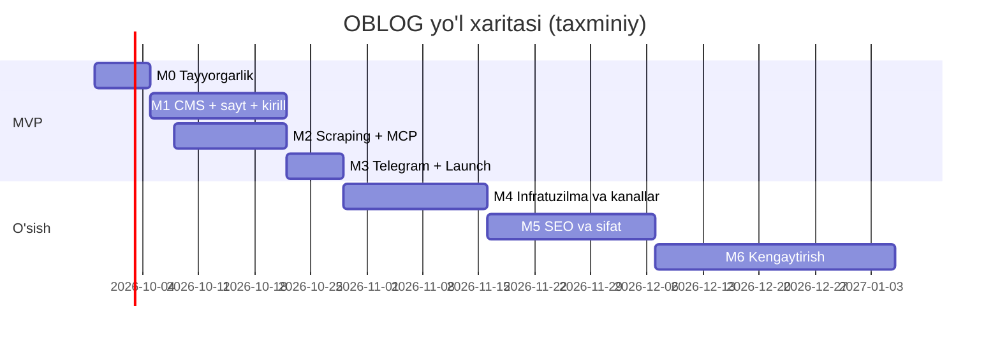

# Amalga oshirish rejasi — OBLOG (blog.odya.uz)

Asos: [TZ.md](TZ.md) v1.1. Ochiq savollar: [QUESTIONS.md](QUESTIONS.md).

## 0. Umumiy tamoyillar

- Loyiha **Quiel** vazifa tizimi orqali AI agentlar tomonidan bajariladi. Har bir vazifa — bitta branch, bitta PR (`gitMode = PR`), commit prefiksi — vazifa kaliti (`OBLOG-N`).
- **Rollar (ishlab chiqish):** `developer` (kod), `sysadmin` (Vercel, Supabase, Cloudflare, CI/CD, backup, monitoring; keyin Contabo), `designer` (brend, UI kit, maketlar), `manager` (manbalar, huquqiy, kontent siyosati, hisoblar, egasi bilan aloqa).
- Baho: **S** ≤ 0.5 kun, **M** 1–2 kun, **L** 3–5 kun (agent + tekshiruv).
- Har bir developer vazifasi: typecheck + lint + tegishli testlar CI'da yashil; Vercel preview ishlaydi.
- Vazifa ID'lari shartli (`M1-01`); Quiel'da yaratilganda haqiqiy `OBLOG-N` beriladi.

### v1.1 dagi asosiy o'zgarishlar
- Hosting MVP: **Vercel Pro + Supabase Postgres + Cloudflare R2**; Contabo — keyinroq (M4), faqat konfiguratsiya o'zgarishi bilan.
- Redis/BullMQ o'rniga **Payload Jobs + Vercel Cron**.
- Server tomonidagi LLM pipeline olib tashlandi → **MCP server MVP'ga** (M2).
- **Telegram avtopost MVP'ga** (M3).
- **Lotin + kirill** (Payload localization + `lotin-kirill`) — MVP (M1).
- Rollar: faqat admin + editor.

## Bosqichlar xulosasi

| Bosqich | Nomi | Natija | Davomiyligi (taxm.) |
|---|---|---|---|
| M0 | Tayyorgarlik | Hisoblar (Vercel, Supabase, Cloudflare/R2, Telegram bot), huquqiy asos, stil qo'llanma, repo skeleti | 1 hafta |
| M1 | **MVP: CMS + sayt + kirill** | Admin panelda post yozib, lotin va kirill versiyalarida tez, SEO-to'g'ri saytga chiqarish | 2.5 hafta |
| M2 | **MVP: Scraping + MCP** | Har kunlik avtomatik yig'ish; Claude agent MCP orqali qayta yozib review'ga yuboradi | 2 hafta |
| M3 | **MVP: Telegram + Launch** | Telegram avtopost, production, backup, monitoring, indekslash | 1 hafta |
| M4 | O'sish: infratuzilma va kanallar | Contabo worker, MCP OAuth (claude.ai), 2FA, IndexNow, dashboard | 2–3 hafta |
| M5 | O'sish: SEO va kontent sifati | Meilisearch, o'xshash postlar, agregatsiya, SEO ball, CWV | 3 hafta |
| M6 | Kengaytirish | Ixtiyoriy server LLM, rus tili, newsletter, izohlar, reklama, kibersport data, to'liq Contabo | davomiy |

**MVP = M0–M3 ≈ 6.5 hafta** (M1 va M2 qisman parallel — kalendar bo'yicha taxminan 6–7 hafta).

MVP natijasi: har kuni 5 ta manbadan yangiliklar yig'iladi → editor yoki Claude agent (MCP) qayta yozadi → editor tekshirib publish qiladi → post `blog.odya.uz` (lotin) va `blog.odya.uz/kr` (kirill) da chiqadi va Telegram kanalga yuboriladi.

> M2 M1-02 (kolleksiyalar) tayyor bo'lgach boshlanadi va M1 bilan parallel ketadi.

---

## M0 — Tayyorgarlik (1 hafta)

| ID | Vazifa | Rol | Tavsif | Qabul qilish mezonlari | Bog'liq | Baho |
|---|---|---|---|---|---|---|
| M0-01 | Qolgan ochiq savollarga javob | manager | QUESTIONS.md dagi ochiq savollar (brend nomi, Telegram yozuvi, kunlik hajm, editorlar soni va b.) | Javoblar QUESTIONS.md ga kiritilgan, TZ'dagi `[Taxmin]`lar yangilangan | — | S |
| M0-02 | Manbalar huquqiy auditi | manager | 5 manba uchun robots.txt, ToS, aniq RSS URL'lari, feed kategoriyalari → bizning kategoriyalar mapping | `docs/sources.md` (jadval + `fetchMode` + mapping), seed JSON | — | S |
| M0-03 | Stil qo'llanma, SEO qoidalari, glossariy | manager | Imlo (`ʻ`), ohang, atributsiya, mualliflik qoidalari, SEO qoidalari (TZ 5.2), glossariy ≥ 150 atama, translit istisnolari ≥ 300 so'z (oylar, rus o'zlashmalari) | `packages/guidelines/*.md`, `glossary.seed.json`, `translit-exceptions.seed.json` — MCP orqali beriladigan formatda | — | M |
| M0-04 | Brend va logo | designer | Brend nomi (Q1-b) tasdiqlangach: logo (SVG), palitra, shriftlar (lotin + kirill, `oʻ gʻ` to'g'ri), favicon, OG shablon | `design/brand/`; kontrast WCAG AA | M0-01 | M |
| M0-05 | Hisoblar va infratuzilma (MVP) | sysadmin | Vercel Pro team + GitHub integratsiya; Supabase Pro loyiha (region Vercel bilan bir xil), pooler/direct URL'lar; Cloudflare: `odya.uz` zonasi, `blog` → Vercel (DNS-only), R2 bucketlar `media`, `raw`, `backups`, `media.odya.uz` custom domen; Telegram bot yaratish va kanalga admin qilish | `docs/runbooks/infra.md`; env ro'yxati `.env.example`da; sirlar Vercel/GitHub'da; hech qanday sir repo'da yo'q | — | M |
| M0-06 | Monorepo skeleti | developer | pnpm + Turborepo: `apps/web` (Next.js + Payload 3, `@payloadcms/db-postgres`, `@payloadcms/storage-s3`), `packages/shared`, `packages/guidelines`; ESLint, Prettier, TS strict, Vitest; env sxemasi (Zod) — TZ 3.7 dagi barcha o'zgaruvchilar | `pnpm i && pnpm build && pnpm test` ishlaydi; `/admin` lokal ochiladi | — | M |
| M0-07 | Lokal dev muhit | sysadmin | `infra/docker-compose.dev.yml`: Postgres 16 + MinIO (R2 o'rniga, xuddi shu S3 env'lar bilan) + bucket init | `docker compose up` + `pnpm dev` bilan to'liq ishlaydi; README'da yo'riqnoma | M0-06 | S |
| M0-08 | CI va Vercel deploy | sysadmin | GitHub Actions: lint, typecheck, test; Vercel preview har PR uchun (preview DB — alohida Supabase loyiha/branch), production — `main`; migratsiya workflow (`payload migrate`, direct URL) | PR'da yashil tekshiruvlar + preview URL; `main` himoyalangan | M0-05, M0-06 | M |
| M0-09 | ADR yozuvlari | developer | `0001-payload-cms`, `0002-hosting-vercel-supabase-r2`, `0003-jobs-payload-vs-bullmq`, `0004-latin-cyrillic`, `0005-mcp-instead-of-llm-pipeline`, `0006-copyright-model` | 6 ta ADR `docs/adr/` da | — | S |

---

## M1 — MVP: CMS, sayt va kirill (2.5 hafta)

| ID | Vazifa | Rol | Tavsif | Qabul qilish mezonlari | Bog'liq | Baho |
|---|---|---|---|---|---|---|
| M1-01 | Payload asosiy sozlash | developer | Supabase (pooler runtime, direct migratsiya), storage-s3 (R2, `clientUploads: true`), sharp imageSizes (WebP), localization `uz-Latn` (default) / `uz-Cyrl` | Rasm R2'ga yuklanadi (> 4.5 MB ham); lokal MinIO bilan ham ishlaydi — faqat env farqi | M0-06, M0-05 | M |
| M1-02 | Asosiy kolleksiyalar | developer | `users` (admin/editor, API key), `authors`, `categories` (nested-docs), `tags`, `media`, `pages`, `posts` (drafts, autosave, versions, scheduled publish, `workflowStatus`, `sources`, `telegram` group, lokalizatsiya maydonlari) — TZ 10 | Maydonlar TZ bo'yicha; `payload-types.ts`; seed (kategoriyalar, admin, 3 demo post) | M1-01 | L |
| M1-03 | Access control va workflow | developer | TZ 4.2: admin/editor huquqlari; status o'tishlari validatsiyasi; claim lock; kelajakdagi `author` roli uchun kengaytiriladigan tuzilma | Rol × amal integration testlari (Local API) | M1-02 | M |
| M1-04 | Transliteratsiya (lotin → kirill) | developer | `packages/shared/translit.ts`: `lotin-kirill` adapteri + `translit-exceptions` + glossariydagi `doNotTransliterate`; Lexical JSON'da faqat matn tugunlari (kod, URL o'tkazib yuboriladi); `beforeChange` hook barcha lokalizatsiya maydonlariga; `cyrlLocked` / `cyrlStale` mantiqi; admin'da "Kirillni qayta generatsiya" tugmasi | ≥ 60 unit test (oylar, `ts/ц`, `ye/е`, `yo/ё`, `oʻ/gʻ`, apostrof variantlari, brendlar, URL, kod); qulflangan maydon qayta yozilmaydi (test) | M1-02, M0-03 | L |
| M1-05 | O'zbekcha slugify va redirectlar | developer | `slugify-uz.ts` (TZ 8.1), `kr` zaxiralangan slug, slug o'zgarsa 301 (plugin-redirects) | ≥ 30 unit test; 301 ishlaydi | M1-02 | S |
| M1-06 | UI kit va maketlar | designer | shadcn/ui + Tailwind: bosh sahifa, post, kategoriya, teg, muallif, qidiruv, 404; "Lotin / Кирилл" almashtirgich; mobil-birinchi; light/dark; reklama joylari (placeholder) | `/styleguide` sahifa yoki Figma + developer uchun spetsifikatsiya | M0-04 | L |
| M1-07 | Ommaviy sayt sahifalari (ikki yozuv) | developer | App Router: `(latn)` va `/kr` segmentlari (bitta komponentlar to'plami, locale parametr bilan): `/`, `/[category]`, `/[category]/[slug]`, `/tag/[slug]`, `/author/[slug]`, `/[page]`, `/search` (FTS); ISR + `revalidateTag`; Lexical renderer; almashtirgich (cookie) | Barcha sahifalar ikki yozuvda ishlaydi; publish'dan ≤ 10 s ichida yangilanadi | M1-04, M1-06 | L |
| M1-08 | SEO meta va hreflang | developer | `@payloadcms/plugin-seo` (lokalizatsiya), `generateMetadata`: canonical (o'ziga), `hreflang` uz-Latn/uz-Cyrl/x-default, OG, Twitter, `lang` atributi, `next/og` OG rasm (ikkala yozuv) | Har bir sahifa turi va yozuv uchun meta to'g'ri (e2e snapshot) | M1-07 | M |
| M1-09 | JSON-LD | developer | `NewsArticle` (`inLanguage`, `isBasedOn`), `BreadcrumbList`, `Organization`, `WebSite+SearchAction`, `Person`, `FAQPage` | Rich Results Test xatosiz (lotin va kirill namunalari) | M1-07 | M |
| M1-10 | Sitemap, news sitemap, robots, RSS | developer | Sitemap index + alternates, news sitemap (48 soat, ikkala yozuv), `robots.ts`, `/rss.xml`, `/kr/rss.xml` | Validatorlardan o'tadi; preview'da `noindex` | M1-07 | M |
| M1-11 | Rasm yetkazish | developer | `next/image` custom loader → `media.odya.uz` dagi tayyor variantlar (Vercel Image Optimization ishlatilmaydi), `sizes`, LCP `priority`, fokus nuqta | Post sahifasida rasmlar R2/Cloudflare'dan WebP; Vercel image usage = 0 | M1-07 | S |
| M1-12 | Menyular va sozlamalar | developer | Globals: `site-settings`, `header`, `footer` (lokalizatsiya) | Admin'dan o'zgarish saytda ko'rinadi | M1-02 | S |
| M1-13 | Huquqiy va E-E-A-T sahifalar | manager | Biz haqimizda (Odya LLC), Aloqa, Tahririyat siyosati, Maxfiylik siyosati, Mualliflik huquqi / shikoyatlar, Foydalanish shartlari | 6 sahifa chop etilgan (kirill avtomatik tekshirilgan) | M0-03, M1-02 | M |
| M1-14 | Performance budget | developer | Lighthouse CI (mobil, preview URL): Perf ≥ 90, SEO 100, A11y ≥ 90; JS ≤ 150 KB | CI'da yashil | M1-07, M0-08 | S |

---

## M2 — MVP: Scraping va MCP (2 hafta)

| ID | Vazifa | Rol | Tavsif | Qabul qilish mezonlari | Bog'liq | Baho |
|---|---|---|---|---|---|---|
| M2-01 | Scraping kolleksiyalari | developer | `sources` (feed mapping, keywordRules), `scraped-items`, `glossary`, `translit-exceptions`, global `scraping-settings`; seed (M0-02, M0-03) | Admin'da ko'rinadi, seed yuklangan | M1-02, M0-02 | M |
| M2-02 | Payload Jobs + Vercel Cron | developer | Jobs konfiguratsiyasi, `/api/cron/run-jobs` (`CRON_SECRET`), `vercel.json` cron, `JOBS_MODE=cron|autorun` (keyingi Contabo uchun) | Cron har 10 daqiqada job'larni bajaradi; `autorun` rejimi lokal ishlaydi | M2-01 | M |
| M2-03 | `feed.poll` | developer | `rss-parser`, URL normallashtirish, `urlHash` dedupe, `ETag`/`Last-Modified`, `pollIntervalMin` | 5 manbadan yangi elementlar; qayta ishga tushirishda dublikat yo'q | M2-02 | M |
| M2-04 | `item.fetch` + `item.extract` | developer | `robots-parser`, domen rate limit (Postgres), Readability + jsdom/linkedom, selektor fallback, raw HTML gzip → R2 `raw/`, arxiv rasmlar, `fetchMode=rss_only`; har task ≤ 30 s | Har manbadan 10 ta fixture to'g'ri ajratiladi (snapshot testlar) | M2-03 | L |
| M2-05 | `item.dedupe` + `item.classify` | developer | SimHash klaster; LLM'siz klassifikatsiya: feed mapping + kalit so'z qoidalari; evristik score | Bir yangilik 2 manbada — bitta klaster; 30 namunada kategoriya ≥ 80% to'g'ri | M2-04 | M |
| M2-06 | Tahririyat navbati (admin UI) | developer | Custom view: bugungi scraped items (score, filtr), "Qoralamaga olish" / "Rad etish"; post tahrirlashda asl manba paneli; "Review" navbati | Editor 1 postni qo'lda ≤ 10 daqiqada tayyorlab chop eta oladi | M2-05, M1-03 | L |
| M2-07 | API kalitlar va audit log | developer | Payload `useAPIKey` (shaxsiy kalit, bekor qilish), `audit-logs` (faqat yozish), barcha kolleksiyalarda hooklar, `channel` belgisi | Har o'zgarish logda; bekor qilingan kalit rad etiladi (test) | M1-03 | M |
| M2-08 | MCP server | developer | `/api/mcp` — `mcp-handler` + `@modelcontextprotocol/sdk`, Streamable HTTP, Bearer API kalit; TZ 6.3 dagi 16 tool, 2 prompt, 4 resource; Zod validatsiya; server tekshiruvlari (TZ 5.3); `<untrusted_source>` o'rash; publish tool yo'q | Claude Code'dan to'liq zanjir `list_scraped → … → submit_for_review` ishlaydi; kirill avtomatik; audit'da `channel=mcp`; integration testlar (MCP client bilan) | M2-07, M2-01, M1-04 | L |
| M2-09 | Markdown → Lexical | developer | Agent yuborgan Markdown'ni Lexical'ga o'girish (sarlavhalar, ro'yxatlar, havolalar, iqtiboslar, kod), sanitizatsiya | 20 ta namunada formatlash to'g'ri, XSS testlari | M1-02 | S |
| M2-10 | MCP yo'riqnoma va sinov | manager | `docs/mcp.md`: Claude Code / Claude Desktop (`mcp-remote`) ulanishi, kalit olish, namuna so'rovlar; 20 ta real maqolani agent bilan qayta yozish va stil qo'llanma bo'yicha baholash | Yo'riqnoma bo'yicha yangi editor 15 daqiqada ulanadi; baholash hisoboti + guidelines v2 bo'yicha tuzatishlar | M2-08 | M |
| M2-11 | Scraping ogohlantirishlari | developer | Manba 3 marta ketma-ket xato / muvaffaqiyat < 80% → Telegram admin guruhiga | Sun'iy xato bilan test | M2-03 | S |

---

## M3 — MVP: Telegram va Launch (1 hafta)

| ID | Vazifa | Rol | Tavsif | Qabul qilish mezonlari | Bog'liq | Baho |
|---|---|---|---|---|---|---|
| M3-01 | Telegram avtopost | developer | `telegram-settings` global; publish (va scheduled publish) → `telegram.post` job; grammY `sendPhoto` + caption (sarlavha, lid, UTM havola, heshteglar, ≤ 1024), rasm yo'q bo'lsa `sendMessage`; idempotentlik (`messageId`), "yubormaslik" belgisi, tahrirda `editMessageCaption`, retry + ogohlantirish; yozuv (`script`) sozlamasi | Publish'dan ≤ 2 daqiqada kanalda post; ikki marta yuborilmaydi (test); test kanalida e2e | M2-02, M1-02 | M |
| M3-02 | Production sozlash | sysadmin | Vercel production domen `blog.odya.uz`, env'lar, cron'lar, function region (Supabase bilan bir xil), Supabase production (pooler, network restrictions, Data API o'chirilgan) | Sayt HTTPS'da ishlaydi; `/admin` faqat login bilan | M0-05, M0-08 | S |
| M3-03 | Xavfsizlik | developer | Security headers (CSP, HSTS), `maxLoginAttempts`, rate limit (API/MCP), `pnpm audit` CI'da | securityheaders.com — A; OWASP ZAP bazaviy — kritik yo'q | M3-02 | M |
| M3-04 | Backup | sysadmin | GitHub Actions kunlik `pg_dump` (direct URL) → shifrlash (`age`) → R2 `backups/` (30 kun); R2 media haftalik nusxasi; tiklash runbook | Staging'ga tiklash sinovi o'tgan, `docs/runbooks/restore.md` | M3-02 | M |
| M3-05 | Monitoring | sysadmin | Sentry (server/client/jobs), uptime monitor (sayt, admin, `/api/mcp` health), Telegram admin guruhiga ogohlantirishlar, Vercel Speed Insights | Sun'iy xato Sentry'da; sayt o'chsa ≤ 5 daqiqada xabar | M3-02 | S |
| M3-06 | Analitika va webmaster | manager | GA4, Yandex Metrica, cookie banner, Google Search Console, Yandex Webmaster, sitemap yuborish, Google News Publisher Center | Hisoblar ulangan, sitemap qabul qilingan | M3-02 | S |
| M3-07 | Contabo'ga ko'chish runbook'i | sysadmin | `docs/runbooks/migrate-to-contabo.md` — TZ 3.7 qadamlari, env farqlari, DB dump/restore, media sync, DNS | Runbook yozilgan va lokal Docker'da quruq sinovdan o'tgan | M0-07 | S |
| M3-08 | Launch tekshiruvi | manager | 30+ post (lotin + kirill tekshirilgan), huquqiy sahifalar, Lighthouse, Rich Results, redirectlar, Telegram, mobil sinov, preview `noindex` | `docs/launch-checklist.md` to'liq ✅; sayt ochiq | M1-*, M2-*, M3-01..07 | S |

---

## M4 — O'sish: infratuzilma va kanallar (2–3 hafta)

| ID | Vazifa | Rol | Tavsif | Qabul qilish mezonlari | Bog'liq | Baho |
|---|---|---|---|---|---|---|
| M4-01 | Contabo server tayyorlash | sysadmin | Ubuntu LTS, SSH hardening, ufw, fail2ban, Docker, avtomatik yangilanishlar | Runbook; faqat 22/80/443 ochiq | Egasi qarori | M |
| M4-02 | Worker'ni Contabo'ga ko'chirish | developer + sysadmin | `apps/worker` (xuddi shu Payload config, `JOBS_MODE=autorun`), Supabase va R2'ga ulanadi; Vercel Cron o'chiriladi; Playwright (JS-sahifalar uchun, ixtiyoriy) | Scraping 48 soat uzluksiz ishlaydi, Vercel function vaqti kamayadi | M4-01, M2-02 | M |
| M4-03 | MCP OAuth | developer | OAuth 2.1 (MCP autorizatsiya spetsifikatsiyasi) — claude.ai / Claude Desktop custom connector sifatida ulash | claude.ai'dan connector sifatida ulanadi | M2-08 | L |
| M4-04 | Admin 2FA | developer | TOTP 2FA admin/editor uchun | 2FA majburiy, zaxira kodlar | M3-03 | M |
| M4-05 | IndexNow | developer | Publish'da IndexNow (Yandex/Bing), ikkala URL | Yandex Webmaster'da ko'rinadi | M1-10 | S |
| M4-06 | Admin dashboard | developer | Bugungi scraped/drafts/review/published, manba sog'lig'i, editor/agent statistikasi, Telegram holati | Ma'lumotlar DB bilan mos | M2-06 | M |
| M4-07 | Ko'rishlar va "Mashhur" | developer | Hisoblagich (bot filtri; MVP — Postgres, keyin Redis), "Mashhur" bloki | Blok ishlaydi, keshga zarar bermaydi | M1-07 | S |
| M4-08 | Telegram kengaytirish | developer | Kirill kanali (agar egasi xohlasa), rejalashtirilgan dayjest (kun oxirida top-5) | Egasi qaroriga qarab | M3-01 | S |

---

## M5 — O'sish: SEO va kontent sifati (3 hafta)

| ID | Vazifa | Rol | Tavsif | Qabul qilish mezonlari | Bog'liq | Baho |
|---|---|---|---|---|---|---|
| M5-01 | Meilisearch | developer + sysadmin | Contabo'da Meilisearch, sinxronizatsiya, lotin/kirill, `oʻ/o'` sinonimlari | Qidiruv ≤ 50 ms | M4-01 | M |
| M5-02 | O'xshash postlar (pgvector) | developer | Embedding (lokal model yoki arzon API — egasi qarori), "O'xshash maqolalar", MCP `search_posts` semantik rejim | Relevantlik ≥ 7/10 | M3 | M |
| M5-03 | Multi-source agregatsiya | developer | Klasterdan bitta qoralama (barcha manbalar atributsiyada); MCP `get_source` klasterni to'liq beradi | Klasterdan 1 qoralama | M2-05 | M |
| M5-04 | SEO ball paneli | developer | Admin'da va MCP `save_rewrite` javobida: uzunliklar, keyword, alt, ichki havolalar, H2 | Ball < 70 — publish'da ogohlantirish | M1-08 | M |
| M5-05 | Kategoriya landing sahifalari va kalit so'zlar | manager | 8 kategoriya uchun SEO matn; lotin va kirill so'rovlar tadqiqoti | `docs/keywords.md`; matnlar kiritilgan | M3-06 | M |
| M5-06 | CWV monitoring | developer | `web-vitals` → GA4; regressiyalarni tuzatish | "Good" URL ≥ 90% | M3-06 | M |
| M5-07 | Guidelines v3 | manager | Editor tuzatishlari tahlili asosida stil qo'llanma, glossariy, translit istisnolarini yangilash | Editor tahriri hajmi 20% kamayadi | M2-10 | M |

---

## M6 — Kengaytirish (egasi qaroriga qarab)

| ID | Vazifa | Rol | Tavsif | Bog'liq | Baho |
|---|---|---|---|---|---|
| M6-01 | Server tomonidagi LLM pipeline (ixtiyoriy) | developer | `AI_PIPELINE_ENABLED` flag, Anthropic API, byudjet limiti, xarajat logi; xuddi shu guidelines va validatsiya | Egasi API kaliti bersa | L |
| M6-02 | To'liq Contabo migratsiyasi | sysadmin | Web + Postgres (+ ixtiyoriy MinIO) Contabo'ga, runbook bo'yicha | M4-02, M3-07 | M |
| M6-03 | Rus tili | developer | Payload locale `ru`, `/ru/` segment, hreflang | M1-07 | L |
| M6-04 | Newsletter | developer + sysadmin | Listmonk (UZ serverda — shaxsiy ma'lumotlar qonuni) | M4-01 | M |
| M6-05 | Izohlar | developer | Telegram comments widget yoki Remark42 | Egasi qarori | M |
| M6-06 | Reklama | developer | `ad-slots` → AdSense / Yandex RSYA, CLS himoyasi | Egasi qarori | S |
| M6-07 | Kibersport ma'lumotlari | developer | PandaScore API: turnirlar, natijalar | M3 | L |
| M6-08 | Qo'shimcha manbalar | manager | Ars Technica, Wired, Esports Insider, rasmiy AI bloglari — huquqiy audit bilan | M0-02 | S |

---

## Xavflar

| Xavf | Ehtimol | Ta'sir | Kamaytirish |
|---|---|---|---|
| Mualliflik huquqi shikoyati | O'rta | Yuqori | Rewrite modeli, rasmlar siyosati, shikoyat sahifasi (TZ 2.3) |
| Google "scaled content" jazosi | O'rta | Yuqori | Inson publish qiladi, o'z kontekst, E-E-A-T |
| Transliteratsiya xatolari (kirill) | Yuqori | O'rta | Istisnolar lug'ati, qo'lda tuzatish + qulflash, editor tekshiruvi |
| Vercel/Supabase xarajati yoki limitlari | O'rta | O'rta | Custom image loader, kichik job'lar, config-only Contabo ko'chish yo'li |
| Supabase/Vercel'ga bog'lanib qolish | Past | O'rta | Standart Postgres + S3 API, o'z `pg_dump` backup, runbook |
| Tahririyat resursi (editorlar) yetishmasligi | O'rta | Yuqori | MCP agent batch rejimi; ochiq savol — editorlar soni |
| Claude obunasi limitlari (agent ishlash hajmi) | O'rta | O'rta | Batch'larni kun davomida taqsimlash; kerak bo'lsa M6-01 (API) |
| Manba HTML tuzilmasi o'zgarishi / bloklash | Yuqori | O'rta | RSS birinchi, selektor fallback, ogohlantirishlar, `rss_only` |
| Shaxsiy ma'lumotlar qonuni (serverlar UZ'dan tashqarida) | Past (MVP) | O'rta | MVP'da o'quvchi ma'lumoti yig'ilmaydi; newsletter/izohdan oldin UZ server |
