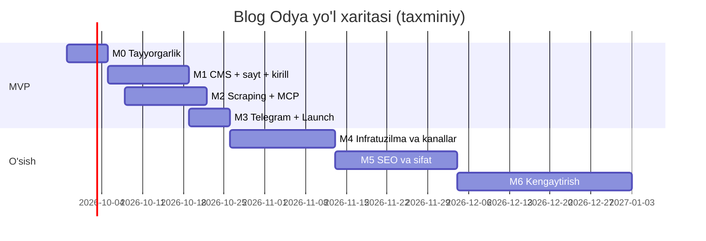

# Amalga oshirish rejasi — Blog Odya (blog.odya.uz)

Asos: [TZ.md](TZ.md) v1.2. MVP vazifalari batafsil: [TASKS.md](TASKS.md). Savollar va qarorlar: [QUESTIONS.md](QUESTIONS.md).

## 0. Umumiy tamoyillar

- Loyiha **Quiel** vazifa tizimi orqali AI agentlar tomonidan bajariladi. Har bir vazifa — bitta branch, bitta PR (`gitMode = PR`), commit prefiksi — vazifa kaliti (`OBLOG-N`).
- **Rollar:** `developer` (kod), `sysadmin` (Vercel, Supabase, Cloudflare, CI/CD, backup, monitoring), `designer` (brend, UI). Egasi bajarishi kerak bo'lgan ishlar (hisoblar, sirlar, DNS, Telegram) — `executor: HUMAN` vazifalar, qadam-baqadam yo'riqnoma bilan.
- Baho: **S** ≤ 0.5 kun, **M** 1–2 kun, **L** 3–5 kun. MVP vazifalari ≤ 2 kun (bitta agent sessiyasi).
- Har bir developer vazifasi: lint + typecheck + testlar CI'da yashil; Vercel preview ishlaydi.

### Versiyalar bo'yicha asosiy o'zgarishlar
- **v1.1:** Vercel + Supabase + R2; Payload Jobs (Redis/BullMQ yo'q); MCP server va Telegram avtopost MVP'da; lotin + kirill; rollar admin + editor; server tomonidagi LLM yo'q.
- **v1.2:** **bepul tariflar** (Vercel Hobby, Supabase Free, R2 free) — $0/oy; scheduler — Supabase `pg_cron` + `pg_net`; DB hajmini tejash; brend "Blog Odya" (wordmark); **ikkita Telegram kanal**; 9 ta kategoriya va dizayn yo'nalishi TZ'da; MVP 25 ta vazifaga bo'lindi ([TASKS.md](TASKS.md)).

## Bosqichlar xulosasi

| Bosqich | Nomi | Natija | Davomiyligi (taxm.) |
|---|---|---|---|
| M0 | Tayyorgarlik | Repo skeleti + CI, bepul hisoblar va sirlar, Telegram kanallar/bot, manbalar auditi, tahririyat hujjatlari, brend | 1 hafta |
| M1 | **MVP: CMS + sayt + kirill** | Admin panelda post yozib, lotin va kirill versiyalarida tez, SEO-to'g'ri saytga chiqarish | 2 hafta |
| M2 | **MVP: Scraping + MCP** | Har 10 daqiqada avtomatik yig'ish; tahririyat navbati; Claude agent MCP orqali qayta yozib review'ga yuboradi | 2 hafta |
| M3 | **MVP: Telegram + Launch** | Ikki kanalga avtopost, xavfsizlik, backup, monitoring, launch | 1 hafta |
| M4 | O'sish: infratuzilma va kanallar | Pullik tarif yoki Contabo (triggerlar bo'yicha), MCP OAuth, 2FA, IndexNow, dashboard | 2–3 hafta |
| M5 | O'sish: SEO va kontent sifati | Meilisearch, o'xshash postlar, agregatsiya, SEO ball, CWV | 3 hafta |
| M6 | Kengaytirish | Ixtiyoriy server LLM, rus tili, newsletter, reklama (faqat Pro/Contabo'da), kibersport data | davomiy |

**MVP = M0–M3 ≈ 6 hafta** (25 vazifa, jami ≈ 36 agent-kun; M1 va M2 parallel oqimlar bilan kalendar bo'yicha ~6 hafta). Xarajat: **$0/oy** + domen.

MVP natijasi: har kuni 5 ta manbadan yangiliklar yig'iladi → editor yoki Claude agent (MCP) qayta yozadi → admin/editor publish qiladi → post `blog.odya.uz` (lotin) va `blog.odya.uz/kr` (kirill) da chiqadi va lotin/kirill Telegram kanallariga yuboriladi.

---

## MVP (M0–M3) — vazifalar

Batafsil tavsif, qadamlar va qabul qilish mezonlari — **[TASKS.md](TASKS.md)**.

| Ref | Vazifa | Rol | Ijrochi | Bog'liq |
|---|---|---|---|---|
| M0-01 | Repozitoriy skeleti: Next.js + Payload 3 + Postgres, lint, CI | developer | AGENT | — |
| M0-02 | Hisoblarni sozlash: Supabase, Cloudflare R2/DNS, Vercel | sysadmin | **HUMAN** | M0-01 |
| M0-03 | Telegram: 2 ta kanal va bot yaratish | sysadmin | **HUMAN** | — |
| M0-04 | Manbalar auditi va seed ma'lumotlari | developer | AGENT | M0-01 |
| M0-05 | Tahririyat hujjatlari: stil, SEO, mualliflik, glossariy, huquqiy matnlar | developer | AGENT | M0-01 |
| M0-06 | Brend: wordmark logo, favicon, OG shablon, palitra | designer | AGENT | — |
| M1-01 | Payload asosiy sozlash: Supabase, R2, localization, rollar | developer | AGENT | M0-01, M0-02 |
| M1-02 | Kontent kolleksiyalari, workflow va seed | developer | AGENT | M1-01, M0-04, M0-05 |
| M1-03 | Lotin → kirill transliteratsiya va slugify-uz | developer | AGENT | M1-02, M0-05 |
| M1-04 | UI kit va sahifa maketlari (kodda) | designer | AGENT | M0-06, M0-01 |
| M1-05 | Ommaviy sayt: layout, bosh sahifa, maqola, kategoriya | developer | AGENT | M1-02, M1-03, M1-04 |
| M1-06 | SEO: meta, hreflang, JSON-LD, sitemap, robots, RSS, OG | developer | AGENT | M1-05 |
| M1-07 | Teg, muallif, statik sahifa, qidiruv, 404 + Lighthouse CI | developer | AGENT | M1-05 |
| M2-01 | Scraping kolleksiyalari, jobs endpoint, pg_cron, feed.poll | developer | AGENT | M1-02, M0-04 |
| M2-02 | item.fetch va item.extract | developer | AGENT | M2-01 |
| M2-03 | Dedupe, klassifikatsiya, tozalash, ogohlantirishlar | developer | AGENT | M2-02 |
| M2-04 | Tahririyat navbati (admin custom view) | developer | AGENT | M2-01, M1-03 |
| M2-05 | API kalitlar va audit log | developer | AGENT | M1-02 |
| M2-06 | MCP server: ulanish, o'qish toollari, prompts/resources | developer | AGENT | M2-05, M2-01, M0-05 |
| M2-07 | MCP server: yozish toollari, validatsiya, yo'riqnoma | developer | AGENT | M2-06, M1-03 |
| M3-01 | Telegram avtopost: lotin va kirill kanallari | developer | AGENT | M2-01, M1-03, M0-03 |
| M3-02 | Xavfsizlik, health, Sentry, analitika | developer | AGENT | M1-05 |
| M3-03 | Kunlik backup (pg_dump → R2) va tiklash runbook'i | sysadmin | AGENT | M0-01, M0-02 |
| M3-04 | Runbook'lar, launch checklist, e2e smoke | sysadmin | AGENT | M1-06, M1-07, M2-04, M2-07, M3-01..03 |
| M3-05 | Production'ni ishga tushirish | sysadmin | **HUMAN** | M3-04 |

---

## M4 — O'sish: infratuzilma va kanallar (2–3 hafta)

| ID | Vazifa | Rol | Tavsif | Qabul qilish mezonlari | Bog'liq | Baho |
|---|---|---|---|---|---|---|
| M4-01 | Bepul kvotalar monitoringi va yangilash qarori | sysadmin | Oylik hisobot: DB/R2 hajmi, Vercel kvotalari, Supabase pauza hodisalari; TZ §3.7.2 triggerlari bo'yicha tavsiya | Oylik hisobot; trigger bo'lsa — egasiga taklif | MVP | S |
| M4-02 | Vercel Pro / Supabase Pro ga o'tish (trigger bo'lsa) | sysadmin (HUMAN) | Tarifni o'zgartirish, Vercel Cron'ni yoqish (`pg_cron` zaxira), Supabase PITR | Kod o'zgarishisiz ishlaydi | M4-01 | S |
| M4-03 | Contabo server va worker (muqobil yo'l) | sysadmin + developer | Ubuntu, hardening, Docker; `apps/worker` (`JOBS_MODE=autorun`), Playwright; `pg_cron` o'chiriladi | Scraping 48 soat uzluksiz | M4-01 | M |
| M4-04 | MCP OAuth | developer | OAuth 2.1 (MCP autorizatsiya spetsifikatsiyasi) — claude.ai custom connector | claude.ai'dan ulanadi | M2-07 | L |
| M4-05 | Admin 2FA | developer | TOTP 2FA | 2FA majburiy, zaxira kodlar | M3-02 | M |
| M4-06 | IndexNow | developer | Publish'da IndexNow (Yandex/Bing), ikkala URL | Yandex Webmaster'da ko'rinadi | M1-06 | S |
| M4-07 | Admin dashboard | developer | Scraped/draft/review/published, manba sog'lig'i, editor/agent statistikasi, Telegram holati, kvotalar | Ma'lumotlar DB bilan mos | M2-04 | M |
| M4-08 | Ko'rishlar va "Mashhur" | developer | Hisoblagich (bot filtri, DB yozuvini tejash uchun batch), "Mashhur" bloki | Blok ishlaydi | M1-05 | S |
| M4-09 | Telegram dayjest | developer | Kun oxirida top-5 (ikkala kanal) | Rejalashtirilgan post | M3-01 | S |

## M5 — O'sish: SEO va kontent sifati (3 hafta)

| ID | Vazifa | Rol | Tavsif | Qabul qilish mezonlari | Bog'liq | Baho |
|---|---|---|---|---|---|---|
| M5-01 | Meilisearch | developer + sysadmin | Contabo'da yoki Meilisearch Cloud; lotin/kirill, `oʻ/o'` sinonimlari | ≤ 50 ms | M4-03 | M |
| M5-02 | O'xshash postlar (pgvector) | developer | Embedding, "O'xshash maqolalar", MCP `search_posts` semantik rejim | Relevantlik ≥ 7/10 | MVP | M |
| M5-03 | Multi-source agregatsiya | developer | Klasterdan bitta qoralama, barcha manbalar atributsiyada | Klasterdan 1 qoralama | M2-03 | M |
| M5-04 | SEO ball paneli | developer | Admin'da va MCP javobida | Ball < 70 — ogohlantirish | M1-06 | M |
| M5-05 | Kategoriya SEO matnlari va kalit so'zlar | developer | 9 kategoriya uchun 150–300 so'z; Wordstat / Keyword Planner (lotin + kirill) | `docs/keywords.md` | MVP | M |
| M5-06 | CWV monitoring | developer | `web-vitals` → GA4; regressiyalar | "Good" ≥ 90% | M3-02 | M |
| M5-07 | Guidelines v2 | developer | Editor tuzatishlari tahlili → stil qo'llanma, glossariy, translit istisnolari | Editor tahriri hajmi kamayadi | M2-07 | M |

## M6 — Kengaytirish

| ID | Vazifa | Rol | Tavsif | Bog'liq | Baho |
|---|---|---|---|---|---|
| M6-01 | Server tomonidagi LLM pipeline (ixtiyoriy) | developer | `AI_PIPELINE_ENABLED` flag, API kaliti, byudjet limiti | Egasi qarori | L |
| M6-02 | To'liq Contabo migratsiyasi | sysadmin | Web + Postgres (+ MinIO) — runbook bo'yicha | M4-03 | M |
| M6-03 | Rus tili | developer | Locale `ru`, `/ru/`, hreflang | MVP | L |
| M6-04 | Newsletter | developer + sysadmin | Listmonk (UZ serverda) | M4-03 | M |
| M6-05 | Reklama | developer | AdSense / Yandex RSYA — **faqat Vercel Pro yoki Contabo'da** (Hobby ToS) | M4-02 yoki M6-02 | S |
| M6-06 | Kibersport ma'lumotlari | developer | PandaScore API | MVP | L |
| M6-07 | Qo'shimcha manbalar | developer | Ars Technica, Wired, Esports Insider, rasmiy AI bloglari | M0-04 | S |

---

## Xavflar

| Xavf | Ehtimol | Ta'sir | Kamaytirish |
|---|---|---|---|
| Vercel Hobby ToS (notijorat) | O'rta | Yuqori | Monetizatsiyadan oldin Pro/Contabo (TZ §3.7.2); config-only ko'chish yo'li |
| Supabase Free pauza / 500 MB limit | O'rta | Yuqori | Doimiy scheduler + health ping, hajmni tejash, ogohlantirish 70%, o'z backup |
| Bepul function vaqti yetmasligi | O'rta | O'rta | Kichik batch, deadline, Contabo worker (M4-03) |
| Mualliflik huquqi shikoyati | O'rta | Yuqori | Rewrite modeli, rasmlar siyosati, shikoyat sahifasi |
| Google "scaled content" jazosi | O'rta | Yuqori | Inson publish qiladi, o'z kontekst, E-E-A-T |
| Transliteratsiya xatolari | Yuqori | Past–O'rta | Istisnolar lug'ati, qo'lda tuzatish + qulflash |
| Tahririyat resursi | O'rta | Yuqori | MCP agent batch rejimi |
| Manba HTML o'zgarishi / bloklash | Yuqori | O'rta | RSS birinchi, selektor fallback, ogohlantirishlar |
