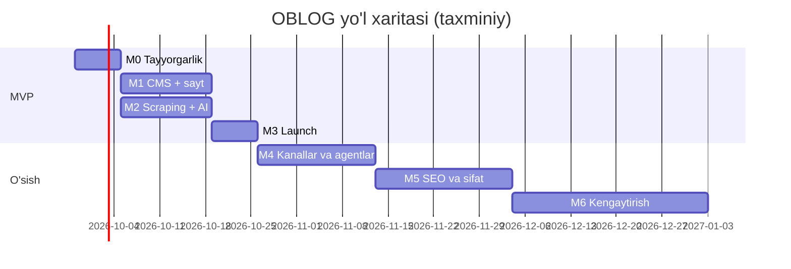

# Amalga oshirish rejasi — OBLOG

Asos: [TZ.md](TZ.md). Ochiq savollar: [QUESTIONS.md](QUESTIONS.md).

## 0. Umumiy tamoyillar

- Loyiha **Quiel** vazifa tizimi orqali AI agentlar tomonidan bajariladi. Har bir vazifa — bitta branch, bitta PR (`gitMode = PR`), commit prefiksi — vazifa kaliti (`OBLOG-N`).
- **Rollar:** `developer` (kod), `sysadmin` (server, CI/CD, backup, monitoring), `designer` (brend, UI kit, maketlar), `manager` (manbalar, huquqiy, kontent siyosati, hisoblar, egasi bilan aloqa).
- Har bir vazifada: qabul qilish mezonlari (AC), bog'liqliklar, baho (**S** ≤ 0.5 kun, **M** 1–2 kun, **L** 3–5 kun agent + tekshiruv vaqti).
- Har bir developer vazifasi: typecheck + lint + tegishli testlar CI'da yashil bo'lishi shart; README/`docs/` kerak bo'lsa yangilanadi.
- Vazifa kaliti quyida shartli (`M1-01`); Quiel'da yaratilganda haqiqiy `OBLOG-N` beriladi.

## Bosqichlar xulosasi

| Bosqich | Nomi | Maqsad | Davomiyligi (taxm.) |
|---|---|---|---|
| M0 | Tayyorgarlik | Qarorlar, brend, huquqiy asos, repo skeleti | 1 hafta |
| M1 | **MVP: CMS + sayt** | Qo'lda post yozib, tez va SEO-to'g'ri sayt chiqarish | 2 hafta |
| M2 | **MVP: Scraping + AI** | Har kunlik avtomatik yig'ish, AI rewrite, tahririyat navbati | 2 hafta |
| M3 | **MVP: Launch** | Production, monitoring, backup, indekslash | 1 hafta |
| M4 | O'sish: kanallar va agentlar | MCP, REST API kalitlar, Telegram, analitika dashboard | 2–3 hafta |
| M5 | O'sish: SEO va kontent sifati | Meilisearch, related (embedding), klasterlash, SEO ball, performance | 3 hafta |
| M6 | Kengaytirish | Rus tili, newsletter, izohlar, reklama, kibersport data | davomiy |

**MVP = M0–M3 (~6 hafta):** muharrir har kuni 5 ta manbadan yig'ilgan qoralamalarni admin panelda ko'radi, AI rewrite'ni tahrirlab chop etadi; sayt tez, SEO-to'g'ri, sitemap/news sitemap bilan, MinIO+CDN media, backup va monitoring bilan.

> M1 va M2 parallel bajarilishi mumkin (M2 faqat M1-02 — Payload kolleksiyalariga bog'liq).

---

## M0 — Tayyorgarlik

| ID | Vazifa | Rol | Tavsif | Qabul qilish mezonlari | Bog'liq | Baho |
|---|---|---|---|---|---|---|
| M0-01 | Egasidan bloklovchi savollarga javob olish | manager | QUESTIONS.md dagi 🔴 savollar (Q1, Q2, Q3, Q7, Q9, Q15, Q16, Q17) | Javoblar QUESTIONS.md ga yozilgan; TZ'dagi `[Taxmin]`lar yangilangan | — | S |
| M0-02 | Manbalar huquqiy auditi | manager | Har bir manba uchun robots.txt, ToS, RSS URL'lari, rasmlar siyosati tekshiruvi | `docs/sources.md`: jadval (manba, RSS URL'lar, robots/ToS xulosasi, `fetchMode`), egasi tasdiqlagan | M0-01 | S |
| M0-03 | Tahririyat va stil qo'llanma | manager | Imlo (`ʻ`), ohang, atributsiya formati, AI shaffoflik, tuzatishlar siyosati; boshlang'ich glossariy (≥ 150 atama) | `docs/STYLE_GUIDE.md`, `packages/prompts/glossary.seed.json` | M0-01 | M |
| M0-04 | Brend va logo | designer | Nom tasdiqlangach: logo (SVG), rang palitra, shriftlar (lotin kengaytirilgan, `oʻ gʻ` to'g'ri ko'rinadi), favicon, OG shablon | `design/brand/` da fayllar; kontrast WCAG AA | M0-01 | M |
| M0-05 | Monorepo skeleti | developer | pnpm + Turborepo: `apps/web` (Next.js + Payload 3 blank template), `apps/worker`, `apps/mcp`, `packages/shared`, `packages/prompts`; ESLint, Prettier, TS strict, Vitest | `pnpm i && pnpm build && pnpm test` ishlaydi; `/admin` lokal ochiladi | — | M |
| M0-06 | Lokal dev muhit | sysadmin | `infra/docker-compose.dev.yml`: Postgres 16, Redis 7, MinIO (+ bucketlar `media`, `raw`, `archive` init), Mailpit | `docker compose up` bilan hammasi ko'tariladi; `.env.example` to'liq; README'da yo'riqnoma | M0-05 | S |
| M0-07 | CI pipeline | sysadmin | GitHub Actions: install (kesh), lint, typecheck, test, build; branch himoyasi `main` | PR'da yashil tekshiruvlar majburiy | M0-05 | S |
| M0-08 | ADR yozuvlari | developer | `docs/adr/0001-payload-cms.md`, `0002-worker-bullmq.md`, `0003-copyright-model.md` | 3 ta ADR merge qilingan | M0-01 | S |

---

## M1 — MVP: CMS va ommaviy sayt

| ID | Vazifa | Rol | Tavsif | Qabul qilish mezonlari | Bog'liq | Baho |
|---|---|---|---|---|---|---|
| M1-01 | Payload + Postgres + MinIO sozlash | developer | `@payloadcms/db-postgres`, `@payloadcms/storage-s3` (MinIO, `forcePathStyle`), sharp, migratsiyalar | Rasm yuklash MinIO'ga tushadi; `payload migrate` ishlaydi | M0-06 | S |
| M1-02 | Asosiy kolleksiyalar | developer | `users` (rollar), `authors`, `categories` (nested-docs), `tags`, `media` (imageSizes, license), `pages`, `posts` (drafts, autosave, versions, scheduled publish, `workflowStatus`) — TZ 10-bo'lim | Barcha maydonlar TZ bo'yicha; `payload-types.ts` generatsiya; seed skript (kategoriyalar, 1 admin, 3 demo post) | M1-01 | L |
| M1-03 | Access control va workflow qoidalari | developer | TZ 4.2 jadvali bo'yicha rollar; status o'tishlari validatsiyasi (hook); translator publish qila olmaydi | Har bir rol × amal uchun integration test (Vitest + Payload Local API) | M1-02 | M |
| M1-04 | O'zbekcha slugify | developer | `packages/shared/slugify-uz.ts`: `oʻ/o'/o‘`→`o`, `gʻ`→`g`, kirill→lotin, stop-so'zlar, ≤ 60; slug o'zgarsa redirect yaratish (plugin-redirects) | ≥ 30 unit test; slug o'zgarganda 301 ishlaydi | M1-02 | S |
| M1-05 | SEO plagin va meta | developer | `@payloadcms/plugin-seo` (auto-generate title/description), `generateMetadata` barcha sahifalarda, canonical, OG, Twitter, `hreflang uz`, `lang="uz-Latn"` | Har bir sahifa turida meta to'g'ri (e2e snapshot) | M1-02 | M |
| M1-06 | UI kit va sahifa maketlari | designer | shadcn/ui + Tailwind asosida: bosh sahifa, post, kategoriya, teg, muallif, qidiruv, 404; mobil-birinchi; light/dark; reklama joylari (placeholder) | Figma yoki kodda Storybook/`/styleguide` sahifa; developer uchun spetsifikatsiya | M0-04 | L |
| M1-07 | Ommaviy sayt sahifalari | developer | App Router: `/`, `/[category]`, `/[category]/[slug]`, `/tag/[slug]`, `/author/[slug]`, `/[page]`, `/search` (Postgres FTS), 404; ISR + publish'da `revalidateTag`; Lexical → JSX renderer (rasm, embed, iqtibos, kod, jadval) | Barcha sahifalar ishlaydi; publish'dan so'ng ≤ 10 s ichida saytda yangilanadi | M1-05, M1-06 | L |
| M1-08 | JSON-LD | developer | `NewsArticle` (+`isBasedOn`), `BreadcrumbList`, `Organization`, `WebSite+SearchAction`, `Person`, `FAQPage` | Google Rich Results Test xatosiz (3 ta namuna URL); schema unit testlar | M1-07 | M |
| M1-09 | Sitemap, news sitemap, robots, RSS | developer | `sitemap.ts` (bo'lingan), `news-sitemap.xml` (48 soat), `robots.ts`, `/rss.xml` va kategoriya RSS | Validatorlardan o'tadi; staging'da `noindex` + robots `Disallow: /` | M1-07 | M |
| M1-10 | Rasm optimizatsiyasi | developer | `next/image` (AVIF/WebP, `remotePatterns` MinIO/CDN domeni), `sizes`, LCP `priority`, `focalPoint`; `next/og` bilan avto OG rasm | Post sahifasida rasmlar AVIF/WebP; OG rasm har bir postda | M1-07 | S |
| M1-11 | Menyular va sozlamalar | developer | Globals: `site-settings`, `header`, `footer`, `ad-slots` | Admin'dan menyu o'zgarsa saytda yangilanadi | M1-02 | S |
| M1-12 | Huquqiy va E-E-A-T sahifalar | manager | Matnlar: Biz haqimizda, Aloqa, Tahririyat siyosati, Maxfiylik siyosati, Mualliflik huquqi / shikoyatlar, Foydalanish shartlari | 6 ta sahifa `pages` da chop etilgan | M0-03, M1-02 | M |
| M1-13 | Performance budget | developer | Lighthouse CI (mobil) GitHub Actions'da: Perf ≥ 90, SEO 100, A11y ≥ 90; JS ≤ 150 KB | CI'da Lighthouse tekshiruvi yashil | M1-07, M0-07 | S |

---

## M2 — MVP: Scraping va AI rewrite

| ID | Vazifa | Rol | Tavsif | Qabul qilish mezonlari | Bog'liq | Baho |
|---|---|---|---|---|---|---|
| M2-01 | Scraping kolleksiyalari | developer | `sources`, `scraped-items`, `translation-jobs`, `glossary`, global `ai-settings` (TZ 10) | Kolleksiyalar admin'da; seed: 5 ta manba (M0-02 dan), glossariy | M1-02, M0-02 | M |
| M2-02 | Worker skeleti | developer | `apps/worker`: BullMQ, Redis, Payload Local API ulanishi (`getPayload`), pino loglar, graceful shutdown, Bull Board (`/admin/queues`, faqat admin) | Worker Docker'da ishga tushadi; test job bajariladi | M0-05, M2-01 | M |
| M2-03 | Feed poller | developer | `feed.poll` repeatable job (manba `pollIntervalMin`), `rss-parser`, URL normallashtirish (utm, trailing slash), `urlHash` bilan dedupe, `ETag`/`Last-Modified` | 5 ta manbadan yangi elementlar `scraped` holatda paydo bo'ladi; qayta ishga tushirishda dublikat yo'q | M2-02 | M |
| M2-04 | Sahifa yuklash va extraction | developer | `item.fetch` + `item.extract`: robots.txt tekshiruvi (`robots-parser`), domen bo'yicha rate limit, Readability + jsdom, `Source.selectors` fallback, raw HTML gzip → MinIO `raw/`, rasmlar → `archive/`, metadata | Har bir manbadan 10 ta namuna to'g'ri ajratilgan (fixture testlar, HTML snapshot'lar bilan); `fetchMode=rss_only` hurmat qilinadi | M2-03 | L |
| M2-05 | Kontent dedupe (SimHash) va klaster | developer | `contentHash` SimHash, Hamming masofasi ≤ 3 → bitta `clusterId` | Bir xil yangilik 2 manbada — bitta klaster (test) | M2-04 | S |
| M2-06 | AI klassifikatsiya | developer | `item.classify`: arzon model, JSON chiqish — kategoriya, teglar, `score` 0–100 | 20 ta namunada kategoriya aniqligi ≥ 80% (qo'lda baholash) | M2-04, M2-08 | M |
| M2-07 | Promptlar va sxemalar | developer | `packages/prompts`: rewrite system prompt (TZ 5.1 qoidalari), Zod sxema, glossariy va stil qo'llanma injeksiyasi, prompt versiyasi, prompt caching | Prompt fayllari versiyalangan; sxema testlari | M0-03 | M |
| M2-08 | AI klient va xarajat hisobi | developer | `@anthropic-ai/sdk`, modellar env'dan, retry, timeout, token/narx hisoblash → `translation-jobs`, kunlik byudjet limiti | Byudjet oshsa job'lar to'xtaydi (test); har bir chaqiruv loglangan | M2-02 | M |
| M2-09 | AI rewrite → qoralama | developer | `item.rewrite`: ScrapedItem → `posts` (`draft`), Markdown → Lexical, meta, teglar, `sources` atributsiya, avtomatik sifat tekshiruvlari (kirill yo'q, uzunliklar, manba bilan n-gram o'xshashlik < chegara); `score ≥ ai-settings.autoThreshold` bo'lsa avtomatik | 10 ta real namunada qoralama yaratiladi, barcha tekshiruvlar o'tadi; muharrir baholashi ≥ 7/10 | M2-07, M2-08, M2-06 | L |
| M2-10 | Tahririyat navbati (admin UI) | developer | Payload custom view: bugungi `scraped-items` (score, manba, kategoriya filtri), "Qoralamaga olish" / "AI rewrite" / "Rad etish"; post tahrirlashda yonma-yon asl manba paneli; "Qayta yozish" tugmasi | Muharrir 1 postni ≤ 10 daqiqada chop eta oladi (manager tomonidan qo'lda sinov) | M2-09, M1-03 | L |
| M2-11 | Xato ogohlantirishlari | developer | Manba 3 marta ketma-ket xato / parse muvaffaqiyati < 80% / byudjet 80% → Telegram admin guruhiga xabar | Sun'iy xato bilan test | M2-03 | S |
| M2-12 | Prompt sifat baholash | manager | 30 ta namuna rewrite'ni stil qo'llanma bo'yicha baholash, glossariy va promptni tuzatish bo'yicha tavsiyalar | `docs/prompt-eval-v1.md` + prompt v2 uchun issue'lar | M2-09 | M |

---

## M3 — MVP: Launch

| ID | Vazifa | Rol | Tavsif | Qabul qilish mezonlari | Bog'liq | Baho |
|---|---|---|---|---|---|---|
| M3-01 | Server tayyorlash | sysadmin | VPS (Q16), Ubuntu LTS, SSH hardening, ufw, fail2ban, Docker, avtomatik xavfsizlik yangilanishlari | Runbook `docs/runbooks/server.md`; faqat 22/80/443 ochiq | M0-01 | M |
| M3-02 | Production Docker Compose | sysadmin | `infra/docker-compose.yml`: web, worker, mcp (M4 uchun joy), postgres, redis, minio, traefik (Let's Encrypt), healthcheck, resurs limitlari, log rotation | `staging.` va prod domenlar HTTPS bilan ishlaydi | M3-01 | M |
| M3-03 | CD pipeline | sysadmin | Docker image'lar → GHCR; `main` → staging avtodeploy; tag `v*` → prod (qo'lda tasdiq bilan); deploy'da migratsiya; rollback yo'riqnomasi | Bitta tugma bilan deploy va rollback sinovdan o'tgan | M3-02, M0-07 | M |
| M3-04 | Cloudflare va CDN | sysadmin | DNS, Full (strict) SSL, kesh qoidalari (HTML — ISR bilan mos, media — uzoq), `/admin` va `/api` kesh bypass, WAF bazaviy qoidalar | Media `cf-cache-status: HIT`; admin keshlanmaydi | M3-02 | S |
| M3-05 | Backup | sysadmin | Postgres kunlik `pg_dump` + MinIO `mc mirror` → tashqi saqlash, shifrlash, rotatsiya (7/4/6); tiklash runbook | Tiklash sinovi staging'da muvaffaqiyatli, hujjatlangan | M3-02 | M |
| M3-06 | Monitoring | sysadmin | Sentry (web/worker), Uptime Kuma, Telegram ogohlantirishlar, disk/RAM ogohlantirish | Sun'iy xato Sentry'da ko'rinadi; sayt o'chsa 2 daqiqada xabar | M3-02 | S |
| M3-07 | Xavfsizlik sozlamalari | developer | Security headers (CSP, HSTS), `maxLoginAttempts`, admin 2FA, rate limit, `pnpm audit` CI'da | securityheaders.com — A; OWASP ZAP bazaviy skan — kritik yo'q | M3-02 | M |
| M3-08 | Analitika va webmaster | manager | GA4, Yandex Metrica, cookie banner, Google Search Console, Yandex Webmaster, sitemap yuborish, Google News Publisher Center | Barcha hisoblar ulangan, sitemap qabul qilingan | M3-04 | S |
| M3-09 | Launch tekshiruvi | manager | Checklist: 30+ post chop etilgan, huquqiy sahifalar, Lighthouse, Rich Results, 404/redirect, mobil sinov, staging `noindex` | Checklist `docs/launch-checklist.md` to'liq ✅; prod ochiq | M1-*, M2-*, M3-01..08 | S |

---

## M4 — O'sish: kanallar va AI agentlar

| ID | Vazifa | Rol | Tavsif | Qabul qilish mezonlari | Bog'liq | Baho |
|---|---|---|---|---|---|---|
| M4-01 | API kalitlar va servis foydalanuvchilar | developer | `ai_agent` roli, API kalitlar (hash, scopes, expiry, lastUsed, revoke), rate limit | Kalit bilan REST ishlaydi; bekor qilingan kalit rad etiladi (test) | M1-03 | M |
| M4-02 | Audit log | developer | `audit-logs` (faqat yozish), barcha kolleksiyalarda hooklar, kanal (admin/rest/mcp/worker), diff; admin'da filtr | Har bir o'zgarish logda; hech kim o'chira olmaydi (test) | M4-01 | M |
| M4-03 | Maxsus REST endpointlar + OpenAPI | developer | `to-draft`, `rewrite`, `submit`, `publish` endpointlar; `/api/docs` | OpenAPI hujjati; endpoint integration testlari | M4-01, M2-09 | M |
| M4-04 | MCP server | developer | `apps/mcp`: `@modelcontextprotocol/sdk`, Streamable HTTP, Bearer API kalit; TZ 6.3 dagi 12 ta tool; `claim_draft` lock; Zod validatsiya; audit | Claude Code'dan `list_drafts → get_source → save_translation → submit_for_review` zanjiri ishlaydi; `publish` agent uchun rad etiladi (flag o'chiq) | M4-02, M4-03 | L |
| M4-05 | MCP yo'riqnoma va agent prompt | manager | `docs/mcp.md`: ulanish, toollar, tarjimon agent uchun namuna system prompt | Yangi agent yo'riqnoma bo'yicha 1 postni `review` ga yubora oladi | M4-04 | S |
| M4-06 | Telegram avtopost | developer | grammY; publish → kanal posti (sarlavha, lid, rasm, havola, UTM, heshteglar); shablon `telegram-settings`da; `telegramMessageId`; tahrirlashda yangilash | Publish'dan ≤ 1 daqiqada kanalda post | M2-02 | M |
| M4-07 | IndexNow va ping | developer | Publish'da IndexNow (Yandex/Bing), sitemap yangilanishi | Yandex Webmaster'da IndexNow so'rovlari ko'rinadi | M1-09 | S |
| M4-08 | Admin dashboard | developer | Payload dashboard widgetlari: bugungi scraped/drafts/published, manba sog'lig'i, AI xarajati (kun/oy), muharrirlar bo'yicha statistika | Dashboard ma'lumotlari DB bilan mos | M2-08 | M |
| M4-09 | Ko'rishlar soni va "Mashhur" | developer | Redis counter (bot filtri) → kunlik `views` ga yozish; "Mashhur" bloki | Blok saytda ishlaydi, keshga zarar bermaydi | M1-07 | S |

---

## M5 — O'sish: SEO va kontent sifati

| ID | Vazifa | Rol | Tavsif | Qabul qilish mezonlari | Bog'liq | Baho |
|---|---|---|---|---|---|---|
| M5-01 | Meilisearch | developer | Meilisearch servis, sinxronizatsiya hook, o'zbekcha tokenizatsiya/sinonimlar, typo tolerance; `/search` UI | Qidiruv ≤ 50 ms, `oʻ/o'` variantlari topiladi | M3-02 | M |
| M5-02 | pgvector bilan o'xshash postlar | developer | Embedding (post saqlanganda), "O'xshash maqolalar", AI uchun ichki havola takliflari | Relevantlik qo'lda baholash ≥ 7/10 | M3-02 | M |
| M5-03 | Multi-source agregatsiya | developer | Klasterdagi 2–3 manbadan bitta rewrite; admin'da "klaster" ko'rinishi | Klasterdan 1 qoralama, barcha manbalar atributsiyada | M2-05, M2-09 | M |
| M5-04 | SEO ball paneli | developer | Post tahrirlashda: uzunliklar, focus keyword, alt, ichki havolalar ≥ 2, H2 tuzilma, readability | Ball < 70 bo'lsa publish'da ogohlantirish | M1-05 | M |
| M5-05 | Kategoriya landing sahifalari | manager | Har bir kategoriya uchun 150–300 so'zlik SEO matn, meta; kalit so'zlar tadqiqoti (Wordstat, Keyword Planner) | 8 ta kategoriya to'ldirilgan; `docs/keywords.md` | M3-08 | M |
| M5-06 | CWV monitoring | developer | `web-vitals` → GA4 hodisalari; haftalik hisobot; performance regressiyalarini tuzatish | CrUX / GSC'da "Good" URL ≥ 90% | M3-08 | M |
| M5-07 | Prompt v2 va A/B | developer | M2-12 natijalari bo'yicha prompt yangilash; 2 ta prompt versiyasini muharrir baholari bilan solishtirish | O'rtacha muharrir tahriri hajmi 20% kamayadi | M2-12 | M |
| M5-08 | Prometheus + Grafana + Loki | sysadmin | Metrikalar (worker navbatlari, AI xarajat, HTTP), markazlashgan loglar, dashboardlar | 3 ta dashboard, 5 ta alert qoidasi | M3-06 | M |
| M5-09 | PITR backup | sysadmin | WAL-G bilan Postgres uzluksiz arxivlash | Istalgan daqiqaga tiklash sinovi | M3-05 | M |

---

## M6 — Kengaytirish (egasi qaroriga qarab)

| ID | Vazifa | Rol | Tavsif | Bog'liq | Baho |
|---|---|---|---|---|---|
| M6-01 | Rus tili versiyasi | developer | Payload `localization`, `[locale]` segmenti, `hreflang`, RU prompt | M3 | L |
| M6-02 | Kirill yozuvi (avtomatik transliteratsiya) | developer | Lotin → kirill konvertor, `/uz-cyrl/` yoki subdomen | M6-01 | M |
| M6-03 | Email newsletter | developer + sysadmin | Listmonk self-hosted (UZ serverda), kunlik dayjest | M3 | M |
| M6-04 | Izohlar | developer | Remark42 yoki Telegram comments widget, moderatsiya | Q22 | M |
| M6-05 | Reklama integratsiyasi | developer | `ad-slots` → AdSense / Yandex RSYA, lazy load, CLS himoyasi | Q4 | S |
| M6-06 | Kibersport ma'lumotlari | developer | PandaScore API: turnirlar, natijalar, jadval sahifalari | M3 | L |
| M6-07 | AI muqova rasmlari | developer + designer | Brend shabloni bilan avtomatik muqova generatsiya | M0-04 | M |
| M6-08 | Qo'shimcha manbalar | manager | Ars Technica, Wired, Esports Insider, rasmiy AI bloglari — huquqiy audit bilan | M0-02 | S |

---

## Xavflar

| Xavf | Ehtimol | Ta'sir | Kamaytirish |
|---|---|---|---|
| Mualliflik huquqi shikoyati / DMCA | O'rta | Yuqori | Rewrite modeli, rasmlar siyosati, shikoyat sahifasi, 48 soatda javob (TZ 2.3) |
| Google "scaled content" jazosi | O'rta | Yuqori | Inson tekshiruvi, noyob kontekst, sifat > miqdor, E-E-A-T |
| Manba HTML tuzilmasi o'zgarishi | Yuqori | O'rta | RSS birinchi, Readability, selektor fallback, ogohlantirishlar |
| Manba bot'ni bloklashi | O'rta | O'rta | Rate limit, ochiq User-Agent, `rss_only` rejim |
| AI xarajati oshib ketishi | Past | O'rta | Kunlik byudjet limiti, score chegarasi, Batch API |
| O'zbek tili sifati past (AI) | O'rta | Yuqori | Glossariy, stil qo'llanma, prompt baholash (M2-12, M5-07), inson tekshiruvi |
| Payload 3 cheklovlari / breaking changes | Past | O'rta | Versiyani qotirish, Renovate, ADR |
| Tahririyat resursi yetishmasligi | O'rta | Yuqori | MCP agentlar orqali yuklamani kamaytirish; Q7 |
