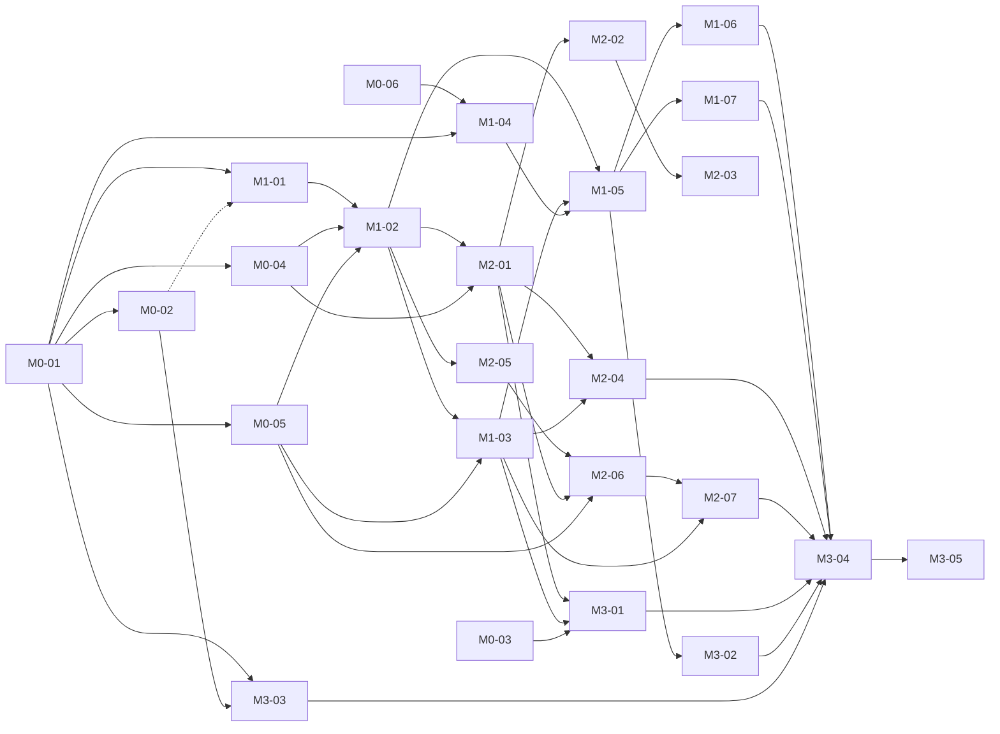
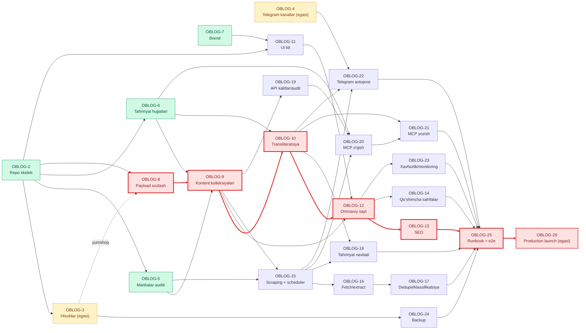

# MVP vazifalari (M0–M3) — Blog Odya

Asos: [TZ.md](TZ.md) v1.2, [PLAN.md](PLAN.md). Vazifalar bog'liqlik tartibida; har biri bitta agent sessiyasiga (≈ 0.5–2 kun) mo'ljallangan. `HUMAN` — egasi bajaradi (hisoblar, sirlar, DNS, Telegram).

Quiel'ga import uchun mashina o'qiydigan nusxa (`tasks.json`) repo'dan tashqarida saqlanadi; ikkalasi bitta manbadan generatsiya qilingan va mazmunan bir xil.

## Xulosa jadvali

| Ref | Quiel | Vazifa | Tur | Prioritet | Rol | Ijrochi | Bog'liq | Baho |
|---|---|---|---|---|---|---|---|---|
| M0-01 | OBLOG-2 | Repozitoriy skeleti: Next.js + Payload 3 + Postgres, lint, CI | CHORE | P1 | developer | AGENT | — | 1.5 kun |
| M0-02 | OBLOG-3 | Hisoblarni sozlash: Supabase, Cloudflare R2/DNS, Vercel (egasi) | INFRA | P1 | sysadmin | HUMAN | M0-01 | 0.5 kun (egasi) |
| M0-03 | OBLOG-4 | Telegram: 2 ta kanal va bot yaratish (egasi) | INFRA | P1 | sysadmin | HUMAN | — | 0.5 soat (egasi) |
| M0-04 | OBLOG-5 | Manbalar auditi va seed ma'lumotlari | CHORE | P1 | developer | AGENT | M0-01 | 1 kun |
| M0-05 | OBLOG-6 | Tahririyat hujjatlari: stil, SEO, mualliflik qoidalari, glossariy, huquqiy matnlar | CHORE | P1 | developer | AGENT | M0-01 | 2 kun |
| M0-06 | OBLOG-7 | Brend: wordmark logo, favicon, OG shablon, palitra | DESIGN | P1 | designer | AGENT | — | 1 kun |
| M1-01 | OBLOG-8 | Payload asosiy sozlash: Supabase, R2, localization, rollar | FEATURE | P1 | developer | AGENT | M0-01, M0-02 (yumshoq) | 1 kun |
| M1-02 | OBLOG-9 | Kontent kolleksiyalari, workflow va seed | FEATURE | P1 | developer | AGENT | M1-01, M0-04, M0-05 | 2 kun |
| M1-03 | OBLOG-10 | Lotin → kirill transliteratsiya va slugify-uz | FEATURE | P1 | developer | AGENT | M1-02, M0-05 | 2 kun |
| M1-04 | OBLOG-11 | UI kit va sahifa maketlari (kodda) | DESIGN | P1 | designer | AGENT | M0-06, M0-01 | 2 kun |
| M1-05 | OBLOG-12 | Ommaviy sayt: layout, bosh sahifa, maqola, kategoriya (lotin + kirill) | FEATURE | P1 | developer | AGENT | M1-02, M1-03, M1-04 | 2 kun |
| M1-06 | OBLOG-13 | SEO: meta, hreflang, JSON-LD, sitemap, news sitemap, robots, RSS, OG rasm | FEATURE | P1 | developer | AGENT | M1-05 | 2 kun |
| M1-07 | OBLOG-14 | Qo'shimcha sahifalar: teg, muallif, statik sahifa, qidiruv, 404 + Lighthouse CI | FEATURE | P2 | developer | AGENT | M1-05 | 1.5 kun |
| M2-01 | OBLOG-15 | Scraping kolleksiyalari, jobs endpoint va pg_cron scheduler, feed.poll | FEATURE | P1 | developer | AGENT | M1-02, M0-04 | 2 kun |
| M2-02 | OBLOG-16 | item.fetch va item.extract: yuklash, robots, Readability, R2 arxiv | FEATURE | P1 | developer | AGENT | M2-01 | 2 kun |
| M2-03 | OBLOG-17 | Dedupe, klassifikatsiya, tozalash va ogohlantirishlar | FEATURE | P1 | developer | AGENT | M2-02 | 1.5 kun |
| M2-04 | OBLOG-18 | Tahririyat navbati: admin custom view va manba paneli | FEATURE | P1 | developer | AGENT | M2-01, M1-03 | 2 kun |
| M2-05 | OBLOG-19 | API kalitlar va audit log | FEATURE | P1 | developer | AGENT | M1-02 | 1 kun |
| M2-06 | OBLOG-20 | MCP server: ulanish, o'qish toollari, ko'rsatmalar (prompts/resources) | FEATURE | P1 | developer | AGENT | M2-05, M2-01, M0-05 | 1.5 kun |
| M2-07 | OBLOG-21 | MCP server: yozish toollari, validatsiya va yo'riqnoma | FEATURE | P1 | developer | AGENT | M2-06, M1-03 | 2 kun |
| M3-01 | OBLOG-22 | Telegram avtopost: lotin va kirill kanallari | FEATURE | P1 | developer | AGENT | M2-01, M1-03, M0-03 | 1.5 kun |
| M3-02 | OBLOG-23 | Xavfsizlik, health, Sentry va analitika | FEATURE | P2 | developer | AGENT | M1-05 | 1.5 kun |
| M3-03 | OBLOG-24 | Kunlik backup (pg_dump → R2) va tiklash runbook'i | INFRA | P1 | sysadmin | AGENT | M0-01, M0-02 | 1 kun |
| M3-04 | OBLOG-25 | Runbook'lar, launch checklist va e2e smoke testlar | CHORE | P1 | sysadmin | AGENT | M1-06, M1-07, M2-04, M2-07, M3-01, M3-02, M3-03 | 1 kun |
| M3-05 | OBLOG-26 | Production'ni ishga tushirish (egasi) | INFRA | P1 | sysadmin | HUMAN | M3-04 | 0.5 kun (egasi) |

**Kritik yo'l:** M1-01 → M1-02 → M1-03 → M1-05 → M1-06 → M3-04 → M3-05 (batafsil — «Bog'liqliklar va bajarish tartibi» bo'limida), parallel: M2-01 → M2-02 → M2-03; M2-05 → M2-06 → M2-07.

---

## Bog'liqliklar va bajarish tartibi

**Holat (2026-09-23):** OBLOG-2, OBLOG-5, OBLOG-6, OBLOG-7 bajarilgan (DONE). Quiel'da bog'liqliklarni MCP orqali o'rnatib bo'lmaydi, shuning uchun bog'liqliklar bo'yicha yagona manba — shu bo'limdagi jadval va graf.

Graf: `A --> B` — A tugamaguncha B boshlanmaydi (qattiq bog'liqlik); `A -.-> B` — yumshoq bog'liqlik: OBLOG-8 lokal Docker (Postgres + MinIO) bilan ishlanadi, Supabase/R2 bilan tekshiruv OBLOG-3 dan keyin. Yashil — bajarilgan, sariq (punktir chegara) — egasi (HUMAN), qizil — kritik yo'l.

**Kritik yo'l:** OBLOG-8 → OBLOG-9 → OBLOG-10 → OBLOG-12 → OBLOG-13 → OBLOG-25 → OBLOG-26 (egasi).

### To'lqinlar (waves)

| Wave | Vazifalar | Parallel bajarish mumkin | Izoh |
|---|---|---|---|
| 0 (bajarilgan) | OBLOG-2, OBLOG-5, OBLOG-6, OBLOG-7 | — | DONE |
| 1 (hozir boshlash mumkin) | OBLOG-3 (egasi), OBLOG-4 (egasi), OBLOG-8, OBLOG-11 | Ha, hammasi | OBLOG-8 lokal Docker bilan; OBLOG-3 kritik yo'lda emas, lekin OBLOG-24 va OBLOG-8 ning Supabase/R2 tekshiruvi uni kutadi |
| 2 | OBLOG-9, OBLOG-24 | Ha | OBLOG-24 — OBLOG-3 dan keyin |
| 3 | OBLOG-10, OBLOG-15, OBLOG-19 | Ha | Uchalasi faqat OBLOG-9 (va wave 0) ga bog'liq |
| 4 | OBLOG-12, OBLOG-16, OBLOG-18, OBLOG-20, OBLOG-22 | Ha | OBLOG-22 uchun OBLOG-4 ham kerak |
| 5 | OBLOG-13, OBLOG-14, OBLOG-17, OBLOG-21, OBLOG-23 | Ha | — |
| 6 | OBLOG-25 | — | Barcha M1–M3 vazifalari tugagach |
| 7 | OBLOG-26 (egasi) | — | Production launch |

### Har bir vazifa: nimaga bog'liq / nimani bloklaydi

| Vazifa | Kutadi (blocked by) | Bloklaydi (blocks) | Rol | Ijrochi |
|---|---|---|---|---|
| OBLOG-2 — Repo skeleti ✅ | — | OBLOG-3, OBLOG-5, OBLOG-6, OBLOG-8, OBLOG-11 | developer | AGENT |
| OBLOG-3 — Hisoblar (egasi) | OBLOG-2 | OBLOG-24 (+ OBLOG-8 yumshoq) | sysadmin | HUMAN |
| OBLOG-4 — Telegram kanallar (egasi) | — | OBLOG-22 | sysadmin | HUMAN |
| OBLOG-5 — Manbalar auditi ✅ | OBLOG-2 | OBLOG-9, OBLOG-15 | developer | AGENT |
| OBLOG-6 — Tahririyat hujjatlari ✅ | OBLOG-2 | OBLOG-9, OBLOG-10, OBLOG-20 | developer | AGENT |
| OBLOG-7 — Brend ✅ | — | OBLOG-11 | designer | AGENT |
| OBLOG-8 — Payload sozlash | OBLOG-2 (+ OBLOG-3 yumshoq) | OBLOG-9 | developer | AGENT |
| OBLOG-9 — Kontent kolleksiyalari | OBLOG-5, OBLOG-6, OBLOG-8 | OBLOG-10, OBLOG-12, OBLOG-15, OBLOG-19 | developer | AGENT |
| OBLOG-10 — Transliteratsiya | OBLOG-6, OBLOG-9 | OBLOG-12, OBLOG-18, OBLOG-21, OBLOG-22 | developer | AGENT |
| OBLOG-11 — UI kit | OBLOG-2, OBLOG-7 | OBLOG-12 | designer | AGENT |
| OBLOG-12 — Ommaviy sayt | OBLOG-9, OBLOG-10, OBLOG-11 | OBLOG-13, OBLOG-14, OBLOG-23 | developer | AGENT |
| OBLOG-13 — SEO | OBLOG-12 | OBLOG-25 | developer | AGENT |
| OBLOG-14 — Qo'shimcha sahifalar | OBLOG-12 | OBLOG-25 | developer | AGENT |
| OBLOG-15 — Scraping + scheduler | OBLOG-5, OBLOG-9 | OBLOG-16, OBLOG-18, OBLOG-20, OBLOG-22 | developer | AGENT |
| OBLOG-16 — Fetch/extract | OBLOG-15 | OBLOG-17 | developer | AGENT |
| OBLOG-17 — Dedupe/klassifikatsiya | OBLOG-16 | OBLOG-25 | developer | AGENT |
| OBLOG-18 — Tahririyat navbati | OBLOG-10, OBLOG-15 | OBLOG-25 | developer | AGENT |
| OBLOG-19 — API kalitlar/audit | OBLOG-9 | OBLOG-20 | developer | AGENT |
| OBLOG-20 — MCP o'qish | OBLOG-6, OBLOG-15, OBLOG-19 | OBLOG-21 | developer | AGENT |
| OBLOG-21 — MCP yozish | OBLOG-10, OBLOG-20 | OBLOG-25 | developer | AGENT |
| OBLOG-22 — Telegram avtopost | OBLOG-4, OBLOG-10, OBLOG-15 | OBLOG-25 | developer | AGENT |
| OBLOG-23 — Xavfsizlik/monitoring | OBLOG-12 | OBLOG-25 | developer | AGENT |
| OBLOG-24 — Backup | OBLOG-3 | OBLOG-25 | sysadmin | AGENT |
| OBLOG-25 — Runbook + e2e | OBLOG-13, OBLOG-14, OBLOG-17, OBLOG-18, OBLOG-21, OBLOG-22, OBLOG-23, OBLOG-24 | OBLOG-26 | sysadmin | AGENT |
| OBLOG-26 — Production launch (egasi) | OBLOG-25 | — | sysadmin | HUMAN |

---

## M0 — Tayyorgarlik

### M0-01 (OBLOG-2) — Repozitoriy skeleti: Next.js + Payload 3 + Postgres, lint, CI

**Tur:** CHORE · **Prioritet:** P1 · **Rol:** developer · **Ijrochi:** AGENT

#### Maqsad
Loyihaning ishlaydigan boshlang'ich kodbazasini yaratish — keyingi barcha vazifalar shu asosda ishlaydi.

Asosiy hujjat: `docs/TZ.md` (v1.2). Ishni boshlashdan oldin TZ'ning ko'rsatilgan bo'limlarini o'qing. Bo'limlar: §3.1 (stek), §3.4 (repo tuzilmasi), §3.7.3 (env ro'yxati), §9.7 (CI).

#### Nima qilish kerak
- pnpm workspaces + Turborepo: `apps/web`, `packages/shared`, `packages/guidelines`.
- `apps/web`: Next.js (App Router, TypeScript strict) + **Payload CMS 3** (rasmiy blank template asosida), `@payloadcms/db-postgres`, `@payloadcms/storage-s3` (hozircha faqat ulanadi), `sharp`. `/admin` ishlaydi, bitta `users` kolleksiyasi (auth).
- Env sxemasi (Zod, `apps/web/src/env.ts`): `DATABASE_URL`, `DATABASE_URL_DIRECT`, `PAYLOAD_SECRET`, `S3_ENDPOINT`, `S3_BUCKET`, `S3_ACCESS_KEY_ID`, `S3_SECRET_ACCESS_KEY`, `S3_REGION`, `S3_FORCE_PATH_STYLE`, `MEDIA_PUBLIC_URL`, `NEXT_PUBLIC_SITE_URL`, `JOBS_MODE`, `JOBS_SECRET`, `TELEGRAM_BOT_TOKEN`, `TELEGRAM_CHANNEL_LATN`, `TELEGRAM_CHANNEL_CYRL`, `TELEGRAM_ALERT_CHAT_ID`, `SENTRY_DSN` (ixtiyoriylari belgilangan). `.env.example` — izohlar bilan.
- `infra/docker-compose.dev.yml`: Postgres 16 + MinIO (+ `media`, `raw`, `backups` bucketlarini yaratuvchi init konteyner). Lokal dev MinIO bilan, production R2 bilan — faqat env farqi.
- ESLint (next + typescript), Prettier, Vitest (bitta namuna test), `pnpm typecheck`.
- GitHub Actions `ci.yml`: PR'da install (pnpm cache) → lint → typecheck → test (Postgres service container) → build. Daqiqalarni tejash: faqat `pull_request` va `main` push.
- Payload migratsiyalari yoqilgan (`payload migrate:create` ishlaydi), birinchi migratsiya commit qilingan.
- `README.md` ga "Lokal ishga tushirish" bo'limi.

**Bog'liq:** yo'q

**Baho:** 1.5 kun

#### Qabul qilish mezonlari

- `pnpm i && docker compose -f infra/docker-compose.dev.yml up -d && pnpm dev` bilan `/admin` ochiladi va birinchi admin yaratiladi.
- `pnpm lint`, `pnpm typecheck`, `pnpm test`, `pnpm build` — xatosiz.
- PR'da CI yashil.
- `.env.example` da TZ §3.7.3 dagi barcha o'zgaruvchilar bor; repo'da hech qanday sir yo'q.
- Lokal MinIO'ga fayl yozish/o'qish sinovi (Vitest yoki skript) o'tadi.

### M0-02 (OBLOG-3) — Hisoblarni sozlash: Supabase, Cloudflare R2/DNS, Vercel (egasi)

**Tur:** INFRA · **Prioritet:** P1 · **Rol:** sysadmin · **Ijrochi:** HUMAN

#### Maqsad
Bepul tariflardagi infratuzilmani tayyorlash va sirlarni Vercel/GitHub'ga kiritish. Buni **egasi** bajaradi (hisoblarga kirish huquqi faqat unda). Asos: `docs/TZ.md` §3.7.1, §3.7.2, §9.7.

#### Qadamlar
**Supabase (Free)**
1. supabase.com → New project: `blog-odya-prod`, region **Central EU (Frankfurt)**, kuchli DB paroli (parol menejerida saqlang).
2. **Staging yo'q** (egasi qarori, OBLOG-31): faqat bitta prod loyiha. Ikkinchi Supabase loyiha, `-staging` bucketlar va `media-staging.odya.uz` yaratilmaydi.
3. Project Settings → Database → Connection string:
   - **Transaction pooler** (port 6543) → bu `DATABASE_URL`;
   - **Session pooler** yoki **Direct** (port 5432) → bu `DATABASE_URL_DIRECT`.
4. Database → Extensions: `pg_cron` va `pg_net` ni yoqing.

**Cloudflare**
5. R2 → Create bucket: `blog-odya-media`, `blog-odya-raw`, `blog-odya-backups`.
6. `blog-odya-media` → Settings → Custom Domain: `media.odya.uz`.
7. `blog-odya-raw` → Lifecycle rule: 30 kundan keyin o'chirish; `blog-odya-backups` → 14 kun.
8. R2 → Manage API tokens → "Object Read & Write" (faqat shu bucketlar) → `Access Key ID`, `Secret Access Key`, endpoint `https://<account_id>.r2.cloudflarestorage.com`.
9. DNS (`odya.uz` zonasi): `blog` → CNAME `cname.vercel-dns.com`, **Proxy status: DNS only (kulrang bulut)**.

**Vercel (Hobby)**
10. Add New → Project → GitHub `Odya-LLC/blog_odya` ni import qiling; Root Directory: `apps/web`; Framework: Next.js.
11. Settings → Domains: `blog.odya.uz`.
12. Settings → Functions: region `fra1` (Frankfurt). Fluid compute yoqilgan bo'lsin.
13. Settings → Environment Variables — `.env.example` dagi barcha qiymatlar **faqat Production** scope'da (prod qiymatlari). `PAYLOAD_SECRET` va `JOBS_SECRET` uchun 32+ belgili tasodifiy satr (`openssl rand -hex 32`). `S3_REGION=auto`, `S3_FORCE_PATH_STYLE=true`, `MEDIA_PUBLIC_URL=https://media.odya.uz`. **Preview** scope'ga DB/R2 sirlarini qo'ymang: preview build ularsiz o'tadi (build DB'ga ulanmaydi), preview'da statik sahifalar va `/styleguide` ishlaydi, `/admin` va `/api` esa env xatosi bilan to'xtaydi — preview prod bazaga tegmaydi. Migratsiya Vercel Preview'da kod darajasida taqiqlangan (`apps/web/src/config/database.ts`).

**GitHub**
14. Settings → Secrets and variables → Actions: `DATABASE_URL_DIRECT_PROD`, `R2_ENDPOINT`, `R2_ACCESS_KEY_ID`, `R2_SECRET_ACCESS_KEY`, `BACKUP_AGE_PUBLIC_KEY` (M3-03 da tushuntiriladi).
15. Settings → Branches: `main` himoyasi (PR majburiy, CI yashil).

**Hisobot**
16. Bajarilgan qadamlarni (sirlarsiz!) va joriy bepul kvotalarni (Vercel Hobby function vaqti, bandwidth; Supabase Free DB/storage; R2 free) vazifaga izoh sifatida yozing — agentlar `docs/runbooks/free-tier.md` ni to'ldiradi.

**Bog'liq:** M0-01

**Baho:** 0.5 kun (egasi)

#### Qabul qilish mezonlari

- Vercel preview va production deploy (build) muvaffaqiyatli, production'da `https://blog.odya.uz/admin` ochiladi.
- Supabase prod'ga Vercel Production'dan ulanish ishlaydi (admin yaratish mumkin).
- `https://media.odya.uz` orqali R2'dagi test fayl ochiladi.
- `pg_cron` va `pg_net` yoqilgan.
- GitHub secrets va `main` himoyasi sozlangan; hech qanday sir repo'da yo'q.

### M0-03 (OBLOG-4) — Telegram: 2 ta kanal va bot yaratish (egasi)

**Tur:** INFRA · **Prioritet:** P1 · **Rol:** sysadmin · **Ijrochi:** HUMAN

#### Maqsad
Avtopost uchun ikkita kanal (lotin va kirill) va bitta bot tayyorlash. Asos: `docs/TZ.md` §7.1.

#### Qadamlar
1. Telegram'da ikkita **ommaviy kanal** yarating:
   - Lotin: nomi "Blog Odya", username masalan `@blogodya`;
   - Kirill: nomi "Блог Одя", username masalan `@blogodya_kr`.
   Tavsifga `https://blog.odya.uz` havolasini qo'ying. (Avatar — M0-06 dagi belgini keyin qo'yasiz.)
2. Har ikkala kanalda: Kanal sozlamalari → Discussion → izohlar uchun guruh ulash (ixtiyoriy, TZ §7: izohlar Telegram'da).
3. @BotFather → `/newbot` → nomi "Blog Odya Bot", username masalan `@blogodya_bot`. **Token** ni saqlang (sir!).
4. Botni **ikkala kanalga admin** qilib qo'shing: faqat "Post messages" va "Edit messages of others" huquqlari.
5. Admin ogohlantirishlari uchun yopiq guruh yarating ("Blog Odya — alerts"), botni qo'shing.
6. Chat ID'larni aniqlang: ommaviy kanallar uchun `@username` ishlatish mumkin; yopiq guruh uchun botga guruhda xabar yozib, `https://api.telegram.org/bot<TOKEN>/getUpdates` dan `chat.id` ni oling (`-100…`).
7. Vercel → Environment Variables (Production): `TELEGRAM_BOT_TOKEN`, `TELEGRAM_CHANNEL_LATN` (`@blogodya`), `TELEGRAM_CHANNEL_CYRL` (`@blogodya_kr`), `TELEGRAM_ALERT_CHAT_ID`. Preview uchun — alohida test kanallar yoki bo'sh qoldiring (avtopost o'chiq).

**Bog'liq:** yo'q

**Baho:** 0.5 soat (egasi)

#### Qabul qilish mezonlari

- Ikkita kanal va ogohlantirish guruhi mavjud, bot ularning barchasida admin (kanallarda — faqat post/edit huquqi).
- Vercel Production env'da 4 ta Telegram o'zgaruvchisi kiritilgan.
- Kanal username'lari va guruh ID vazifa izohida yozilgan (token yozilmaydi).

### M0-04 (OBLOG-5) — Manbalar auditi va seed ma'lumotlari

**Tur:** CHORE · **Prioritet:** P1 · **Rol:** developer · **Ijrochi:** AGENT

#### Maqsad
5 ta tasdiqlangan manbaning texnik va huquqiy tavsifini tayyorlash va seed faylini yaratish.

Asosiy hujjat: `docs/TZ.md` (v1.2). Ishni boshlashdan oldin TZ'ning ko'rsatilgan bo'limlarini o'qing. Bo'limlar: §2.2, §2.3, §3.5, §10.1, §10.4 (kategoriyalar va mapping).

#### Nima qilish kerak
- Har bir manba (The Verge, TechCrunch, Habr — faqat yangiliklar, iXBT, Dexerto esports + HLTV) uchun: haqiqiy RSS URL'larni tekshirish (HTTP 200, to'g'ri XML), feed kategoriyalari, `robots.txt` dagi cheklovlar (bizning User-Agent `OdyaBlogBot/1.0` uchun), ToS'dagi scraping bandi, sahifa server HTML berishi (JS'siz o'qiladimi), taxminiy kunlik hajm.
- Xulosa: `fetchMode` (`rss_only` / `rss_plus_page`), `pollIntervalMin`, `rateLimitSec`, `priority`, kerak bo'lsa CSS selektorlar.
- Har bir feed → bizning 9 kategoriyadan biriga mapping (§10.4), kalit so'z qoidalari (`keywordRules`) — kamida 5 tadan har kategoriya uchun.
- `docs/sources.md` — jadval va izohlar.
- `packages/shared/seed/sources.json` — `sources` kolleksiyasi sxemasiga (§10.1) mos seed.
- `packages/shared/seed/categories.json` — §10.4 dagi 9 kategoriya (lotin/kirill nomlar, slug, tartib, menyu).

**Bog'liq:** M0-01

**Baho:** 1 kun

#### Qabul qilish mezonlari

- `docs/sources.md` da 5 manba bo'yicha: RSS URL'lar (tekshirilgan sana bilan), robots/ToS xulosasi, `fetchMode`, mapping.
- `sources.json` va `categories.json` JSON Schema/Zod bilan validatsiyadan o'tadi (test).
- Har bir RSS URL uchun avtomatik test (yoki skript) — 200 va parse qilinadi (CI'da o'chirilgan, qo'lda ishga tushiriladi).

### M0-05 (OBLOG-6) — Tahririyat hujjatlari: stil, SEO, mualliflik qoidalari, glossariy, huquqiy matnlar

**Tur:** CHORE · **Prioritet:** P1 · **Rol:** developer · **Ijrochi:** AGENT

#### Maqsad
AI agent (MCP orqali) va editor ishlatadigan ko'rsatmalarni, glossariyni, transliteratsiya istisnolarini va huquqiy sahifa matnlarini tayyorlash.

Asosiy hujjat: `docs/TZ.md` (v1.2). Ishni boshlashdan oldin TZ'ning ko'rsatilgan bo'limlarini o'qing. Bo'limlar: §2.3, §3.6, §5.2, §5.3, §8.5, §9.6.

#### Nima qilish kerak
`packages/guidelines/` da (Markdown, MCP resource sifatida beriladi):
- `style.md` — o'zbek adabiy tili, lotin yozuvi, `ʻ` (U+02BB) qoidasi, "siz" murojaati, raqamlar/sana/valyuta (asl + taxminiy so'm), sarlavha uslubi, clickbait taqiqi, "O'zbekiston uchun ahamiyati" bloki qachon qo'shiladi, namunalar (yaxshi/yomon).
- `copyright.md` — faktlar asosida qayta yozish qoidalari, iqtiboslar, atributsiya formati, rasmlar siyosati.
- `seo.md` — uzunlik chegaralari (title ≤ 70, seoTitle ≤ 60, meta 140–160, 400–900 so'z), focus keyword, H2/H3, ichki havolalar 2–5, teglar 3–7, FAQ.
- `output-schema.md` — `save_rewrite`/`set_seo` maydonlari tavsifi.
- `glossary.seed.json` — ≥ 150 atama (EN/RU → UZ, `doNotTranslate`, `doNotTransliterate` belgilari; brendlar ro'yxati).
- `translit-exceptions.seed.json` — ≥ 300 yozuv: oylar (`sentabr → сентябрь`), `ts → ц` holatlari (`sirk → цирк`, `konsert → концерт`), `ye/e`, `yo`, yumshoq/qattiq belgili rus o'zlashmalari, keng tarqalgan IT atamalari.
- `legal/*.md` — 6 ta sahifa matni (Biz haqimizda — Odya LLC, Aloqa, Tahririyat siyosati, Maxfiylik siyosati, Mualliflik huquqi / shikoyatlar (48 soat), Foydalanish shartlari) — M1-02 seed'da `pages` ga yuklanadi.

**Bog'liq:** M0-01

**Baho:** 2 kun

#### Qabul qilish mezonlari

- Barcha fayllar mavjud, Markdown to'g'ri, JSON'lar Zod sxemasi bilan validatsiyadan o'tadi (unit test).
- Glossariy ≥ 150, translit istisnolari ≥ 300 yozuv, dublikatsiz.
- Qoidalar TZ §2.3, §5.2 bilan zid emas; har bir faylda versiya va sana.

### M0-06 (OBLOG-7) — Brend: wordmark logo, favicon, OG shablon, palitra

**Tur:** DESIGN · **Prioritet:** P1 · **Rol:** designer · **Ijrochi:** AGENT

#### Maqsad
"Blog Odya" uchun oddiy, tez tayyorlanadigan brend to'plami (logo yo'q — matnli wordmark).

Asosiy hujjat: `docs/TZ.md` (v1.2). Ishni boshlashdan oldin TZ'ning ko'rsatilgan bo'limlarini o'qing. Bo'lim: §12.1, §12.2.

#### Nima qilish kerak
- Wordmark "Blog **Odya**" (va kirill "Блог **Одя**") — SVG, light/dark variantlar; shrift — Inter yoki Manrope (OFL litsenziya).
- Kvadrat belgi (monogramma) — SVG + PNG 512/192/180/32/16, `favicon.ico`, Telegram kanal avatari (640×640) lotin va kirill uchun.
- Palitra: neytral asos + **2 ta aksent varianti** (masalan, ko'k `#2563EB` va binafsha `#7C3AED`) — egasi tanlashi uchun `design/brand/README.md` da yonma-yon ko'rsatish; tanlov bo'lmaguncha 1-variant ishlatiladi. Kategoriya ranglari (9 ta, §10.4).
- OG rasm shabloni (1200×630) tavsifi va namunasi (lotin va kirill sarlavha bilan) — `next/og` da amalga oshirish uchun o'lchamlar, shrift o'lchamlari, joylashuv.
- Hammasi `design/brand/` da; Tailwind uchun rang tokenlari `design/brand/tokens.json`.

**Bog'liq:** yo'q

**Baho:** 1 kun

#### Qabul qilish mezonlari

- `design/brand/` da SVG wordmark (lotin, kirill, light, dark), favicon to'plami, Telegram avatarlari, `tokens.json`, OG namunasi (PNG) mavjud.
- Kontrast WCAG AA (matn/fon) — README'da tekshiruv natijasi.
- `ʻ` va kirill harflari tanlangan shriftda to'g'ri ko'rinadi (namuna rasmda).

---

## M1 — CMS, sayt va kirill

### M1-01 (OBLOG-8) — Payload asosiy sozlash: Supabase, R2, localization, rollar

**Tur:** FEATURE · **Prioritet:** P1 · **Rol:** developer · **Ijrochi:** AGENT

#### Maqsad
Payload'ni production muhitiga mos sozlash.

Asosiy hujjat: `docs/TZ.md` (v1.2). Ishni boshlashdan oldin TZ'ning ko'rsatilgan bo'limlarini o'qing. Bo'limlar: §3.1, §3.6 (saqlash), §3.7.1, §3.7.2 (Supabase Free, R2), §4.2, §10.7, §10.11.

#### Nima qilish kerak
- `db-postgres`: runtime — `DATABASE_URL` (Supavisor transaction pooler, `pool.max` 2–3, prepared statements o'chirilgan agar kerak bo'lsa); migratsiyalar — `DATABASE_URL_DIRECT`.
- `storage-s3` → R2 (`media` kolleksiyasi), **`clientUploads: true`**, `MEDIA_PUBLIC_URL` orqali ommaviy URL.
- `media` kolleksiyasi: `imageSizes` (thumb 320, card 640, hero 1280, og 1200×630, full 1920; WebP), `focalPoint`, `alt` (L, majburiy), `caption` (L), `credit`, `license`, `licenseUrl`.
- `localization`: `uz-Latn` (default), `uz-Cyrl`; `fallback: true`.
- `users`: `role` (`admin`, `editor`), `name`, `enableAPIKey`; access helper'lar `isAdmin`, `isAdminOrEditor`; faqat admin foydalanuvchi yaratadi.
- Admin panel tili: o'zbekcha (custom translations, kamida asosiy UI).

**Bog'liq:** M0-01; M0-02 (OBLOG-3) — yumshoq: lokal Docker (Postgres + MinIO) bilan ishlanadi, Supabase/R2 bilan tekshiruv OBLOG-3 dan keyin

**Baho:** 1 kun

#### Qabul qilish mezonlari

- 5 MB dan katta rasm Vercel preview'da R2'ga yuklanadi va `media.odya.uz` orqali ochiladi; variantlar WebP.
- Lokal (MinIO) va preview (R2) — faqat env farqi.
- Editor foydalanuvchi yaratolmaydi, admin yaratadi (integration test).
- Migratsiya direct URL bilan ishlaydi; runtime pooler orqali.

### M1-02 (OBLOG-9) — Kontent kolleksiyalari, workflow va seed

**Tur:** FEATURE · **Prioritet:** P1 · **Rol:** developer · **Ijrochi:** AGENT

#### Maqsad
Blog kontent modelini TZ bo'yicha yaratish.

Asosiy hujjat: `docs/TZ.md` (v1.2). Ishni boshlashdan oldin TZ'ning ko'rsatilgan bo'limlarini o'qing. Bo'limlar: §4 (statuslar, rollar), §7 (funksiyalar), §10.3–10.6, §10.10, §10.13, §10.15.

#### Nima qilish kerak
- Kolleksiyalar: `authors`, `categories` (nested-docs plagini), `tags`, `pages`, `posts`, `redirects` (plugin-redirects); globals: `site-settings`, `header`, `footer`, `telegram-settings`, `scraping-settings`. Lokalizatsiya qilinadigan maydonlar — **(L)** belgisi bo'yicha.
- `posts`: drafts + autosave (interval 10 s), `maxPerDoc: 10`, scheduled publish, `workflowStatus` va o'tish qoidalari (§4.1 diagramma) — `beforeChange` hook'da validatsiya; `assignee`/`lockedUntil`; `sources[]`; `telegramSkip`, `telegram[]`; `rewrittenBy`, `aiDisclosure`; `readingTime` avtomatik.
- Access (§4.2): admin — hammasi; editor — publish ham qila oladi, `sources`/`users` boshqara olmaydi, o'chira olmaydi.
- `@payloadcms/plugin-seo` — `meta` (L) guruhi.
- Seed skripti (`pnpm seed`): 9 kategoriya (M0-04), 6 huquqiy sahifa (M0-05 `legal/`), 1 muallif, 3 demo post, `site-settings` ("Blog Odya" / "Блог Одя").
- `payload-types.ts` generatsiya, migratsiya.

**Bog'liq:** M1-01, M0-04, M0-05

**Baho:** 2 kun

#### Qabul qilish mezonlari

- Admin'da barcha kolleksiyalar va globals TZ §10 bo'yicha; lokalizatsiya maydonlarida locale almashtirgich ishlaydi.
- Ruxsat etilmagan status o'tishlari (masalan, `draft → published`, `scraped → review`) rad etiladi — TZ §4.1 diagrammasi bo'yicha testlar; rol × amal matritsasi integration testlari (§4.2).
- `pnpm seed` toza DB'da ishlaydi va takror ishga tushirilganda dublikat yaratmaydi.

### M1-03 (OBLOG-10) — Lotin → kirill transliteratsiya va slugify-uz

**Tur:** FEATURE · **Prioritet:** P1 · **Rol:** developer · **Ijrochi:** AGENT

#### Maqsad
Kirill versiyasini avtomatik yaratish va o'zbekcha slug'lar.

Asosiy hujjat: `docs/TZ.md` (v1.2). Ishni boshlashdan oldin TZ'ning ko'rsatilgan bo'limlarini o'qing. Bo'limlar: §3.6 (to'liq), §8.1 (slugify), §10.9.

#### Nima qilish kerak
- `packages/shared/translit.ts`: `lotin-kirill` (npm, MIT) adapteri; avval `translit-exceptions` (DB kolleksiya + seed M0-05) va glossariy `doNotTransliterate` qo'llanadi; apostrof variantlari (`ʻ ' ‘ ’`) normallashtiriladi; URL, email, `@mention`, kod saqlanadi.
- Lexical JSON transliteratsiyasi: faqat `text` tugunlari; `code` bloklar, havola URL'lari o'zgarmaydi.
- `translit-exceptions` va `glossary` kolleksiyalari (§10.8–10.9) + seed.
- `beforeChange` hook (posts, pages, categories, tags, authors, media alt/caption, globals): `uz-Latn` o'zgarsa → `uz-Cyrl` generatsiya, `cyrlLocked` maydonlari bundan mustasno; qulflangan va lotin o'zgargan bo'lsa `cyrlStale = true`.
- Editor kirill maydonini qo'lda o'zgartirsa — avtomatik `cyrlLocked[field] = true`.
- Admin UI: "Kirillni qayta generatsiya qilish" tugmasi (qulfni olib, qayta yaratadi).
- `packages/shared/slugify-uz.ts` (§8.1), `kr` zaxiralangan; slug o'zgarsa 301 redirect avtomatik.

**Bog'liq:** M1-02, M0-05

**Baho:** 2 kun

#### Qabul qilish mezonlari

- ≥ 60 unit test (oylar, `ts/ц`, `ye/е`, `yo/ё`, `oʻ/gʻ`, barcha apostrof variantlari, brendlar, URL, kod bloklari) va ≥ 30 slugify testi — yashil.
- Post saqlanganda kirill avtomatik to'ladi; qulflangan maydon qayta yozilmaydi (integration test).
- Slug o'zgarganda eski URL 301 bilan yangisiga o'tadi.

### M1-04 (OBLOG-11) — UI kit va sahifa maketlari (kodda)

**Tur:** DESIGN · **Prioritet:** P1 · **Rol:** designer · **Ijrochi:** AGENT

#### Maqsad
Sayt uchun komponentlar to'plami va maketlar — developer to'g'ridan-to'g'ri ishlatadi.

Asosiy hujjat: `docs/TZ.md` (v1.2). Ishni boshlashdan oldin TZ'ning ko'rsatilgan bo'limlarini o'qing. Bo'lim: §12 (to'liq), §8.4 (performance).

#### Nima qilish kerak
- Tailwind tema (`design/brand/tokens.json` dan), light/dark (class strategiya, FOUC'siz), `next/font` (Inter/Manrope, lotin + kirill subset).
- shadcn/ui asosida komponentlar `apps/web/src/components/ui` va `…/blog`: Header (wordmark, kategoriya menyu, qidiruv, Lotin/Кирилл almashtirgich, tema tugmasi, Telegram tugmasi), Footer, PostCard (katta/o'rta/kichik/ro'yxat), HeroBlock, LatestFeed, CategoryBlock, ArticleHeader, ArticleBody tipografiyasi (prose), SourceBox ("Manba: …"), TagList, ShareButtons (Telegram birinchi), RelatedPosts, TelegramCTA, Pagination, EmptyState, 404, rasm yo'q placeholder, reklama joyi placeholder (yashirin).
- `/styleguide` sahifa (faqat dev/preview, `noindex`) — barcha komponentlar, ikkala yozuv va ikkala tema.
- Mobil (360 px) va desktop (1280 px) holatlari.

**Bog'liq:** M0-06, M0-01

**Baho:** 2 kun

#### Qabul qilish mezonlari

- `/styleguide` preview'da ochiladi, barcha komponentlar lotin/kirill va light/dark'da ko'rinadi.
- Kontrast WCAG AA, klaviatura bilan navigatsiya ishlaydi.
- Komponentlar RSC'ga mos (client komponentlar faqat interaktiv qismlar uchun: almashtirgich, tema, menyu).

### M1-05 (OBLOG-12) — Ommaviy sayt: layout, bosh sahifa, maqola, kategoriya (lotin + kirill)

**Tur:** FEATURE · **Prioritet:** P1 · **Rol:** developer · **Ijrochi:** AGENT

#### Maqsad
Saytning asosiy sahifalarini ikkala yozuvda chiqarish.

Asosiy hujjat: `docs/TZ.md` (v1.2). Ishni boshlashdan oldin TZ'ning ko'rsatilgan bo'limlarini o'qing. Bo'limlar: §3.6 (URL, almashtirgich), §8.1 (URL sxemasi), §8.4, §12.3.

#### Nima qilish kerak
- App Router: lotin — ildizda, kirill — `/kr` segmenti; bitta komponentlar to'plami, `locale` parametr bilan (`uz-Latn` / `uz-Cyrl`); `<html lang>` mos.
- Sahifalar: `/` va `/kr`, `/[category]`, `/[category]/page/[n]`, `/[category]/[slug]` (+ `/kr/...`).
- Ma'lumot Payload Local API orqali (RSC), ISR: `revalidate` + publish/unpublish'da `revalidateTag` (post, kategoriya, bosh sahifa).
- Lexical → JSX renderer: paragraf, sarlavhalar, ro'yxat, havola, iqtibos, rasm (media), kod, jadval, embed (YouTube, X, Telegram).
- Maqola: SourceBox (`sources[]`), AI shaffoflik izohi (`aiDisclosure`), o'qish vaqti, o'xshash postlar (teg/kategoriya kesishmasi).
- Almashtirgich: joriy sahifaning boshqa yozuvdagi URL'iga o'tadi, tanlovni cookie'da saqlaydi; `Accept-Language` bo'yicha redirect **yo'q**.
- `next/image` custom loader — `media` variantlaridan mosini tanlaydi (`media.odya.uz`), Vercel Image Optimization ishlatilmaydi.

**Bog'liq:** M1-02, M1-03, M1-04

**Baho:** 2 kun

#### Qabul qilish mezonlari

- Demo postlar lotin va kirill URL'larida ochiladi, almashtirgich to'g'ri sahifaga o'tadi.
- Postni publish qilgandan so'ng ≤ 10 s ichida sayt yangilanadi.
- Rasmlar `media.odya.uz` dan WebP bilan yuklanadi (Network'da Vercel `/_next/image` so'rovlari yo'q).
- Playwright smoke testi: bosh sahifa → kategoriya → maqola (ikkala yozuv).

### M1-06 (OBLOG-13) — SEO: meta, hreflang, JSON-LD, sitemap, news sitemap, robots, RSS, OG rasm

**Tur:** FEATURE · **Prioritet:** P1 · **Rol:** developer · **Ijrochi:** AGENT

#### Maqsad
Har bir sahifani qidiruv tizimlari uchun to'liq tayyorlash.

Asosiy hujjat: `docs/TZ.md` (v1.2). Ishni boshlashdan oldin TZ'ning ko'rsatilgan bo'limlarini o'qing. Bo'limlar: §8.1–8.3, §3.6 (SEO qatori).

#### Nima qilish kerak
- `generateMetadata` barcha sahifalarda: title (`{seoTitle} — Blog Odya` / `— Блог Одя`), description, canonical (o'ziga), `alternates.languages` (`uz-Latn`, `uz-Cyrl`, `x-default` → lotin), OG (`og:locale`), Twitter Card.
- `next/og` bilan avtomatik OG rasm (muqova bo'lmasa) — M0-06 shabloni, ikkala yozuv.
- JSON-LD: `NewsArticle` (`inLanguage`, `isBasedOn`), `BreadcrumbList`, `Organization`, `WebSite` + `SearchAction`, `Person`, `FAQPage`.
- `sitemap.xml` index (oylik post sitemap'lar, kategoriyalar, sahifalar) — `xhtml:link` alternates; `news-sitemap.xml` (48 soat, ikkala yozuv); `robots.ts` (`/admin`, `/api`, `/search`, `/kr/search` yopiq; preview'da hammasi yopiq).
- `/rss.xml`, `/kr/rss.xml`, `/[category]/rss.xml`.
- Teg sahifasida < 3 post — `noindex` (M1-07 bilan kelishilgan helper).

**Bog'liq:** M1-05

**Baho:** 2 kun

#### Qabul qilish mezonlari

- Google Rich Results Test — namuna maqola (lotin va kirill) xatosiz (natija skrinshoti PR'da).
- Sitemap va news sitemap validatorlardan o'tadi; hreflang juftliklari o'zaro to'g'ri (unit test).
- Preview muhitida `robots.txt` — `Disallow: /` va `noindex`.

### M1-07 (OBLOG-14) — Qo'shimcha sahifalar: teg, muallif, statik sahifa, qidiruv, 404 + Lighthouse CI

**Tur:** FEATURE · **Prioritet:** P2 · **Rol:** developer · **Ijrochi:** AGENT

#### Maqsad
Qolgan ommaviy sahifalar va performance nazorati.

Asosiy hujjat: `docs/TZ.md` (v1.2). Ishni boshlashdan oldin TZ'ning ko'rsatilgan bo'limlarini o'qing. Bo'limlar: §7, §8.1, §8.4.

#### Nima qilish kerak
- `/tag/[slug]`, `/author/[slug]`, `/[page]` (statik sahifalar, `kr` va kategoriya slug'lari bilan to'qnashuv tekshiruvi), `/search?q=` (Postgres FTS: `tsvector` lotin+kirill, `pg_trgm`, `noindex`), `not-found` — barchasi `/kr` versiyasi bilan.
- Header/footer menyulari `header`/`footer` globals'dan.
- Lighthouse CI (GitHub Actions, PR'da, preview URL'ga): mobil Performance ≥ 90, SEO = 100, Accessibility ≥ 90; JS budget ≤ 150 KB gzip.

**Bog'liq:** M1-05

**Baho:** 1.5 kun

#### Qabul qilish mezonlari

- Barcha sahifalar ikkala yozuvda ishlaydi; qidiruv lotin va kirill so'rovlar bilan natija beradi, `oʻ`/`o'` variantlari topiladi.
- Lighthouse CI PR'da yashil (bosh sahifa, maqola, kategoriya).

---

## M2 — Scraping va MCP

### M2-01 (OBLOG-15) — Scraping kolleksiyalari, jobs endpoint va pg_cron scheduler, feed.poll

**Tur:** FEATURE · **Prioritet:** P1 · **Rol:** developer · **Ijrochi:** AGENT

#### Maqsad
Har 10 daqiqada manbalardan yangi yangiliklarni topuvchi fon tizimi.

Asosiy hujjat: `docs/TZ.md` (v1.2). Ishni boshlashdan oldin TZ'ning ko'rsatilgan bo'limlarini o'qing. Bo'limlar: §3.5 (to'liq), §3.7.1, §3.7.2 (Vercel Hobby cron cheklovi), §10.1, §10.2, §10.14.

#### Nima qilish kerak
- Kolleksiyalar: `sources`, `scraped-items` (DB'da faqat `extractedText`; HTML — R2), `scraping-settings` global; seed `sources.json` (M0-04).
- Payload Jobs: tasks va workflow ro'yxati; `POST /api/jobs/run` — `Authorization: Bearer JOBS_SECRET`, `payload.jobs.run({ limit })`, ichki deadline ≈ 40 s, natija JSON (bajarilgan/qolgan). `JOBS_MODE=endpoint|autorun`.
- `infra/supabase/cron.sql`: `pg_cron` + `pg_net` — har 10 daqiqada endpoint'ni chaqirish (URL va secret Supabase Vault'da yoki SQL parametrida; yo'riqnoma faylda). Zaxira: `.github/workflows/jobs-fallback.yml` (`workflow_dispatch` + ixtiyoriy `schedule` har 30 daqiqa, default o'chiq).
- Task `feed.poll`: `rss-parser`, URL normallashtirish (utm, fragment, trailing slash), `urlHash` (SHA-256) bilan dedupe, `ETag`/`Last-Modified`, `pollIntervalMin` hisobga olinadi; har yangi URL uchun `scrapeItem` workflow navbatga.

**Bog'liq:** M1-02, M0-04

**Baho:** 2 kun

#### Qabul qilish mezonlari

- Lokal: `curl -X POST -H "Authorization: Bearer …" /api/jobs/run` 5 manbadan yangi `scraped-items` yaratadi; qayta chaqiruvda dublikat yo'q (test).
- Noto'g'ri secret — 401.
- `cron.sql` prod Supabase'da ishga tushirilgan va har 10 daqiqada chaqiruvlar Vercel loglarida ko'rinadi (PR'da skrinshot yoki log).
- Bitta chaqiruv 60 s dan oshmaydi (deadline testi).

### M2-02 (OBLOG-16) — item.fetch va item.extract: yuklash, robots, Readability, R2 arxiv

**Tur:** FEATURE · **Prioritet:** P1 · **Rol:** developer · **Ijrochi:** AGENT

#### Maqsad
Har bir yangi URL'dan to'liq matn va metadatani olish.

Asosiy hujjat: `docs/TZ.md` (v1.2). Ishni boshlashdan oldin TZ'ning ko'rsatilgan bo'limlarini o'qing. Bo'limlar: §2.3 (texnik muvofiqlik), §3.5, §3.7.2 (hajm), §10.2.

#### Nima qilish kerak
- `item.fetch`: `fetch`/`undici`, User-Agent `OdyaBlogBot/1.0 (+https://blog.odya.uz/bot)`, timeout 15 s, `robots-parser` (robots.txt 24 soat keshlanadi), domen bo'yicha rate limit (`sources.rateLimitSec`, oxirgi so'rov vaqti Postgres'da), `fetchMode = rss_only` bo'lsa sahifa yuklanmaydi (RSS matni ishlatiladi).
- `item.extract`: `@mozilla/readability` + `linkedom`/`jsdom`, `sources.selectors` fallback; sarlavha, muallif, sana, teglar, `og:image`, rasm URL'lari, so'zlar soni; `extractedText` (Markdown, `turndown`); raw va clean HTML → gzip → R2 `raw/{source}/{yyyy-mm}/{id}.html.gz` va `.clean.html.gz`.
- Har task ≤ 30 s; 3 retry (backoff); xato `scraped-items.error` va `status=error` ga.
- Fixture testlar: har manbadan 2–3 ta saqlangan HTML sahifa (`__fixtures__`) — ajratish natijasi snapshot.
- `/bot` sahifasi (bot haqida qisqa ma'lumot, aloqa).

**Bog'liq:** M2-01

**Baho:** 2 kun

#### Qabul qilish mezonlari

- Har bir manba fixture'larida sarlavha, sana va matn to'g'ri ajratiladi (snapshot testlar yashil).
- robots.txt'da taqiqlangan URL yuklanmaydi (test).
- R2'da gzip fayllar paydo bo'ladi; DB'da HTML saqlanmaydi.

### M2-03 (OBLOG-17) — Dedupe, klassifikatsiya, tozalash va ogohlantirishlar

**Tur:** FEATURE · **Prioritet:** P1 · **Rol:** developer · **Ijrochi:** AGENT

#### Maqsad
Dublikatlarni birlashtirish, LLM'siz kategoriya/score va bepul kvotani saqlash.

Asosiy hujjat: `docs/TZ.md` (v1.2). Ishni boshlashdan oldin TZ'ning ko'rsatilgan bo'limlarini o'qing. Bo'limlar: §3.5 (task 4, 5, 7), §3.7.2 (hajm hisobi va triggerlar), §10.2.

#### Nima qilish kerak
- `item.dedupe`: SimHash (64-bit) `contentHash`, Hamming ≤ 3 → umumiy `clusterId`.
- `item.classify`: feed mapping (`sources.feeds[].mapsTo`) + `keywordRules` → `suggestedCategory`; `score` 0–100 = manba `priority` + yangilik (soat) + klaster hajmi + kalit so'z boost.
- `maintenance.cleanup` (kuniga 1 marta): qoralamaga aylanmagan 30 kundan eski itemlarning `extractedText` ini o'chirish, `rejected` 30 kun → o'chirish, published postlarning 30 kundan eski versiyalarini 3 tagacha kesish, DB hajmi (`pg_database_size`) va R2 hajmini o'lchab `scraping-settings.stats` ga yozish.
- Ogohlantirishlar (Telegram `TELEGRAM_ALERT_CHAT_ID`, token bo'lmasa — faqat log): manba 3 marta ketma-ket xato, 24 soatda muvaffaqiyat < 80%, DB ≥ 70% (350 MB), R2 ≥ 8 GB.

**Bog'liq:** M2-02

**Baho:** 1.5 kun

#### Qabul qilish mezonlari

- Bir yangilik ikki manbada — bitta `clusterId` (test).
- 30 ta real namunada `suggestedCategory` ≥ 80% to'g'ri (natija jadvali PR'da).
- Cleanup job test DB'da kutilgan yozuvlarni o'chiradi/kesadi (integration test); ogohlantirish chegaralari unit testlar bilan.

### M2-04 (OBLOG-18) — Tahririyat navbati: admin custom view va manba paneli

**Tur:** FEATURE · **Prioritet:** P1 · **Rol:** developer · **Ijrochi:** AGENT

#### Maqsad
Editor bugungi yangiliklarni tez ko'rib, qoralamaga aylantirishi va qo'lda qayta yozishi.

Asosiy hujjat: `docs/TZ.md` (v1.2). Ishni boshlashdan oldin TZ'ning ko'rsatilgan bo'limlarini o'qing. Bo'limlar: §4.1, §6.1, §5.1 (qo'lda yo'l).

#### Nima qilish kerak
- Payload admin custom view "Yangiliklar navbati": bugungi/tanlangan sana `scraped-items`, score bo'yicha saralash, manba/kategoriya/holat filtri, klaster guruhlash; tugmalar "Qoralamaga olish" (post yaratadi: `sources[]` atributsiya, kategoriya, `workflowStatus=draft`, o'zini `assignee`), "Rad etish" (sabab).
- Post tahrirlash sahifasida yon panel: asl manba (sarlavha, matn, havola, sana) — read-only.
- "Review" ro'yxati — `workflowStatus = review` postlar (agent yuborganlar belgisi bilan, `notesForEditor` ko'rinadi).
- Dashboard widget: bugun scraped / draft / review / published soni.

**Bog'liq:** M2-01, M1-03

**Baho:** 2 kun

#### Qabul qilish mezonlari

- Editor navbatdan element tanlab, qoralama yaratib, qo'lda yozib, publish qilishi ≤ 10 daqiqa (qo'lda sinov, PR'da qisqa video yoki skrinshotlar).
- Rad etilgan element navbatdan yo'qoladi; qoralamaga olingan element `drafted` holatiga o'tadi.

### M2-05 (OBLOG-19) — API kalitlar va audit log

**Tur:** FEATURE · **Prioritet:** P1 · **Rol:** developer · **Ijrochi:** AGENT

#### Maqsad
MCP va REST uchun xavfsiz kirish va barcha o'zgarishlar izi.

Asosiy hujjat: `docs/TZ.md` (v1.2). Ishni boshlashdan oldin TZ'ning ko'rsatilgan bo'limlarini o'qing. Bo'limlar: §6.2, §6.4, §4.2, §9.2, §10.12.

#### Nima qilish kerak
- `users.enableAPIKey`: har bir foydalanuvchi o'z kalitini yaratadi/bekor qiladi (admin — hammaniki); REST'da `Authorization: users API-Key <key>`; MCP uchun Bearer helper (M2-06 ishlatadi) — kalit orqali foydalanuvchini aniqlash.
- `audit-logs` kolleksiyasi (faqat yaratish, hech kim tahrir/o'chira olmaydi): `afterChange`/`afterDelete` hooklar barcha kontent kolleksiyalarida; `channel` (admin/rest/graphql/mcp/job) `req.context` orqali; `diff` (o'zgargan maydonlar), `locale`, `ip`, `userAgent`.
- Oddiy rate limit (kalit bo'yicha, 60/min) — Postgres yoki in-memory (Vercel instansiya darajasida) — hujjatlangan cheklov bilan.

**Bog'liq:** M1-02

**Baho:** 1 kun

#### Qabul qilish mezonlari

- Kalit bilan REST so'rov ishlaydi, bekor qilingan kalit — 401 (test).
- Post o'zgarishi audit logda to'g'ri `channel` bilan paydo bo'ladi; audit yozuvini o'zgartirish/o'chirish rad etiladi (test).

### M2-06 (OBLOG-20) — MCP server: ulanish, o'qish toollari, ko'rsatmalar (prompts/resources)

**Tur:** FEATURE · **Prioritet:** P1 · **Rol:** developer · **Ijrochi:** AGENT

#### Maqsad
Claude Code / Claude Desktop agenti tahririyat ma'lumotlarini o'qiy olishi.

Asosiy hujjat: `docs/TZ.md` (v1.2). Ishni boshlashdan oldin TZ'ning ko'rsatilgan bo'limlarini o'qing. Bo'limlar: §5.1, §5.2, §6.3 (to'liq), §9.2 (prompt injection).

#### Nima qilish kerak
- Route `apps/web/src/app/api/mcp/[transport]/route.ts`: `mcp-handler` + `@modelcontextprotocol/sdk`, Streamable HTTP, stateless; `Authorization: Bearer <API kalit>` → foydalanuvchi; Payload Local API `overrideAccess: false`, `req.context.channel = 'mcp'`.
- Toollar (o'qish): `get_guidelines`, `get_glossary`, `list_sources`, `list_scraped`, `get_source` (matn `<untrusted_source>` teglari ichida + klasterdagi boshqa itemlar), `list_drafts`, `search_posts`, `list_categories`, `list_tags`.
- Prompts: `rewrite_article(scrapedItemId)`, `daily_batch(count, minScore)`; Resources: `odya://guidelines/style|seo|copyright`, `odya://glossary` — `packages/guidelines` dan.
- Zod input sxemalari, sahifalash, tushunarli xato matnlari (o'zbekcha).
- `/api/mcp` health (autentifikatsiyasiz `GET` → 200 minimal javob).

**Bog'liq:** M2-05, M2-01, M0-05

**Baho:** 1.5 kun

#### Qabul qilish mezonlari

- Claude Code'da `claude mcp add --transport http odya <preview-url>/api/mcp --header "Authorization: Bearer …"` ulanadi, toollar ro'yxati ko'rinadi, `list_scraped` va `get_source` real ma'lumot qaytaradi.
- Kalitsiz so'rov — 401; MCP client bilan integration testlar (SDK client) yashil.

### M2-07 (OBLOG-21) — MCP server: yozish toollari, validatsiya va yo'riqnoma

**Tur:** FEATURE · **Prioritet:** P1 · **Rol:** developer · **Ijrochi:** AGENT

#### Maqsad
Agent qoralamani olib, qayta yozib, SEO'ni to'ldirib, review'ga yubora olishi (publish — yo'q).

Asosiy hujjat: `docs/TZ.md` (v1.2). Ishni boshlashdan oldin TZ'ning ko'rsatilgan bo'limlarini o'qing. Bo'limlar: §5.1, §5.3, §6.3, §4.1, §4.2.

#### Nima qilish kerak
- Toollar: `create_draft(scrapedItemIds[])`, `claim_draft` (lock 2 soat, `in_progress`), `release_draft`, `save_rewrite` (lotin: title, excerpt, body Markdown → Lexical, category, tags — yangi teg yaratish mumkin), `set_seo` (seoTitle, metaDescription, focusKeyword, faq[], coverAlt), `preview_cyrillic`, `submit_for_review(notesForEditor)`.
- Markdown → Lexical konvertor (sarlavhalar, ro'yxatlar, havolalar, iqtiboslar, kod, jadval), sanitizatsiya (XSS).
- Server tekshiruvlari §5.3: lotin maydonlarda kirill yo'q, uzunliklar, slug unikalligi, `sources` bo'sh emas, manba bilan juda yuqori n-gram o'xshashlik — ogohlantirish. Javobda `ok`, `errors[]`, `warnings[]`, `seoScore`.
- Faqat `draft`/`in_progress` holatdagi va agent egasiga biriktirilgan postlarni o'zgartirish mumkin; **publish tool yo'q**. `rewrittenBy = ai_agent`, `aiDisclosure = true`.
- `docs/mcp.md`: API kalit olish, Claude Code va Claude Desktop (`mcp-remote`) ulanishi, namuna so'rovlar ("Bugungi score ≥ 60 bo'lgan 5 ta yangilikni qayta yozib review'ga yubor"), cheklovlar.

**Bog'liq:** M2-06, M1-03

**Baho:** 2 kun

#### Qabul qilish mezonlari

- Claude Code bilan to'liq zanjir `list_scraped → create_draft → claim_draft → get_source → save_rewrite → set_seo → submit_for_review` preview'da ishlaydi; post review navbatida, kirill avtomatik to'lgan, audit'da `channel=mcp`.
- Validatsiya xatolari agentga tushunarli qaytadi (testlar); `published` postni MCP orqali o'zgartirish rad etiladi.
- Markdown → Lexical: 20 ta namuna testlari va XSS testlari yashil.

---

## M3 — Telegram va Launch

### M3-01 (OBLOG-22) — Telegram avtopost: lotin va kirill kanallari

**Tur:** FEATURE · **Prioritet:** P1 · **Rol:** developer · **Ijrochi:** AGENT

#### Maqsad
Chop etilgan har bir post avtomatik ravishda ikkita kanalga — tegishli yozuvda — yuborilishi.

Asosiy hujjat: `docs/TZ.md` (v1.2). Ishni boshlashdan oldin TZ'ning ko'rsatilgan bo'limlarini o'qing. Bo'limlar: §7.1 (to'liq), §10.3 (`telegram[]`), §10.15 (`telegram-settings`).

#### Nima qilish kerak
- `telegram-settings` global: `channels[] { script, chatId, isEnabled }` (bo'sh bo'lsa env `TELEGRAM_CHANNEL_LATN/CYRL`), shablon, heshteglar soni, `alertChatId`.
- `posts` `afterChange` (published bo'lganda, scheduled publish ham) → har faol kanal uchun `telegram.post` job; imkon bo'lsa darhol bajarish (`after()`/`waitUntil`), aks holda keyingi scheduler tsiklida.
- grammY: `sendPhoto` (muqova `og` yoki `hero` varianti URL'i) + HTML caption ≤ 1024 (sarlavha qalin, lid, havola — lotin `/…`, kirill `/kr/…`, UTM `utm_campaign=latn|cyrl`, 2–3 heshteg); rasm yo'q — `sendMessage`. Escape va qisqartirish.
- Idempotentlik: (post, script) bo'yicha `telegram[]` da `messageId` bor bo'lsa — qayta yuborilmaydi; sarlavha/lid o'zgarsa — `editMessageCaption`/`editMessageText`; `telegramSkip`.
- Xatolar: 429 `retry_after`, 3 retry, keyin `alertChatId` ga xabar; admin'da post yon panelida Telegram holati.

**Bog'liq:** M2-01, M1-03, M0-03

**Baho:** 1.5 kun

#### Qabul qilish mezonlari

- Test kanallarida: publish'dan keyin lotin kanalda lotin, kirill kanalda kirill post (rasm, sarlavha, lid, to'g'ri havola) — ≤ 2 daqiqa (darhol yuborish) yoki keyingi tsiklda.
- Qayta saqlash/publish — dublikat xabar yo'q; sarlavha tahriri kanaldagi xabarni yangilaydi (integration test, grammY mock bilan + qo'lda e2e).
- Token/kanal sozlanmagan bo'lsa — xato emas, ogohlantirish logi.

### M3-02 (OBLOG-23) — Xavfsizlik, health, Sentry va analitika

**Tur:** FEATURE · **Prioritet:** P2 · **Rol:** developer · **Ijrochi:** AGENT

#### Maqsad
Productionga chiqishdan oldingi xavfsizlik va kuzatuv.

Asosiy hujjat: `docs/TZ.md` (v1.2). Ishni boshlashdan oldin TZ'ning ko'rsatilgan bo'limlarini o'qing. Bo'limlar: §9.2, §9.4, §9.5, §3.7.2 (Supabase pauza).

#### Nima qilish kerak
- Security headers (`next.config`): CSP (analitika va Telegram embed domenlari bilan), HSTS, X-Frame-Options (admin'dan tashqari), Referrer-Policy, Permissions-Policy.
- Payload `maxLoginAttempts: 5`, `lockTime: 15 min`; kuchli parol qoidasi.
- `GET /api/health` — DB'ga yengil so'rov (`select 1`) + versiya; UptimeRobot uchun (Supabase faolligini ham saqlaydi).
- Sentry (`@sentry/nextjs`): server, client, jobs; `SENTRY_DSN` bo'lmasa o'chiq; source maps.
- GA4 va Yandex Metrica (`next/script`, `lazyOnload`), ID'lar `site-settings` dan; oddiy cookie banner (rozilikdan keyin yuklanadi); `/kr` bo'yicha segmentatsiya uchun `content_group`.
- `pnpm audit --prod` CI'da (high/critical — xato).

**Bog'liq:** M1-05

**Baho:** 1.5 kun

#### Qabul qilish mezonlari

- securityheaders.com — kamida A (preview URL).
- `/api/health` 200 qaytaradi va DB ishlamasa 503.
- Sun'iy xato Sentry'da ko'rinadi (DSN berilganda).
- Cookie rozilikisiz analitika skriptlari yuklanmaydi.

### M3-03 (OBLOG-24) — Kunlik backup (pg_dump → R2) va tiklash runbook'i

**Tur:** INFRA · **Prioritet:** P1 · **Rol:** sysadmin · **Ijrochi:** AGENT

#### Maqsad
Supabase Free'da backup yo'qligini o'z backup'imiz bilan qoplash.

Asosiy hujjat: `docs/TZ.md` (v1.2). Ishni boshlashdan oldin TZ'ning ko'rsatilgan bo'limlarini o'qing. Bo'limlar: §9.3, §3.7.2.

#### Nima qilish kerak
- `.github/workflows/backup.yml`: `schedule` kuniga 1 marta (masalan 02:30 UTC) + `workflow_dispatch`; `pg_dump` (Postgres client versiyasi Supabase bilan mos) `DATABASE_URL_DIRECT_PROD` bilan → `gzip` → `age` (ochiq kalit `BACKUP_AGE_PUBLIC_KEY`) → R2 `blog-odya-backups/db/{yyyy-mm-dd}.sql.gz.age` (aws-cli yoki rclone, R2 endpoint). Muvaffaqiyatsizlikda — Telegram alert.
- `docs/runbooks/restore.md`: `age` yopiq kalitini egasi qanday saqlaydi (offline), backup'ni yuklab olish, shifrni ochish, lokal Postgres'ga tiklash (staging yo'q), tekshirish.
- Tiklash sinovi: oxirgi backup lokal Postgres'ga (Docker) tiklanadi — natija runbook'da.

**Bog'liq:** M0-01, M0-02

**Baho:** 1 kun

#### Qabul qilish mezonlari

- Workflow qo'lda ishga tushirilganda R2'da shifrlangan fayl paydo bo'ladi (≤ 5 daqiqa, GitHub daqiqalari tejamkor).
- Runbook bo'yicha tiklash sinovi muvaffaqiyatli, sana va natija yozilgan.
- Hech qanday sir loglarda ko'rinmaydi.

### M3-04 (OBLOG-25) — Runbook'lar, launch checklist va e2e smoke testlar

**Tur:** CHORE · **Prioritet:** P1 · **Rol:** sysadmin · **Ijrochi:** AGENT

#### Maqsad
Productionga chiqishni tekshiriladigan qilish va keyingi yo'lni hujjatlashtirish.

Asosiy hujjat: `docs/TZ.md` (v1.2). Ishni boshlashdan oldin TZ'ning ko'rsatilgan bo'limlarini o'qing. Bo'limlar: §3.7 (to'liq), §11 (MVP qabul mezonlari).

#### Nima qilish kerak
- `docs/runbooks/free-tier.md`: joriy bepul kvotalar (M0-02 hisobotidan), qayerda kuzatiladi, §3.7.2 triggerlari va har trigger uchun harakat.
- `docs/runbooks/migrate-to-contabo.md`: §3.7.3 qadamlari batafsil (env farqlari, `pg_dump/restore`, `rclone`, DNS, rollback), lokal Docker'da quruq sinov.
- `docs/runbooks/scheduler.md`: `cron.sql` o'rnatish, tekshirish (`cron.job_run_details`), zaxira GitHub workflow'ni yoqish.
- `docs/launch-checklist.md`: TZ §11 ning har bir bandi + tekshirish usuli.
- Playwright e2e smoke (preview URL): bosh sahifa (lotin/kirill), maqola, kategoriya, qidiruv, sitemap, `robots.txt`, `/api/health`.

**Bog'liq:** M1-06, M1-07, M2-04, M2-07, M3-01, M3-02, M3-03

**Baho:** 1 kun

#### Qabul qilish mezonlari

- 4 ta hujjat mavjud va TZ bilan mos; checklist'da har bir band uchun aniq tekshirish qadami.
- e2e smoke preview'da yashil.

### M3-05 (OBLOG-26) — Production'ni ishga tushirish (egasi)

**Tur:** INFRA · **Prioritet:** P1 · **Rol:** sysadmin · **Ijrochi:** HUMAN

#### Maqsad
Saytni ommaga ochish. Buni **egasi** bajaradi (hisoblar unda). Asos: `docs/launch-checklist.md`, `docs/runbooks/scheduler.md`, `docs/TZ.md` §3.7, §8.3, §9.4, §9.5.

#### Qadamlar
1. `main` ni production'ga deploy qiling (Vercel avtomatik), production migratsiyalari bajarilganini tekshiring.
2. `https://blog.odya.uz/admin` → birinchi **admin** foydalanuvchini yarating; editorlarni admin panelda qo'shing (Users → Create, role = editor).
3. Supabase **prod** → SQL Editor: `infra/supabase/cron.sql` ni `docs/runbooks/scheduler.md` bo'yicha ishga tushiring (URL `https://blog.odya.uz/api/jobs/run`, `JOBS_SECRET`). 30 daqiqadan keyin navbatda yangi yangiliklar borligini tekshiring.
4. UptimeRobot (bepul): monitorlar `https://blog.odya.uz`, `https://blog.odya.uz/api/health`, `https://blog.odya.uz/api/mcp` — har 5 daqiqa, ogohlantirish email'ingizga.
5. Sentry (bepul) loyiha yarating → DSN ni Vercel env `SENTRY_DSN` ga qo'shing, qayta deploy.
6. GA4 va Yandex Metrica hisoblari → ID'larni admin → Site settings ga kiriting.
7. Google Search Console va Yandex Webmaster: `blog.odya.uz` ni tasdiqlang (DNS TXT Cloudflare'da), `sitemap.xml` va `news-sitemap.xml` ni yuboring. Google News Publisher Center'da nashrni qo'shing.
8. Telegram kanallariga M0-06 dagi avatarlarni qo'ying.
9. `docs/launch-checklist.md` ni oxirigacha bajaring; 30+ post chop etilgandan keyin saytni e'lon qiling.
10. Vercel Preview deploy'lari `noindex` ekanini tekshiring.

**Bog'liq:** M3-04

**Baho:** 0.5 kun (egasi)

#### Qabul qilish mezonlari

- `https://blog.odya.uz` ochiq, launch checklist'ning barcha bandlari ✅.
- Scheduler har 10 daqiqada ishlayapti, UptimeRobot yashil, backup workflow oxirgi 24 soatda muvaffaqiyatli.
- Sitemap'lar GSC va Yandex Webmaster'da qabul qilingan.
