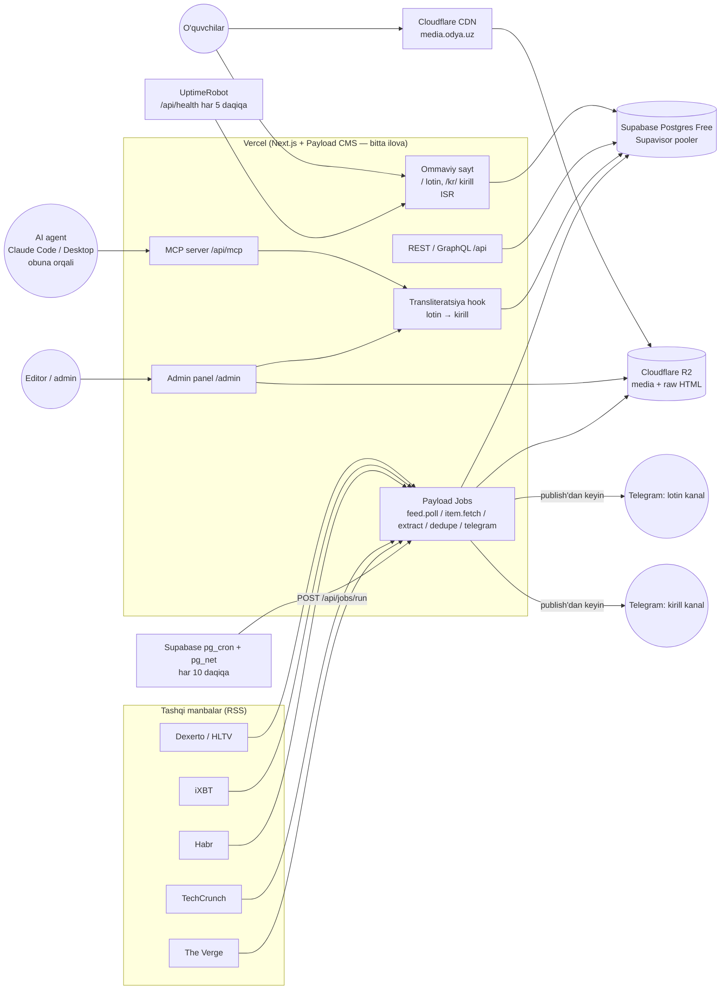
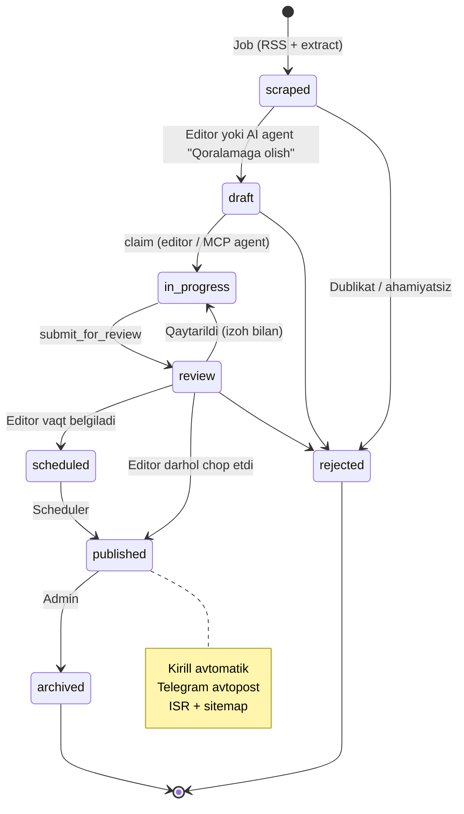
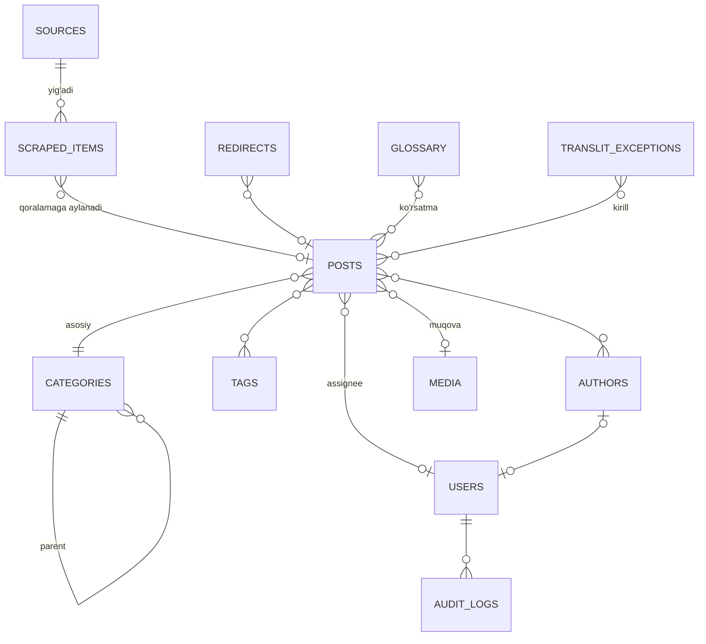

# Texnik vazifa (TZ) — OBLOG "Yangiliklar O'zbek tilida"

| Parametr | Qiymat |
|---|---|
| Loyiha kodi | OBLOG |
| Domen | **blog.odya.uz** |
| Brend | **Blog Odya** |
| Hujjat versiyasi | 1.2 |
| Sana | 2026-09-23 |
| Holat | **Tasdiqlangan — ishlab chiqishga tayyor.** Barcha savollarga javob olingan ([QUESTIONS.md](QUESTIONS.md)) |
| Bog'liq hujjatlar | [PLAN.md](PLAN.md), [TASKS.md](TASKS.md), [QUESTIONS.md](QUESTIONS.md) |

> v1.2 dan boshlab hujjatda ochiq taxminlar yo'q: egasi aniq javob bermagan masalalar bo'yicha standart qarorlar qabul qilingan va [QUESTIONS.md](QUESTIONS.md) da qayd etilgan.

### O'zgarishlar tarixi
| Versiya | Sana | O'zgarishlar |
|---|---|---|
| 1.0 | 2026-09-23 | Birinchi qoralama |
| 1.1 | 2026-09-23 | Egasining javoblari: domen `blog.odya.uz`; faktlar asosida qayta yozish modeli tasdiqlandi; manbalar va stek tasdiqlandi; rollar soddalashtirildi (admin + editor, ikkalasida publish huquqi bor); **lotin + kirill** versiyalari (avtomatik transliteratsiya, `/kr/` URL'lar); **boshlang'ich hosting: Vercel + Supabase Postgres + Cloudflare R2**, keyin Contabo'ga ko'chish yo'li; **server tomonidagi LLM pipeline olib tashlandi** — AI qayta yozish MCP orqali (Claude obunasidagi agent) yoki editor tomonidan qo'lda; **MCP server va Telegram avtopost MVP'ga o'tkazildi**; Redis/BullMQ o'rniga MVP'da Payload Jobs Queue (Postgres) |
| 1.2 | 2026-09-23 | Egasining 2-javoblari: **bepul tariflar** (Vercel Hobby, Supabase Free, Cloudflare R2 free) — 3.7 qayta yozildi, bepul limitlar va yangilash triggerlari; scheduler — Supabase `pg_cron` + `pg_net` (Vercel Hobby cron kuniga 1 marta); DB hajmini tejash (raw/extracted HTML — R2'da, qisqa TTL, versiyalar cheklovi); brend **"Blog Odya"** (logo yo'q — dizayn vazifasi); **ikkita Telegram kanal** (lotin va kirill); kirill avtomatikasiga ishoniladi (majburiy tekshiruv yo'q); kunlik kvota yo'q; editorlar va obuna — admin panel orqali, taxmin shart emas; **kategoriyalar ro'yxati** (10.4) va **dizayn yo'nalishi** (12-bo'lim); barcha `[Taxmin]` belgilari olib tashlandi |

---

## 1. Maqsad va kontekst

### 1.1. Biznes maqsadi
O'zbek tilida (**lotin va kirill yozuvlarida**) AI, IT, texnologiya va kibersport yo'nalishlari bo'yicha **O'zbekistondagi 1-raqamli onlayn nashrni** yaratish. Kontent jahon yetakchi IT-nashrlaridan har kuni avtomatik yig'iladi, AI agent (MCP orqali) yoki editor tomonidan o'zbek tiliga **qayta yoziladi (rewrite)**, editor tekshiradi va SEO-optimallashtirilgan holda **Blog Odya** (`blog.odya.uz`) da chop etadi hamda ikkita Telegram kanalga (lotin va kirill) yuboradi.

### 1.2. Auditoriya
| Segment | Tavsif | Kanal |
|---|---|---|
| IT mutaxassislar, dasturchilar | 20–35 yosh, texnik yangiliklarga qiziqadi | Google qidiruv, Telegram |
| Talabalar va o'quvchilar | IT o'rganayotganlar, AI-ga qiziquvchilar | Telegram, Instagram, Google |
| Geymerlar / kibersport muxlislari | 14–30 yosh, CS2, Dota 2, PUBG Mobile, MLBB | Telegram, YouTube, Google |
| Biznes va qaror qabul qiluvchilar | AI/texnologiya trendlari | Google, Telegram, LinkedIn |
| Kirill yozuvini afzal ko'radiganlar | Asosan 35+ yosh, viloyatlar | Google, Yandex, Telegram |

Asosiy qurilma — **mobil (taxminan 80%+)**, internet tezligi har xil → ishlash tezligi (performance) kritik.

### 1.3. KPI (maqsadli ko'rsatkichlar)
| Ko'rsatkich | 3 oy | 6 oy | 12 oy |
|---|---|---|---|
| Kunlik chop etilgan maqolalar (kvota emas, mo'ljal) | 5–10 | 10–20 | 20–30 |
| Google'da indekslangan sahifalar (lotin + kirill) | 600+ | 3 000+ | 10 000+ |
| Oylik organik tashriflar (GSC clicks) | 5 000 | 30 000 | 150 000 |
| Top-10 o'rindagi kalit so'zlar (uz) | 50 | 300 | 1 000+ |
| Telegram obunachilari (ikkala kanal jami) | 1 000 | 5 000 | 20 000 |
| Core Web Vitals (mobil, "Good" URL ulushi) | ≥ 90% | ≥ 90% | ≥ 95% |
| Scraping → qoralama muvaffaqiyati | ≥ 95% | ≥ 97% | ≥ 98% |
| Qoralamadan publishgacha o'rtacha vaqt | < 24 soat | < 8 soat | < 4 soat |

Raqamlar dastlabki mo'ljal; 1-oy oxirida haqiqiy ma'lumot asosida qayta ko'rib chiqiladi. **Qat'iy kunlik kvota yo'q** (egasi qarori): manbalardan qoralamaga tushgan va editor/agent qayta yozishga ulgurgan barcha materiallar chop etiladi.

### 1.4. Scope (loyiha doirasida)
- Manbalardan yangiliklarni har kuni avtomatik yig'ish (RSS + to'liq matn), to'liq manba nusxasini bazada saqlash.
- Tahririyat jarayoni: qoralama → qayta yozish → tekshiruv → rejalashtirish → chop etish.
- **MCP server** — Claude obunasidagi AI agent (Claude Code / Claude Desktop) qoralamani olib, qayta yozib, SEO maydonlarini to'ldirib, tekshiruvga yuboradi.
- **Lotin (asosiy) + kirill (avtomatik transliteratsiya, qo'lda tuzatish imkoniyati)** versiyalari.
- WordPress'ga o'xshash CMS funksiyalari (postlar, kategoriyalar, teglar, mualliflar, media, menyular, revisiyalar va h.k.).
- Ommaviy sayt (Next.js) — tez, SEO-optimallashtirilgan, mobil-birinchi.
- Admin panel, REST API (API kalitlar bilan).
- Media: S3-mos saqlash (MVP — Cloudflare R2; keyin MinIO ixtiyoriy) + rasm optimizatsiyasi + CDN.
- **Ikkita Telegram kanalga avtomatik post** — lotin va kirill (MVP).
- Monitoring, backup, CI/CD.

### 1.5. Out-of-scope (MVP'da qilinmaydi)
- Server tomonidagi avtomatik LLM qayta yozish (Anthropic API kaliti bilan) — **ixtiyoriy kelajak funksiyasi**, flag ortida (M6).
- Mobil ilova, foydalanuvchi ro'yxatdan o'tishi, paywall.
- Rus tili versiyasi (arxitektura Payload localization tufayli tayyor bo'ladi).
- O'zimizning reklama tarmog'i (faqat reklama joylari uchun joy qoldiriladi).
- Izohlar — keyingi bosqichda qaror qilinadi.
- JavaScript talab qiladigan sahifalarni scraping qilish (Playwright) — faqat Contabo serveriga ko'chgandan keyin.

---

## 2. Manbalarni tanlash

### 2.1. Tanlash mezonlari
1. Yo'nalish bo'yicha qamrov (AI, IT/gadjetlar, kibersport).
2. Obro' va tezkorlik.
3. RSS mavjudligi (qonuniy va texnik jihatdan eng xavfsiz kirish yo'li).
4. Kunlik hajm (5 manbadan kuniga ~100–200 ta material — saralash uchun yetarli).
5. Paywall yo'qligi.

### 2.2. Tasdiqlangan manbalar (egasi tasdiqladi)
| # | Manba | Til | Yo'nalish | RSS | Kunlik hajm (taxm.) | Kontent turi | Izoh |
|---|---|---|---|---|---|---|---|
| 1 | **The Verge** (theverge.com) | EN | IT, gadjetlar, AI, platformalar | Bor (`/rss/index.xml`, bo'limlar bo'yicha) | 30–50 | Yangilik, sharh, review | Keng auditoriya uchun eng yaxshi "general tech" |
| 2 | **TechCrunch** (techcrunch.com) | EN | AI, startaplar, investitsiya, big tech | Bor (`/feed/`, kategoriya feedlari, masalan `/category/artificial-intelligence/feed/`) | 30–40 | Yangilik, tahlil | AI va startap yangiliklari uchun eng tezkor |
| 3 | **Habr** (habr.com/ru) | RU | Dasturlash, AI, IT-industriya | Bor (`/ru/rss/news/`, hub feedlari) | 20–40 (faqat yangiliklar) | Yangiliklar | **Faqat "Новости" bo'limi** — mualliflik maqolalari (UGC) olinmaydi |
| 4 | **iXBT / 3DNews** (ixbt.com/news, 3dnews.ru) | RU | Hardware, gadjetlar, o'yinlar | Bor (`ixbt.com/export/news.rss`, `3dnews.ru/news/rss/`) | 50–80 | Qisqa yangiliklar | MVP'da iXBT; 3DNews — zaxira |
| 5 | **Dexerto (Esports) / HLTV** | EN | Kibersport (CS2, Valorant, Dota 2, MLBB) | Dexerto — bor (`/feed/`, esports bo'limi); HLTV — bor (`hltv.org/rss/news`) | 20–40 | Turnir natijalari, transferlar | HLTV faqat CS2; Dexerto kengroq |

RSS URL'lari M0 dagi manbalar auditida (PLAN M0-02) aniq tekshiriladi.

**Zaxira / kelajakdagi manbalar:** Ars Technica, Wired, VentureBeat AI, Tom's Hardware, Esports Insider, Cybersport.ru, OpenAI / Anthropic / Google AI rasmiy bloglari (press-relizlar — eng xavfsiz manba).

> Manbalar **konfiguratsiya orqali** qo'shiladi/o'chiriladi (admin paneldagi `sources` kolleksiyasi) — kod o'zgartirmasdan.

### 2.3. Mualliflik huquqi — tasdiqlangan model

> **Qaror (egasi, 1.1):** (a) **faktlar asosida qayta yozish + atributsiya**. So'zma-so'z tarjima qilinmaydi.

Asos:
1. **Faktlar mualliflik huquqi bilan himoyalanmaydi, matn esa himoyalanadi.** So'zma-so'z tarjima — "hosila asar", uni ruxsatsiz chop etish Bern konvensiyasi, O'zbekistonning "Mualliflik huquqi va turdosh huquqlar to'g'risida"gi qonuni, AQSh DMCA bo'yicha taqiqlangan.
2. **Google** "scaled content abuse" siyosati bo'yicha qo'shimcha qiymatsiz nusxa/tarjima kontentni jazolaydi.

Majburiy qoidalar (stil qo'llanma va MCP ko'rsatmalariga kiritiladi):
- Manbadagi **faktlar** olinadi, **o'z matnimiz** yoziladi: jumla tuzilishi, tartib, sarlavha o'zgaradi.
- Har bir postda ochiq atributsiya: "Manba: [The Verge](havola)" (bosiladigan havola). Bir nechta manba bo'lsa — hammasi.
- O'z konteksti: "O'zbekiston uchun bu nimani anglatadi", narxlar so'mda, mahalliy analogiyalar.
- Iqtiboslar — qisqa (1–2 jumla), qo'shtirnoqda, manba bilan.
- **Manba rasmlari ommaga chiqarilmaydi.** Faqat: press-kit / rasmiy press-reliz rasmlari, Unsplash/Pexels, Wikimedia Commons (litsenziyaga qarab), o'zimiz yaratgan yoki AI generatsiya qilgan rasmlar, skrinshotlar (fair use doirasida). Manba rasmlari faqat ichki arxivda saqlanadi.
- `robots.txt` va ToS hurmat qilinadi; RSS birinchi navbatda; o'z User-Agent'imiz (`OdyaBlogBot/1.0 (+https://blog.odya.uz/bot)`), 1 so'rov / 5–10 soniya / domen; paywall yoki login orqali kirish **taqiqlanadi**.
- To'liq manba — faqat ichki arxiv (ommaga ochiq emas). ToS'da scraping taqiqlangan manbalar uchun faqat RSS matni saqlanadi (`fetchMode = rss_only`).
- "Mualliflik huquqi / shikoyatlar" sahifasi; takedown so'rovlari 48 soat ichida ko'rib chiqiladi.
- Uzoq muddatda — manbalar bilan hamkorlik / litsenziya (taklif, QUESTIONS.md).

---

## 3. Arxitektura

### 3.1. Texnologik stek (egasi tasdiqladi)

| Qatlam | Tanlov | Izoh |
|---|---|---|
| Frontend (ommaviy sayt) | **Next.js (App Router)**, React Server Components, TypeScript, Tailwind CSS, shadcn/ui | ISR, `next/image`, `generateMetadata`, sitemap — ichida |
| CMS / Backend | **Payload CMS 3.x** (Next.js ichida, bitta ilova) | 3.2 bo'limda asoslangan |
| Ma'lumotlar bazasi | **PostgreSQL** — MVP: **Supabase Free** (managed); keyin: Supabase Pro yoki Contabo'dagi o'z Postgres'imiz | `@payloadcms/db-postgres` |
| Ko'p yozuvlilik | **Payload localization**: `uz-Latn` (asosiy) va `uz-Cyrl` (avtomatik) | Keyinchalik `ru` — yana bitta locale |
| Transliteratsiya | **`lotin-kirill`** (npm, MIT, tayyor kutubxona) + o'z istisnolar lug'atimiz (adapter) | 3.6 bo'lim |
| Media saqlash | S3-mos: MVP — **Cloudflare R2 (bepul kvota)**, egress bepul; keyin — R2 (pullik) yoki MinIO | `@payloadcms/storage-s3`, faqat env orqali almashadi |
| Rasm qayta ishlash | **sharp** (Payload ichida, yuklashda variantlar) | `thumb`, `card`, `hero`, `og`, `full` — WebP |
| CDN | Sayt — Vercel Edge Network (MVP); media — **Cloudflare** (`media.odya.uz` → R2) | 3.7 bo'lim |
| Fon vazifalar (scraping) | MVP: **Payload Jobs Queue** (Postgres'da saqlanadi) + **Supabase `pg_cron` + `pg_net`** (himoyalangan `/api/jobs/run` ni chaqiradi); keyin: xuddi shu job'lar Contabo'da doimiy worker jarayonida (`autoRun`) | Redis/BullMQ MVP'da kerak emas |
| Scraping kutubxonalari | `rss-parser`, `undici`/`fetch`, `@mozilla/readability` + `jsdom` (yoki `linkedom`), `robots-parser`; Playwright — faqat Contabo bosqichida | |
| Qidiruv | MVP: **PostgreSQL FTS** (`tsvector`, `pg_trgm`); keyin: Meilisearch | |
| AI qayta yozish | **MCP server** (`mcp-handler` + `@modelcontextprotocol/sdk`, Next.js route `/api/mcp`) → Claude obunasidagi agent (Claude Code / Claude Desktop) | Server tomonida LLM chaqiruvi yo'q |
| Telegram | **grammY** (Bot API), bitta bot — ikkala kanalda (lotin, kirill) admin | MVP |
| Monorepo | pnpm workspaces + Turborepo: `apps/web`, `packages/shared`; `apps/worker` — Contabo bosqichida | |
| Hosting | MVP: **Vercel Hobby** + Supabase Free + Cloudflare (DNS, R2) — **$0/oy**; keyin: Vercel Pro yoki **Contabo** VPS, Docker Compose + Traefik | 3.7 va 9.7 bo'limlar |
| CI/CD | GitHub Actions (lint, typecheck, test) + Vercel Git integratsiyasi (preview har bir PR uchun) | |
| Monitoring | Sentry (bepul tarif), UptimeRobot (bepul tarif), Vercel Web Analytics (Hobby kvotasi doirasida) | |
| Analitika | GA4 + Yandex Metrica + Google Search Console + Yandex Webmaster | |

### 3.2. Nima uchun Payload CMS 3 (taqqoslash)

| Mezon | **Payload 3** | Strapi 5 | Directus 11 | Headless WordPress |
|---|---|---|---|---|
| Next.js bilan integratsiya | **Bir ilova ichida** (`/admin`, API, MCP, sayt — bitta Vercel deploy) | Alohida servis | Alohida servis | Alohida PHP servis |
| Til | TypeScript (bitta stek) | TS/JS | TS (konfiguratsiya UI orqali) | PHP |
| Local API (HTTP'siz) | **Bor** — RSC, MCP, job'lar uchun qulay | Yo'q | Yo'q | Yo'q |
| Drafts, versiyalar, autosave, scheduled publish | **Ichida bor** | Qisman | Bor | Bor |
| Localization (lotin/kirill/rus) | **Field darajasida, ichida bor** | Plagin (i18n) | Bor | WPML/Polylang (pullik) |
| Fon vazifalar (jobs queue) | **Ichida bor** (Postgres, cron bilan ishlaydi) | Yo'q | Flows | WP-Cron |
| S3/R2/MinIO | Rasmiy `@payloadcms/storage-s3` (+ `clientUploads`) | Plagin | Ichida | Pullik plagin |
| SEO, redirects, nested docs, search | Rasmiy plaginlar | Qisman | Qo'lda | Yoast/RankMath |
| Vercel'da ishlashi | **Rasmiy qo'llab-quvvatlanadi** | Yo'q (doimiy server kerak) | Yo'q | Yo'q |
| Litsenziya | MIT | MIT (CE) | BSL | GPL |

**Qaror:** **Payload CMS 3** — bitta ilova, bitta til, Vercel'da ham, Docker'da ham bir xil ishlaydi; localization, jobs queue, drafts/versions ichida bor; MIT.

### 3.3. Umumiy arxitektura (MVP: Vercel Hobby + Supabase Free + R2)



### 3.4. Repozitoriy tuzilmasi

```
blog_odya/
├── apps/
│   └── web/            # Next.js + Payload CMS: sayt, admin, REST/GraphQL, MCP (/api/mcp), jobs
├── packages/
│   ├── shared/         # slugify-uz, translit (lotin-kirill adapteri + istisnolar), umumiy tiplar
│   └── guidelines/     # stil qo'llanma, glossariy, SEO qoidalari (MCP prompt/resource sifatida beriladi)
├── infra/
│   ├── supabase/cron.sql        # pg_cron + pg_net scheduler
│   ├── docker-compose.dev.yml   # lokal: Postgres + MinIO (S3 o'rnini bosuvchi)
│   └── contabo/                 # keyingi bosqich: docker-compose.yml, traefik, backup
├── docs/               # TZ.md, PLAN.md, TASKS.md, QUESTIONS.md, adr/, runbooks/
└── .github/workflows/
```

Contabo bosqichida `apps/worker` qo'shiladi — u `apps/web` dagi xuddi shu Payload config va job'larni doimiy jarayonda ishga tushiradi (kod takrorlanmaydi).

### 3.5. Scraper / Parser (Payload Jobs)

Har bir bosqich — alohida Payload **task**, `scrapeItem` **workflow** ularni ketma-ket bog'laydi. Har bir task qisqa (≤ 30 s) — Vercel function limitlariga mos.

| # | Task | Vazifa | Trigger |
|---|---|---|---|
| 1 | `feed.poll` | Faol `source` RSS'ini o'qish, yangi URL'larni topish, `urlHash` bilan dedupe, `ETag`/`Last-Modified` | Scheduler (har 10 daqiqada) — `pollIntervalMin` o'tgan manbalar |
| 2 | `item.fetch` | Sahifani yuklash (oddiy HTTP), `robots.txt` tekshiruvi, domen bo'yicha rate limit (Postgres'da oxirgi so'rov vaqti) | yangi URL |
| 3 | `item.extract` | Readability bilan matnni ajratish; sarlavha, muallif, sana, teglar, `og:*`; raw HTML va tozalangan HTML (gzip) → R2 `raw/` (TTL 30 kun); DB'ga faqat `extractedText` (Markdown); manba rasmlari yuklanmaydi — faqat URL saqlanadi | fetch'dan keyin |
| 4 | `item.dedupe` | `contentHash` (SimHash), Hamming ≤ 3 → bitta `clusterId` | extract'dan keyin |
| 5 | `item.classify` | **LLM'siz**: manba/feed kategoriyasi → bizning kategoriya (mapping jadvali) + kalit so'z qoidalari; `score` = manba prioriteti + yangilik + klaster hajmi | dedupe'dan keyin |
| 6 | `post.onPublish` | ISR `revalidateTag`, sitemap, Telegram post (ikkala kanal) | post published bo'lganda |
| 7 | `maintenance.cleanup` | Eskirgan `scraped-items` matnini tozalash, eski versiyalarni kesish, DB hajmini o'lchash (> 70% → ogohlantirish) | kuniga 1 marta |

**Scheduler:** Vercel Hobby'da cron kuniga ko'pi bilan 1 marta ishlaydi — shuning uchun asosiy scheduler **Supabase `pg_cron` + `pg_net`**: har 10 daqiqada `POST https://blog.odya.uz/api/jobs/run` (`Authorization: Bearer <JOBS_SECRET>`). Endpoint `payload.jobs.run({ limit })` ni chaqiradi — kichik batch (masalan, 5–10 job), vaqt limitidan oldin to'xtaydi (ichki `deadline` ≈ 40 s). Zaxira: GitHub Actions `schedule` (har 30 daqiqa; yopiq repo'da bepul daqiqalar cheklangan) va Vercel Hobby kunlik cron. Scheduler tanlovi env/infra darajasida — kod bir xil.

**Saqlanadigan "to'liq manba" (`scraped-items`):** DB'da — asl URL, canonical, sarlavha, muallif, sana, til, teglar, `og:image`, `extractedText` (Markdown), manba rasmlari URL'lari, HTTP metadata; R2'da — `raw/{source}/{yyyy-mm}/{id}.html.gz` va `.clean.html.gz` (30 kun).

**Ishonchlilik:** har bir task — 3 marta retry (backoff); manba uchun maxsus CSS-selektorlar (`sources.selectors`); 3 marta ketma-ket xato yoki parse muvaffaqiyati < 80% → Telegram admin guruhiga ogohlantirish.

**Saqlash muddati (bepul kvotaga moslab):** R2 dagi raw/clean HTML — 30 kun (R2 lifecycle rule); qoralamaga aylanmagan `scraped-items` ning `extractedText` i — 30 kundan keyin o'chiriladi (metadata qoladi — dublikat tekshiruvi uchun); qoralamaga aylanganlari — doimiy; `rejected` — 30 kundan keyin to'liq o'chiriladi.

**Cheklov (MVP):** JavaScript bilan chiziladigan sahifalar qo'llab-quvvatlanmaydi (Playwright Vercel'da ishlamaydi). Tanlangan 5 manba server HTML beradi, shuning uchun MVP'ga ta'sir qilmaydi.

### 3.6. Lotin va kirill yozuvlari

**Tamoyil:** **lotin — asosiy manba (source of truth)**, kirill — avtomatik hosila, editor qo'lda tuzatishi mumkin.

| Jihat | Qaror |
|---|---|
| Saqlash | Payload `localization`: `locales: ['uz-Latn', 'uz-Cyrl']`, `defaultLocale: 'uz-Latn'`. Lokalizatsiya qilinadigan maydonlar: `title`, `excerpt`, `content`, `meta.*`, `faq`, kategoriya/teg `name`, `description`, sahifalar, menyu yorliqlari |
| Avtomatik transliteratsiya | `beforeChange` hook: `uz-Latn` saqlanganda → `uz-Cyrl` maydonlari generatsiya qilinadi. Lexical JSON'da **faqat matn tugunlari** o'giriladi; kod bloklari, URL'lar, `@mention`, brend/mahsulot nomlari (glossariydagi `doNotTransliterate`) — o'zgarmaydi |
| Kutubxona | **`lotin-kirill`** (npm, MIT, 2021-yildan, URL'larni o'tkazib yuboradi). `packages/shared/translit.ts` adapteri orqali ishlatiladi — kerak bo'lsa kutubxonani almashtirish yoki o'z qoidalar jadvalimizga o'tish (≈ 40 qoida) bitta faylda |
| Istisnolar lug'ati | Lotin→kirill bir ma'noli emas (rus o'zlashmalari: `sentabr → сентябрь`, `ts → ц` (`sirk → цирк`), `ye/e → е/э`, `yo → ё`, yumshoq/qattiq belgi). `translit-exceptions` kolleksiyasi (admin'dan to'ldiriladi) + boshlang'ich ro'yxat (oylar, ~300 keng tarqalgan o'zlashma) |
| Qo'lda tuzatish | Har bir lokalizatsiya qilingan maydon uchun `cyrlLocked` belgisi: editor kirill matnini qo'lda o'zgartirsa, maydon "qulflanadi" va avtomatik qayta yozilmaydi. Admin'da "Kirillni qayta generatsiya qilish" tugmasi. Lotin o'zgarib, kirill qulflangan bo'lsa — ogohlantirish ("Kirill versiyasi eskirgan bo'lishi mumkin") |
| URL | Lotin: `https://blog.odya.uz/{category}/{slug}`; Kirill: `https://blog.odya.uz/kr/{category}/{slug}`. **Slug ikkalasida bir xil (lotin)** — oddiy, transliteratsiya xatolari URL'ga ta'sir qilmaydi |
| Tanlov | Header'da "Lotin / Кирилл" almashtirgich (cookie'da eslab qoladi). `Accept-Language` bo'yicha **avtomatik redirect qilinmaydi** (SEO uchun zararli) |
| SEO | Har bir versiyada o'z `canonical` (o'ziga); `hreflang="uz-Latn"`, `hreflang="uz-Cyrl"`, `x-default` → lotin; `<html lang="uz-Latn">` / `<html lang="uz-Cyrl">`; sitemap'da `xhtml:link` alternates; news sitemap — ikkala versiya |
| Qidiruv | FTS ikkala locale bo'yicha; so'rov yozuvi avtomatik aniqlanadi |
| Telegram | **Ikkita kanal**: lotin kanalga lotin versiya (havola `/…`), kirill kanalga kirill versiya (havola `/kr/…`) |
| Tekshiruv | Kirill avtomatikasiga ishoniladi (egasi qarori) — majburiy kirill tekshiruvi yo'q; editor xato ko'rsa qo'lda tuzatadi va istisnolar lug'atiga qo'shadi |
| MCP agent | Agent **faqat lotin** yozadi; kirill avtomatik. `preview_cyrillic` tool orqali natijani ko'rish mumkin |

### 3.7. Hosting: MVP bepul tariflarda (Vercel Hobby + Supabase Free + R2) va keyingi yo'l

> **Egasining qarori (1.2):** hisoblar (Vercel, Supabase, Cloudflare) ochilgan; **hozircha bepul tariflar**.
> Hosting xarajati — **$0/oy** (faqat domen `odya.uz` to'lovi). Pullik tarifga o'tish — 3.7.2 dagi triggerlar bo'yicha.

#### 3.7.1. MVP konfiguratsiyasi

| Komponent | Xizmat (bepul) | Muhim sozlamalar |
|---|---|---|
| Next.js + Payload (sayt, admin, API, MCP, jobs endpoint) | **Vercel Hobby** | Fluid compute yoqilgan; function region Supabase regioniga yaqin (masalan, `fra1` + Supabase `eu-central-1`) |
| Postgres | **Supabase Free** | Runtime: **Supavisor pooler** (transaction mode, port 6543) — serverless uchun majburiy; migratsiyalar: direct/session connection. Supabase Data API/`anon` ishlatilmaydi |
| Scheduler | **Supabase `pg_cron` + `pg_net`** | Har 10 daqiqada `POST /api/jobs/run` (`JOBS_SECRET`). SQL migratsiya fayli `infra/supabase/cron.sql` da |
| Media | **Cloudflare R2** (bepul kvota) | `@payloadcms/storage-s3` + **`clientUploads: true`** (Vercel so'rov tanasi 4.5 MB bilan cheklangan). Ommaviy domen `media.odya.uz`. Lifecycle rule: `raw/` — 30 kun, `backups/` — 14 kun |
| DNS / CDN | **Cloudflare Free** | `blog.odya.uz` → Vercel (**DNS-only**, proxy o'chiq — Vercel oldiga proxy qo'yish tavsiya etilmaydi); `media.odya.uz` → R2 (proxy, kesh) |
| Backup | **GitHub Actions** (kuniga 1 marta) | `pg_dump` → `age` → R2 `backups/` |
| Monitoring | Sentry Free, UptimeRobot Free | `/api/health` har 5 daqiqada (DB so'rovi bilan) |
| Telegram | Payload job (Vercel ichida) | 2 kanal |

#### 3.7.2. Bepul tarif cheklovlari va yechimlar

> Raqamlar yozilish vaqtidagi ommaviy tarif sahifalariga asoslangan; M0 da (TASKS M0-02) joriy qiymatlar tekshirilib, `docs/runbooks/free-tier.md` ga yoziladi.

| Xizmat | Cheklov | Ta'sir | Yechim |
|---|---|---|---|
| **Vercel Hobby** | **Foydalanish shartlari: faqat shaxsiy, notijorat foydalanish** | Kompaniya blogi — "kulrang zona"; reklama/monetizatsiya — aniq tijorat | Boshlash va sinov uchun egasi xavfni qabul qiladi. **Reklama yoki har qanday monetizatsiyadan oldin — majburiy ravishda Vercel Pro yoki Contabo'ga o'tish** |
| Vercel Hobby | Cron — kuniga ko'pi bilan 1 marta | Har 10 daqiqalik scraping Vercel Cron bilan ishlamaydi | Supabase `pg_cron` + `pg_net` (asosiy); zaxira — GitHub Actions `schedule` (har 30 daqiqa) |
| Vercel Hobby | Function bajarilish vaqti cheklangan (Pro'dan qisqa; aniq qiymat Vercel hujjatida — M0 da tekshiriladi) | Uzoq job'lar uziladi | Har chaqiruvda kichik batch, ichki deadline ≈ 40 s, har task ≤ 30 s (1 feed yoki 1 maqola) |
| Vercel Hobby | Oylik kvotalar (bandwidth, function invocations, Image Optimization transformatsiyalari) | Kvota tugasa — sayt cheklanadi | ISR kesh (DB'ga kam murojaat), media — R2/Cloudflare'dan (Vercel bandwidth'ga kirmaydi), `next/image` custom loader (Vercel Image Optimization ishlatilmaydi) |
| Vercel Hobby | Jamoa a'zolari yo'q (bitta shaxsiy hisob) | Bir nechta dasturchi Vercel'ga kira olmaydi | Deploy GitHub orqali; Vercel'ga faqat egasi kiradi |
| **Supabase Free** | DB hajmi **500 MB** | Kontent + lokalizatsiya + versiyalar tez o'sadi | DB'da faqat `extractedText`; raw/clean HTML — R2'da; `maxPerDoc: 10` versiya; qoralamaga aylanmagan scraped matn 30 kunda tozalanadi; hajm monitoringi (≥ 70% → ogohlantirish) |
| Supabase Free | **7 kun faoliyatsizlikdan keyin loyiha pauza qilinadi** | Sayt ishlamay qoladi | Scheduler (har 10 daqiqa) va UptimeRobot `/api/health` (har 5 daqiqa) doimiy faollik beradi. "Faollik" ta'rifi Supabase tomonidan o'zgarishi mumkin — pauza holati UptimeRobot orqali darhol aniqlanadi |
| Supabase Free | Backup/PITR yuklab olib bo'lmaydi | Ma'lumot yo'qolishi xavfi | O'z kunlik `pg_dump` (9.3) |
| Supabase Free | 2 ta faol loyiha | Faqat production ishlatiladi (staging yo'q) | `blog-odya-prod`; lokal dev — Docker Postgres |
| Supabase Free | Ulanishlar soni cheklangan | Serverless'da ulanish tugashi | Supavisor transaction pooler, `pool.max` = 2–3 |
| **Cloudflare R2** | 10 GB saqlash, oylik A/B operatsiyalar kvotasi; egress bepul | Rasm va HTML arxivi | Faqat o'z media (WebP variantlar); manba rasmlari yuklanmaydi; raw HTML gzip + 30 kun TTL |
| **GitHub Actions** | Yopiq repo'da oyiga ~2 000 bepul daqiqa | Tez-tez ishlaydigan workflow'lar kvotani yeydi | CI faqat PR'da; backup kuniga 1 marta; scheduler GitHub Actions'da emas (pg_cron) |

**Hajm hisobi (taxminiy):** kuniga ~150 scraped item × ~5 KB matn ≈ 0.75 MB/kun, 30 kunlik tozalash bilan ≈ 25 MB barqaror; kuniga 20 post × 2 locale × ~10 KB × ≤ 10 versiya ≈ 4 MB/kun eng yomon holatda → publish'dan 30 kun o'tgan postlarning versiyalari 3 tagacha kesiladi → yiliga ≈ 150–250 MB. R2: kuniga 20 muqova × ~400 KB (5 variant) ≈ 8 MB/kun → yiliga ≈ 3 GB.

**Pullik tarifga o'tish triggerlari:**

| Trigger | Harakat |
|---|---|
| Reklama, homiylik yoki boshqa monetizatsiya boshlanishi | **Majburiy:** Vercel Pro yoki Contabo |
| DB hajmi ≥ 400 MB (80%) | Supabase Pro yoki Contabo Postgres |
| Supabase pauza hodisasi takrorlansa | Supabase Pro yoki Contabo |
| Vercel oylik kvotasi ≥ 80% yoki function timeout'lar ko'paysa | Vercel Pro yoki worker'ni Contabo'ga ko'chirish |
| R2 ≥ 8 GB | R2 pullik (arzon, ~$0.015/GB-oy) — o'zgarish shart emas |
| Vercel tomonidan ogohlantirish (ToS) | Darhol Pro yoki Contabo |

#### 3.7.3. Contabo'ga ko'chish yo'li (config-only)

Barcha tashqi bog'liqliklar env orqali: `DATABASE_URL`, `DATABASE_URL_DIRECT`, `S3_ENDPOINT`, `S3_BUCKET`, `S3_ACCESS_KEY_ID`, `S3_SECRET_ACCESS_KEY`, `S3_REGION`, `S3_FORCE_PATH_STYLE`, `MEDIA_PUBLIC_URL`, `JOBS_MODE` (`endpoint` | `autorun`), `JOBS_SECRET`, `TELEGRAM_*`.

| Qadam | Nima qilinadi |
|---|---|
| 1 | Contabo VPS: Docker Compose (`web`, `worker`, `postgres`, ixtiyoriy `minio`, `traefik`) — `infra/contabo/` |
| 2 | **Birinchi navbatda faqat worker** (`JOBS_MODE=autorun`, Supabase va R2 ga ulanadi) — Playwright, uzoq job'lar; `pg_cron` o'chiriladi |
| 3 | DB: `pg_dump` (Supabase) → `pg_restore` (Contabo) — texnik oynada (15–30 daqiqa, admin read-only) |
| 4 | Media: R2 qoladi (tavsiya) **yoki** `rclone sync` R2 → MinIO va `S3_ENDPOINT`/`MEDIA_PUBLIC_URL` almashtiriladi |
| 5 | Web: Contabo'da Next.js konteyner; Cloudflare `blog.odya.uz` → Contabo IP, proxy yoqiladi |
| 6 | Vercel loyihasi 2 hafta zaxira, keyin o'chiriladi |


---

## 4. Kontent jarayoni (workflow)

### 4.1. Statuslar

| Status | Kim/nima o'tkazadi | Tavsif |
|---|---|---|
| `scraped` | Job | `scraped-items` yaratildi, to'liq manba saqlandi |
| `draft` (qoralama) | Editor / AI agent (MCP) | `posts` yaratildi (bo'sh yoki manba havolasi bilan) |
| `in_progress` | Editor / AI agent | Kimdir "oldi" (lock, `assignee`), qayta yozilmoqda |
| `review` | Editor / AI agent | Tekshiruvga tayyor |
| `scheduled` | Admin / editor | Chop etish vaqti belgilangan |
| `published` | Admin / editor / scheduler | Saytda ochiq (lotin + kirill), ikkala Telegram kanalga yuborildi |
| `rejected` | Admin / editor | Rad etildi (sabab majburiy) |
| `archived` | Admin | Saytdan olib tashlangan (410 yoki redirect) |



### 4.2. Rollar va huquqlar (soddalashtirilgan)

> **Qaror (egasi, 1.1):** ikki rol — **admin** va **editor**, ikkalasida publish huquqi bor.

| Amal | admin | editor | AI agent (MCP, editor kaliti bilan) |
|---|---|---|---|
| ScrapedItem ko'rish, qoralama yaratish | ✅ | ✅ | ✅ |
| Postni tahrirlash (har qanday) | ✅ | ✅ | ✅ (faqat `draft` / `in_progress` holatdagi) |
| Kirill versiyasini qo'lda tuzatish | ✅ | ✅ | ❌ |
| `review` ga yuborish | ✅ | ✅ | ✅ |
| **Publish / schedule** | ✅ | ✅ | ❌ (MCP'da publish tool yo'q) |
| Kategoriya/teg/menyu/glossariy boshqarish | ✅ | ✅ | ❌ (faqat o'qish) |
| Manbalar (`sources`) boshqarish | ✅ | ❌ | ❌ |
| Foydalanuvchilar, API kalitlar (boshqalar uchun) | ✅ | ❌ | ❌ |
| O'z API kalitini yaratish/bekor qilish | ✅ | ✅ | — |
| Audit log | ✅ | ✅ (faqat o'qish) | ❌ |
| Postni o'chirish / arxivlash | ✅ | ❌ | ❌ |

**AI agent alohida rol emas:** editor o'zining shaxsiy API kaliti bilan agentni MCP'ga ulaydi; agent editor nomidan ishlaydi, lekin MCP toollari to'plami cheklangan (publish yo'q). Audit logda `channel = mcp` belgilanadi — kim va qaysi agent orqali qilgani ko'rinadi.

Kelajakda kerak bo'lsa `author` (faqat o'z postlari, publish'siz) roli qo'shiladi — access control shunga tayyor yoziladi.

---

## 5. AI yordamida qayta yozish (MCP orqali)

> **Qaror (egasi, 1.1):** Anthropic API kaliti va server tomonidagi LLM pipeline **yo'q**. Qayta yozishni (1) **Claude obunasidagi AI agent** (Claude Code / Claude Desktop) MCP server orqali yoki (2) **editor qo'lda** bajaradi. Publish — har doim inson (admin/editor).

### 5.1. Jarayon (agent)
1. Editor o'z kompyuterida Claude Code (yoki Claude Desktop) ni `https://blog.odya.uz/api/mcp` ga ulaydi (shaxsiy API kalit bilan).
2. Agent `get_guidelines` / MCP prompt `rewrite_article` ni oladi — stil qo'llanma, glossariy, SEO qoidalari, chiqish formati.
3. `list_scraped` (score bo'yicha) → `create_draft` yoki `list_drafts` → `claim_draft`.
4. `get_source` — to'liq manba matni, metadata, shu klasterdagi boshqa manbalar.
5. Agent o'zbek (lotin) tilida qayta yozadi, `search_posts` orqali ichki havolalar topadi.
6. `save_rewrite` — sarlavha, lid, matn (Markdown → Lexical), teglar, kategoriya; `set_seo` — SEO sarlavha, meta description, focus keyword, FAQ, rasm alt. Server validatsiyasi (5.3) xato qaytarsa, agent tuzatadi.
7. Kirill — avtomatik (hook). `preview_cyrillic` bilan tekshirish mumkin.
8. `submit_for_review` → editor admin panelda tekshiradi, kerak bo'lsa tuzatadi, rasm tanlaydi va publish qiladi.

Editor xohlasa agentni "batch" rejimida ishlatadi: "Bugungi score ≥ 60 bo'lgan 10 ta yangilikni qayta yozib, review'ga yubor".

### 5.2. Ko'rsatmalar (MCP prompt / resource sifatida)
`packages/guidelines` da versiyalangan Markdown fayllar, MCP orqali beriladi:
- **Stil qo'llanma** (`docs/STYLE_GUIDE.md` asosida): o'zbek adabiy tili, lotin yozuvi, `oʻ`/`gʻ` uchun `ʻ` (U+02BB), "siz" murojaati, raqamlar, sanalar, valyuta (asl + taxminiy so'm).
- **Mualliflik qoidalari** (2.3): so'zma-so'z tarjima emas; faktlar saqlanadi; qisqa iqtiboslar; atributsiya; o'ylab topilgan faktlar taqiqlanadi, noaniq joylar `notesForEditor` ga.
- **SEO qoidalari**: `title` ≤ 70 belgi, `seoTitle` ≤ 60, `metaDescription` 140–160, focus keyword sarlavha va lidda, H2/H3 tuzilma, 400–900 so'z, 2–5 ichki havola, 3–7 teg, FAQ 2–4 ta (ixtiyoriy), clickbait taqiqlanadi.
- **Glossariy** (`glossary` kolleksiyasi): EN/RU atama → UZ; tarjima qilinmaydigan brendlar.
- **Chiqish sxemasi** (JSON Schema, Zod'dan generatsiya).

### 5.3. Server tomonidagi avtomatik tekshiruvlar (`save_rewrite` / `set_seo` da)
- Lotin maydonlarida kirill harflari yo'q.
- Uzunlik chegaralari (5.2).
- Slug unikalligi, `slugify-uz` bilan normallashtirish.
- Manba bilan n-gram o'xshashlik (EN/RU → UZ bo'lgani uchun asosan raqam/nom ketma-ketliklari) — juda yuqori bo'lsa ogohlantirish.
- Atributsiya (`sources`) bo'sh emas.
- Xatolar agentga tushunarli matn bilan qaytariladi.

### 5.4. Kelajak (ixtiyoriy, M6)
Server tomonidagi avtomatik LLM qayta yozish (`AI_PIPELINE_ENABLED=false` default): API kaliti, kunlik byudjet limiti, `translation-jobs` xarajat logi. Arxitektura bunga tayyor (xuddi shu ko'rsatmalar va validatsiya ishlatiladi), lekin MVP'da amalga oshirilmaydi.

---

## 6. Kirish kanallari

### 6.1. Admin panel (`/admin`)
Payload admin, o'zbekcha interfeys (custom tarjima). Maxsus ko'rinishlar:
- **"Qoralamalar navbati"**: bugungi `scraped-items`, score bo'yicha saralangan, manba/kategoriya filtri; "Qoralamaga olish", "Rad etish".
- **Yonma-yon tahrirlash**: chapda asl manba (read-only), o'ngda post; locale almashtirgich (Lotin / Kirill), kirill maydonlarida "qulflangan" belgisi.
- "Review" navbati — agent yuborgan postlar.
- Kalendar (scheduled postlar).

### 6.2. REST API
- Payload avtomatik REST (`/api/{collection}`) + GraphQL (`/api/graphql`), `?locale=uz-Cyrl` qo'llab-quvvatlanadi.
- **Autentifikatsiya:** foydalanuvchi — JWT (cookie); mashina — **API kalit** (Payload `useAPIKey`, `Authorization: users API-Key <key>`), har bir kalit foydalanuvchiga bog'langan.
- Rate limit: kalit bo'yicha 60 so'rov/daqiqa.

### 6.3. MCP server (MVP'ning asosiy komponenti)
- Joylashuv: Next.js route `apps/web/app/api/mcp/[transport]/route.ts`, `mcp-handler` (Vercel'ning MCP adapteri) + `@modelcontextprotocol/sdk`, **Streamable HTTP**, stateless — Vercel'da ishlaydi. Ma'lumotlarga Payload Local API orqali kiradi (`overrideAccess: false`, foydalanuvchi = kalit egasi).
- Autentifikatsiya: `Authorization: Bearer <editor API kaliti>`.
  - **Claude Code**: `claude mcp add --transport http odya https://blog.odya.uz/api/mcp --header "Authorization: Bearer ..."` — MVP'dagi asosiy mijoz.
  - **Claude Desktop**: `mcp-remote` proksi orqali (header bilan) — MVP.
  - claude.ai custom connector (OAuth talab qiladi) — M4'da OAuth qo'shilganda.

**Tools:**

| Tool | Tavsif |
|---|---|
| `get_guidelines` | Stil qo'llanma + mualliflik qoidalari + SEO qoidalari + chiqish sxemasi (prompt'larni qo'llamaydigan mijozlar uchun) |
| `get_glossary` | Glossariy (filtr: atama, til) |
| `list_sources` | Faol manbalar |
| `list_scraped` | Yangi elementlar (filtr: sana, manba, kategoriya, `minScore`, holat) |
| `get_source` | `scraped-item` to'liq matni, metadata, klasterdagi boshqa elementlar |
| `create_draft` | Scraped item(lar)dan qoralama (atributsiya avtomatik) |
| `list_drafts` | Qoralamalar (holat, assignee) |
| `claim_draft` | `in_progress` ga o'tkazish, lock 2 soat |
| `release_draft` | Lock'ni bo'shatish |
| `save_rewrite` | Lotin: sarlavha, lid, matn (Markdown), kategoriya, teglar; validatsiya natijasi qaytadi |
| `set_seo` | seoTitle, metaDescription, focusKeyword, FAQ, cover alt |
| `preview_cyrillic` | Kirill versiyasini ko'rsatish |
| `search_posts` | Chop etilgan postlar (ichki havolalar uchun) |
| `list_categories` / `list_tags` | Taksonomiya |
| `submit_for_review` | `review` ga yuborish (+ `notesForEditor`) |

**Prompts:** `rewrite_article` (argument: `scrapedItemId`), `daily_batch` (argument: `count`, `minScore`).
**Resources:** `odya://guidelines/style`, `odya://guidelines/seo`, `odya://guidelines/copyright`, `odya://glossary`.

**Publish tool yo'q** — chop etish faqat admin panelda (inson).

### 6.4. Audit log
Barcha o'zgarishlar (admin, REST, MCP, job): `actorType` (user, system), `user`, `channel` (admin, rest, graphql, mcp, job), `action`, `collection`, `docId`, `locale`, `diff`, `ip`, `userAgent`, `timestamp`. MCP uchun — tool nomi. Payload hooklar orqali. Saqlash — 1 yil.

---

## 7. WordPress'ga o'xshash funksiyalar

| Funksiya | Amalga oshirish | Bosqich |
|---|---|---|
| Postlar (drafts, autosave, versiyalar) | Payload `versions: { drafts: { autosave: { interval: 10000 } }, maxPerDoc: 10 }` (bepul DB hajmi uchun cheklangan) | MVP |
| Scheduled publish | Payload `schedulePublish` (jobs queue) | MVP |
| Lotin + kirill | Payload localization + transliteratsiya hook | MVP |
| Kategoriyalar (ierarxik) | `categories` + `@payloadcms/plugin-nested-docs` | MVP |
| Teglar | `tags` | MVP |
| Mualliflar (ommaviy profil) | `authors` | MVP |
| Sahifalar | `pages` + bloklar | MVP |
| Media kutubxona (alt, caption, kredit, litsenziya, fokus nuqta) | `media` + storage-s3 | MVP |
| Menyular | `header`/`footer` globals (lokalizatsiya) | MVP |
| Qidiruv | Postgres FTS → Meilisearch | MVP / M5 |
| Redirects | `@payloadcms/plugin-redirects` + middleware | MVP |
| RSS feed chiqishi | `/rss.xml`, `/kr/rss.xml`, kategoriya RSS | MVP |
| Sitemap, news sitemap, robots | `app/sitemap.ts`, `robots.ts` (hreflang alternates) | MVP |
| **Telegram avtopost (2 kanal)** | Payload job + grammY | **MVP** |
| O'xshash postlar | Teg/kategoriya kesishmasi → pgvector | MVP / M5 |
| Mashhur postlar | Ko'rishlar hisoblagichi | M4 |
| Newsletter | Listmonk (UZ server) | M6 |
| Izohlar | Saytda yo'q; muhokama Telegram kanal izohlarida | — |
| Rus tili | Payload localization — yangi locale | M6 |
| Reklama joylari | `ad-slots` global | M6 |
| Import/eksport | Payload import-export plagini | M6 |

### 7.1. Telegram avtopost (MVP, ikkita kanal)
- **Kanallar:** ikkita alohida kanal — **lotin** va **kirill**. Bitta bot (BotFather) ikkala kanalga **admin** sifatida qo'shiladi (faqat "xabar yuborish" va "xabarlarni tahrirlash" huquqlari). Kanallar va bot egasi tomonidan yaratiladi (PLAN/TASKS: HUMAN vazifa).
- **Sozlamalar:** token — env `TELEGRAM_BOT_TOKEN`; kanal ID'lari — env `TELEGRAM_CHANNEL_LATN`, `TELEGRAM_CHANNEL_CYRL` (standart qiymat) va admin'dagi `telegram-settings` global (ustun turadi): `channels[] { script: uz-Latn | uz-Cyrl, chatId, isEnabled }`, shablon, heshteglar soni, admin ogohlantirish guruhi `alertChatId`.
- **Trigger:** post `published` bo'lganda (`afterChange` → har bir faol kanal uchun alohida `telegram.post` job; scheduled postlar uchun ham).
- **Format:** `sendPhoto` — muqova rasm + caption (≤ 1024 belgi): **sarlavha** (qalin), lid (1–2 jumla), "Batafsil: " havola (lotin kanal → `https://blog.odya.uz/{category}/{slug}`, kirill kanal → `https://blog.odya.uz/kr/{category}/{slug}`; UTM `utm_source=telegram&utm_medium=channel&utm_campaign=latn|cyrl`), 2–3 heshteg. Matn tegishli yozuvda (kirill kanalga — `uz-Cyrl` maydonlari). Rasm bo'lmasa — `sendMessage` link preview bilan. HTML parse mode, maxsus belgilar escape qilinadi; caption 1024 dan oshsa lid qisqartiriladi.
- **Holat:** `posts.telegram[] { script, messageId, sentAt, error }` — har kanal uchun alohida; sarlavha/lid o'zgarsa — `editMessageCaption`; arxivlansa — xabar o'chirilmaydi.
- **Idempotentlik:** har bir (post, kanal) juftligi uchun faqat bir marta yuboriladi; postda "Telegram'ga yubormaslik" belgisi.
- **Xato:** 3 marta retry (429 da `retry_after` hurmat qilinadi), keyin `alertChatId` ga ogohlantirish.

---

## 8. SEO talablari

### 8.1. URL sxemasi
| Sahifa | Lotin | Kirill |
|---|---|---|
| Bosh sahifa | `/` | `/kr` |
| Post | `/{category}/{slug}` | `/kr/{category}/{slug}` |
| Kategoriya | `/{category}`, `/{category}/page/2` | `/kr/{category}` |
| Teg | `/tag/{slug}` (< 3 post — `noindex`) | `/kr/tag/{slug}` |
| Muallif | `/author/{slug}` | `/kr/author/{slug}` |
| Sahifa | `/{slug}` | `/kr/{slug}` |
| Qidiruv | `/search?q=` (`noindex`) | `/kr/search?q=` |

- Slug — faqat lotin, ikkala versiyada bir xil; slug o'zgarsa avtomatik 301.
- `kr` — zaxiralangan slug (kategoriya/sahifa slug'i sifatida ishlatib bo'lmaydi).
- **Slugify:** `oʻ/o'/o‘`→`o`, `gʻ`→`g`, `sh`/`ch` saqlanadi, kirill→lotin, kichik harf, `-`, ≤ 60 belgi, stop-so'zlar olib tashlanadi (`packages/shared/slugify-uz.ts`, unit testlar bilan).

### 8.2. Meta va structured data
- `<title>`: `{seoTitle} — Blog Odya` (kirillda `— Блог Одя`); `meta description`; **canonical — har bir versiya o'ziga**; manbaga canonical qo'yilmaydi.
- `hreflang`: `uz-Latn`, `uz-Cyrl`, `x-default` (→ lotin) — `<link rel="alternate">` va sitemap'da.
- OpenGraph (`og:type=article`, `og:locale=uz_UZ`, `article:*`), Twitter Card (`summary_large_image`).
- OG rasm 1200×630; muqova bo'lmasa `next/og` bilan avtomatik (sarlavha + brend), har bir yozuv uchun alohida.
- **JSON-LD:** `NewsArticle` (headline, image, datePublished, dateModified, author→Person, publisher→Organization, `inLanguage` = `uz-Latn`/`uz-Cyrl`, `isBasedOn` → manba URL), `BreadcrumbList`, `Organization` + `WebSite` (`SearchAction`), `FAQPage` (agar FAQ bo'lsa), `Person`.

### 8.3. Indekslash
- `sitemap.xml` (index) → oylik post sitemap'lar, kategoriyalar, sahifalar — `xhtml:link` alternates bilan.
- **Google News sitemap** — oxirgi 48 soat, ikkala versiya.
- `robots.txt` — `/admin`, `/api`, `/search`, `/kr/search` yopiq.
- IndexNow (Yandex, Bing) — M4.
- Google Search Console (domen `odya.uz` yoki URL-prefix `blog.odya.uz`), Google News Publisher Center, Yandex Webmaster.
- E-E-A-T: muallif sahifalari, "Tahririyat siyosati", "Biz haqimizda" (Odya LLC), aloqa, tuzatishlar siyosati.

### 8.4. Performance (Core Web Vitals)
| Metrika | Maqsad (mobil, p75) |
|---|---|
| LCP | < 2.0 s (talab < 2.5 s) |
| INP | < 200 ms |
| CLS | < 0.1 |
| TTFB (kesh) | < 200 ms |
| Lighthouse Performance (mobil) | ≥ 90 |
| Birinchi yuklash JS | < 150 KB gzip |

Usullar: ISR + `revalidateTag`, RSC, `next/image` custom loader (tayyor WebP variantlar, `sizes`, LCP `priority`), `next/font` (lotin + kirill subset, `display: swap`), uchinchi tomon skriptlar `lazyOnload`.

### 8.5. Kontent SEO
- Focus keyword sarlavha va lidda, H2/H3, 2–5 ichki havola, 1+ tashqi havola (manba), alt matni.
- Kategoriya sahifalarida 150–300 so'zlik tavsif.
- Admin'da "SEO ball" (M5).
- Kalit so'zlar tadqiqoti (Google Keyword Planner, Yandex Wordstat — lotin va kirill so'rovlari alohida).

---

## 9. Nofunksional talablar

### 9.1. Ishlash va masshtab
- MVP bepul tariflarda: kutilgan trafik (dastlabki oylar) ISR keshi tufayli bepul kvotalarga sig'adi. Limitlarga yaqinlashish — 3.7.2 dagi triggerlar bo'yicha pullik tarifga o'tish.
- 1-yil: kuniga 100 000 gacha sahifa ko'rish — Vercel Pro + Supabase Pro yoki Contabo yetarli.
- Scraping: kuniga 500+ element.

### 9.2. Xavfsizlik
- HTTPS hamma joyda (Vercel / Cloudflare sertifikatlari).
- `/admin`: kuchli parol, `maxLoginAttempts` / `lockTime`, 2FA (M4 — Payload plagini yoki custom TOTP). Foydalanuvchilarni admin panel orqali admin yaratadi (editorlar soni cheklanmagan).
- API kalitlar — shaxsiy, bekor qilinadigan, audit log bilan; MCP'da publish tool yo'q.
- Sirlar — Vercel Environment Variables (Production/Preview alohida), GitHub Actions secrets; repo'da emas.
- Security headers (CSP, HSTS, X-Frame-Options, Referrer-Policy) — `next.config`.
- Supabase: Row Level Security'ga tayanilmaydi — DB'ga faqat Payload kiradi; Supabase `anon`/Data API o'chiriladi yoki ishlatilmaydi; DB paroli kuchli, Network Restrictions (imkon bo'lsa).
- `/api/jobs/run` endpoint — `JOBS_SECRET` (Bearer) bilan; faqat POST; rate limit.
- Scraped HTML — sanitizatsiya; ommaga to'g'ridan-to'g'ri chiqarilmaydi.
- **Prompt injection (MCP):** `get_source` matni agentga "ishonchsiz ma'lumot" belgisi bilan (`<untrusted_source>` teglar ichida) beriladi; agent yozgan kontent Markdown sifatida qabul qilinib sanitizatsiya qilinadi; agentda publish huquqi yo'q — yakuniy nazorat inson.
- Bog'liqliklar: Renovate/Dependabot, `pnpm audit` CI'da.

### 9.3. Backup va tiklash
| Bosqich | Postgres | Media |
|---|---|---|
| MVP (Supabase Free) | Free tarifda yuklab olinadigan backup/PITR yo'q → **o'zimizning kunlik `pg_dump`** (GitHub Actions `schedule`, kuniga 1 marta → `age` bilan shifrlangan → R2 `backups/` bucket, 14 kun; R2 bepul kvotaga sig'adi) | R2 — haftalik `rclone` nusxa boshqa joyga (masalan, Contabo serveri) |
| Contabo | `pg_dump` kunlik + WAL-G (PITR), 7/4/6 rotatsiya, tashqi saqlash | `mc mirror` / `rclone` tashqi joyga |

**RPO ≤ 24 soat, RTO ≤ 4 soat**; oyiga bir marta tiklash sinovi (`docs/runbooks/restore.md`).

### 9.4. Monitoring va loglar
- **Sentry** (Next.js: server, client, jobs).
- UptimeRobot (bepul): sayt, `/api/health` (DB so'rovi bilan — Supabase faolligini ham saqlaydi), `/api/mcp`, har 5 daqiqa; ogohlantirish email/Telegram.
- Vercel Logs (Hobby'da qisqa saqlanadi — asosiy xatolar Sentry'da); job metrikalari (manba bo'yicha muvaffaqiyat, navbat uzunligi) — admin dashboard.
- Contabo bosqichida: Uptime Kuma, Prometheus/Grafana/Loki.

### 9.5. Analitika
GA4 + Yandex Metrica (cookie banner bilan) + Google Search Console + Yandex Webmaster. Lotin va kirill versiyalari bo'yicha alohida segment (URL `/kr/`).

### 9.6. Huquqiy va mahalliy talablar
- **OAV sifatida ro'yxatdan o'tish** (AOKA) — egasi tizimdan mustaqil ravishda hal qiladi; saytda "Biz haqimizda" sahifasida yuridik ma'lumotlar (Odya LLC) ko'rsatiladi, guvohnoma olingach qo'shiladi.
- **Shaxsiy ma'lumotlar**: O'zbekiston qonuni fuqarolar shaxsiy ma'lumotlarini UZ hududida saqlashni talab qiladi. MVP'da o'quvchilardan shaxsiy ma'lumot yig'ilmaydi (faqat analitika cookie). Editor akkauntlari — Supabase'da. Newsletter/izohlar qo'shilishidan oldin — UZ'dagi serverga ko'chish yoki yurist xulosasi.
- Cookie banner, Maxfiylik siyosati, Foydalanish shartlari, Tahririyat siyosati, Mualliflik huquqi / shikoyatlar sahifasi.
- AI shaffoflik: agent qayta yozgan postlar oxirida "Material AI yordamida tayyorlangan va muharrir tomonidan tekshirilgan" (post sozlamasida o'chirilishi mumkin).

### 9.7. Hosting va deploy
| | MVP (bepul) | Keyingi bosqich |
|---|---|---|
| Ilova | Vercel Hobby (Git integratsiya: har PR — preview, `main` — production) | Vercel Pro yoki Contabo VPS (Docker Compose + Traefik) |
| DB | Supabase Free (Supavisor pooler) | Supabase Pro yoki Postgres 16 (Contabo) |
| Media | Cloudflare R2 (bepul kvota) + `media.odya.uz` | R2 (pullik) yoki MinIO |
| Fon vazifalar | Supabase `pg_cron` + `pg_net` → `/api/jobs/run` → Payload Jobs | Doimiy worker (`JOBS_MODE=autorun`), Playwright |
| DNS/CDN | Cloudflare (blog — DNS-only, media — proxy) | Cloudflare proxy + WAF (Contabo) |

- Muhitlar: `local` (`docker-compose.dev.yml`: Postgres + MinIO), `preview` (Vercel preview, `noindex`; **staging yo'q** — egasi qarori: DB/R2 sirlari faqat Vercel Production scope'da, preview build ularsiz o'tadi va prod bazaga ulanmaydi; migratsiya preview'da kod darajasida taqiqlangan), `production`.
- **CI (GitHub Actions)**: lint, typecheck, unit/integration testlar (Postgres service container), build. Playwright smoke va Lighthouse CI — preview URL'ga (yopiq repo'da bepul daqiqalarni tejash uchun faqat PR'da).
- Payload migratsiyalari: alohida GitHub Actions workflow (`payload migrate`, direct connection) — `main` ga merge'da, Vercel deploy'dan oldin. Vercel'da migratsiya faqat `VERCEL_ENV=production` da ruxsat etiladi (Preview — taqiqlangan).
- Git: `gitMode = PR`, `main` himoyalangan.

---

## 10. Ma'lumotlar modeli

> Payload kolleksiyalari. `id`, `createdAt`, `updatedAt` avtomatik. **(L)** — lokalizatsiya qilinadigan maydon (`uz-Latn` / `uz-Cyrl`).

### 10.1. `sources` — Manbalar
| Maydon | Tip | Izoh |
|---|---|---|
| name, slug | text | |
| homepageUrl | text | |
| feeds | array { url, feedCategory, mapsTo (rel → categories), isActive } | Kategoriya mapping (LLM'siz klassifikatsiya) |
| language | select: en, ru | |
| fetchMode | select: rss_only, rss_plus_page | Huquqiy auditga qarab |
| selectors | json | Maxsus CSS selektorlar |
| pollIntervalMin, rateLimitSec | number | default 15 / 10 |
| robotsCheckedAt, tosNotes | date, textarea | |
| priority | number 0–50 | score'ga ta'sir |
| keywordRules | array { keyword, category, boost } | |
| isActive | checkbox | |
| stats | json | oxirgi muvaffaqiyat/xato, 24 soatlik soni |

### 10.2. `scraped-items`
| Maydon | Tip | Izoh |
|---|---|---|
| source | rel → sources | |
| url, canonicalUrl | text | |
| urlHash | text, unique | SHA-256 normallashtirilgan URL |
| contentHash, clusterId | text, index | SimHash, klaster |
| title, author, publishedAt, language | | |
| excerpt | textarea | RSS description |
| extractedText | textarea (Markdown) | To'liq matn |
| rawHtmlKey, cleanHtmlKey | text | R2 kalitlari (30 kun TTL) |
| imageUrls | array { url, alt } | Faqat havolalar (yuklanmaydi) |
| sourceTags | array text | |
| wordCount | number | |
| score | number 0–100 | Evristik |
| suggestedCategory | rel → categories | |
| status | select: scraped, drafted, rejected, duplicate, error | |
| error, fetchMeta | textarea, json | |
| post | rel → posts | |

### 10.3. `posts` (drafts + versions + localization)
| Maydon | Tip | Izoh |
|---|---|---|
| title **(L)** | text | |
| slug | text, unique | Lotin, lokalizatsiya qilinmaydi |
| excerpt **(L)** | textarea | Lid |
| content **(L)** | richText (Lexical) | Bloklar: rasm, iqtibos, embed, kod, jadval, FAQ |
| cyrlLocked | json (`{ title: bool, excerpt: bool, content: bool, meta: bool }`) | Qo'lda tuzatilgan kirill maydonlari |
| cyrlStale | checkbox | Lotin o'zgargan, kirill qulflangan |
| coverImage | upload → media | |
| category | rel → categories | |
| tags | rel → tags, hasMany | |
| authors | rel → authors, hasMany | |
| workflowStatus | select: draft, in_progress, review, scheduled, published, rejected, archived | |
| assignee, lockedUntil | rel → users, date | |
| reviewNotes | array { user, note, createdAt } | |
| notesForEditor | textarea | Agent izohi |
| rejectReason | textarea | |
| sources | array { scrapedItem, url, name } | Atributsiya |
| meta **(L)** | group (plugin-seo): title, description, image, focusKeyword, noindex | |
| faq **(L)** | array { question, answer } | |
| publishedAt, scheduledAt | date | |
| rewrittenBy | select: human, ai_agent | |
| aiDisclosure | checkbox (default true, agar ai_agent) | |
| isFeatured, isBreaking | checkbox | |
| relatedPosts | rel → posts, hasMany | |
| telegramSkip | checkbox | Telegram'ga yubormaslik |
| telegram | array { script, messageId, sentAt, error } | Har kanal uchun |
| readingTime, views | number | |

### 10.4. `categories`
`name` **(L)**, `slug`, `description` **(L)**, `parent`, `meta` **(L)**, `color`, `order`, `isInMenu`.

**Boshlang'ich kategoriyalar (egasining iltimosiga ko'ra taklif, qabul qilingan):** tekis ro'yxat — o'yin/platforma nomlari (CS2, Dota 2, MLBB, PUBG Mobile, ChatGPT, iPhone va h.k.) **teg** sifatida.

| # | Nomi (lotin) | Nomi (kirill) | Slug | Menyuda | Qamrov | Asosiy manbalar |
|---|---|---|---|---|---|---|
| 1 | Sun'iy intellekt | Сунъий интеллект | `suniy-intellekt` | ✅ | LLM, generativ AI, AI kompaniyalar, regulyatsiya | TechCrunch AI, The Verge AI, Habr |
| 2 | Texnologiyalar | Технологиялар | `texnologiyalar` | ✅ | Big tech, internet, platformalar, ijtimoiy tarmoqlar, umumiy IT | The Verge, TechCrunch |
| 3 | Gadjetlar | Гаджетлар | `gadjetlar` | ✅ | Smartfonlar, noutbuklar, hardware, sharhlar | iXBT, The Verge |
| 4 | Dasturlash | Дастурлаш | `dasturlash` | ✅ | Tillar, frameworklar, dev-vositalar, open source | Habr |
| 5 | Kiberxavfsizlik | Киберхавфсизлик | `kiberxavfsizlik` | ✅ | Buzib kirishlar, sizib chiqishlar, zaifliklar, maslahatlar | TechCrunch, Habr |
| 6 | Kibersport | Киберспорт | `kibersport` | ✅ | Turnirlar, natijalar, transferlar, jamoalar | Dexerto, HLTV |
| 7 | O'yinlar | Ўйинлар | `oyinlar` | ✅ | Video o'yinlar, konsollar, relizlar | iXBT, The Verge, Dexerto |
| 8 | Startaplar va biznes | Стартаплар ва бизнес | `startaplar` | ✅ | Investitsiyalar, IPO, kompaniyalar, IT bozori | TechCrunch |
| 9 | Ilm-fan | Илм-фан | `ilm-fan` | ➖ ("Yana" menyusida) | Kosmos, fan yutuqlari, energiya, avtomobil texnologiyalari | The Verge, iXBT |

Qoidalar: har bir post — bitta asosiy kategoriya (URL'da); slug'lar lotin, ikkala yozuvda bir xil; kirill nomlari qo'lda tasdiqlangan (transliteratsiyaga tayanmaydi — `Сунъий` kabi holatlar uchun). Manba feedlari → kategoriya mapping `sources.feeds[].mapsTo` da.

### 10.5. `tags`
`name` **(L)**, `slug`, `description` **(L)**, `meta` **(L)**, `synonyms[]`.

### 10.6. `authors`
`name` **(L)**, `slug`, `user` (rel), `bio` **(L)**, `avatar`, `position` **(L)**, `socials`, `isActive`.

### 10.7. `media`
`alt` **(L)** (required), `caption` **(L)**, `credit`, `license` (own, press_kit, unsplash, pexels, cc_by, ai_generated, other), `licenseUrl`, `focalPoint`. `imageSizes`: `thumb` 320w, `card` 640w, `hero` 1280w, `og` 1200×630, `full` 1920w — WebP. Storage: R2 bucket `media` (`clientUploads: true`).

### 10.8. `glossary`
`term`, `language` (en/ru), `translation` (uz-Latn), `doNotTranslate`, `doNotTransliterate`, `note`.

### 10.9. `translit-exceptions`
`latin` (so'z yoki o'zak), `cyrillic`, `matchType` (whole_word, prefix), `note`. Transliteratsiya adapteri avval shu jadvalni qo'llaydi.

### 10.10. `redirects` (plugin-redirects)
`from`, `to`, `type` (301/302).

### 10.11. `users`
Payload auth: `email`, `name`, `role` (**admin**, **editor**), `author` (rel), `enableAPIKey` / `apiKey` (shaxsiy, MCP va REST uchun), `lastLoginAt`.

### 10.12. `audit-logs` (faqat yozish)
`actorType`, `user`, `channel` (admin, rest, graphql, mcp, job), `action`, `tool` (MCP), `collection`, `docId`, `locale`, `diff`, `ip`, `userAgent`.

### 10.13. `pages`
`title` **(L)**, `slug`, `layout` **(L)**, `meta` **(L)**.

### 10.14. `payload-jobs` (Payload ichki)
Job navbati (feed.poll, item.fetch, item.extract, item.dedupe, item.classify, telegram.post, cleanup) — Postgres'da.

### 10.15. Globals
`site-settings` **(L)** (brend nomi "Blog Odya" / "Блог Одя", logo, ijtimoiy tarmoqlar, default OG, analitika ID'lari), `header` **(L)**, `footer` **(L)**, `telegram-settings` (`channels[] { script, chatId, isEnabled }`, template, `alertChatId`), `scraping-settings` (score chegarasi, cron limitlari), `ad-slots` (M6).

### 10.16. ER diagramma (soddalashtirilgan)



---

## 12. Dizayn yo'nalishi

> Egasida namuna yo'q ("yordaming kerak") — quyidagi yo'nalish taklif qilinadi va qabul qilingan. Designer vazifalari: PLAN M0/M1, TASKS.

### 12.1. Brend
- **Nomi:** "Blog Odya" (kirillda "Блог Одя"). Logo yo'q → **matnli wordmark**: "Blog **Odya**" (ikkinchi so'z aksent rangda yoki qalin), kvadrat belgisi (favicon, Telegram avatar) — "O" harfi yoki "BO" monogrammasi.
- **Ranglar:** neytral asos (oq / deyarli qora `#0B0B0F`) + **bitta aksent** (masalan, elektr-ko'k `#2563EB` yoki binafsha `#7C3AED` — designer 2 variant beradi, egasi tanlaydi). Kategoriya rang teglari — yumshoq, kam to'yingan.
- **Shrift:** lotin kengaytirilgan + kirill subsetli, `ʻ` (U+02BB) to'g'ri ko'rinadigan: **Inter** (matn/UI) yoki **Manrope**; sarlavhalar uchun o'sha shriftning 700–800 og'irligi. `next/font` orqali self-hosted.
- **OG rasm shabloni:** 1200×630 — sarlavha (2–3 qator), kategoriya belgisi, wordmark, fon — aksent gradient yoki muqova rasmi + qorong'i qatlam. `next/og` bilan generatsiya; lotin va kirill.

### 12.2. Uslub va namunalar
| Namuna | Nima olinadi |
|---|---|
| **The Verge** | Katta, qalin tipografiya; kartochkalar; kuchli bosh sahifa "hero" bloki |
| **Habr** | O'qish qulayligi: toza maqola sahifasi, kod bloklari, teglar |
| **kun.uz / daryo.uz** | Mahalliy auditoriyaga tanish tuzilma: "So'nggi yangiliklar" xronologik lentasi, vaqt belgilari, lotin/kirill almashtirgich joylashuvi |

### 12.3. Sahifa tuzilmasi (mobil-birinchi)
- **Header:** wordmark, kategoriyalar menyusi (mobilda gorizontal scroll yoki burger), qidiruv, **"Lotin / Кирилл"** almashtirgich, light/dark rejim tugmasi, Telegram tugmasi (joriy yozuvdagi kanalga).
- **Bosh sahifa:** asosiy yangilik (hero) + 2–4 ta ikkinchi darajali; "So'nggi yangiliklar" lentasi (vaqt bilan); kategoriya bloklari (AI, Kibersport, Gadjetlar…); "Mashhur" (M4); Telegram obuna banneri.
- **Maqola:** o'qish kengligi ≤ 680 px, matn 18 px / 1.7; kategoriya → sarlavha → lid → muallif, sana, o'qish vaqti → muqova 16:9 → matn → **manba bloki** ("Manba: …") → teglar → ulashish (Telegram birinchi) → o'xshash maqolalar → Telegram CTA.
- **Kategoriya / teg:** sarlavha + SEO tavsif, kartochkalar ro'yxati, sahifalash.
- **Footer:** kategoriyalar, huquqiy sahifalar, ikkala Telegram kanal, "© Odya LLC".
- **Holatlar:** 404, bo'sh qidiruv, rasm yo'q kartochka (kategoriya rangidagi placeholder).
- **Dark mode:** tizim sozlamasiga qarab + qo'lda almashtirish (cookie), FOUC yo'q.
- **Reklama joylari:** hozir yo'q; maket o'lchamlari (header ostida, maqola ichida, sidebar) CLS'siz qo'shish uchun rezerv qilinadi.
- **Accessibility:** WCAG AA kontrast, klaviatura navigatsiyasi, `alt` majburiy.


---

## 11. Qabul qilish mezonlari (MVP)
1. 5 ta manbadan har kuni avtomatik yig'ish ishlaydi (Supabase `pg_cron` → `/api/jobs/run` → Payload Jobs), 24 soatda ≥ 95% muvaffaqiyat, dublikatlar yo'q.
2. Claude Code MCP orqali `list_scraped → create_draft → claim_draft → get_source → save_rewrite → set_seo → submit_for_review` zanjirini bajaradi; validatsiya xatolari agentga tushunarli qaytadi; hammasi audit logda (`channel = mcp`).
3. Editor review'dagi postni admin panelda tekshirib, rasm tanlab, 10 daqiqadan kam vaqtda chop eta oladi; editor MCP'siz ham postni qo'lda to'liq yoza oladi.
4. Chop etilgan post lotin (`/…`) va kirill (`/kr/…`) versiyalarida ochiladi; kirill avtomatik, editor qo'lda tuzatgan maydon qayta yozilmaydi; hreflang va canonical to'g'ri.
5. Publish'dan ≤ 15 daqiqa ichida (keyingi scheduler tsikli; darhol yuborish — publish hook ichida urinib ko'riladi) lotin kanalda lotin, kirill kanalda kirill post (rasm, sarlavha, lid, havola) paydo bo'ladi; bir post bir kanalga ikki marta yuborilmaydi.
6. Meta, OG, JSON-LD (Rich Results Test xatosiz), sitemap va news sitemap (ikkala versiya) to'g'ri.
7. Lighthouse mobil Performance ≥ 90, SEO = 100, Accessibility ≥ 90.
8. Media R2'da, `media.odya.uz` orqali Cloudflare keshidan WebP bilan beriladi; 4.5 MB dan katta rasm yuklanadi.
9. Kunlik o'z `pg_dump` backup ishlaydi, tiklash sinovi o'tgan.
11. Oylik hosting xarajati — $0 (domen tashqari); DB hajmi va R2 hajmi admin dashboard/ogohlantirishlarda kuzatiladi.
10. Barcha sozlamalar env orqali — Contabo'ga ko'chish runbook'i (`docs/runbooks/migrate-to-contabo.md`) yozilgan.
