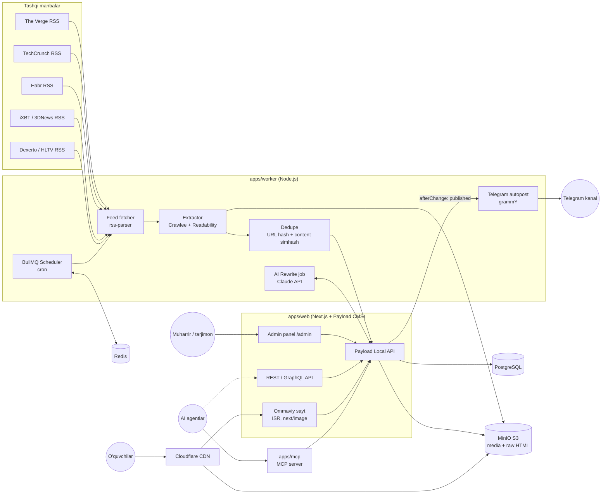
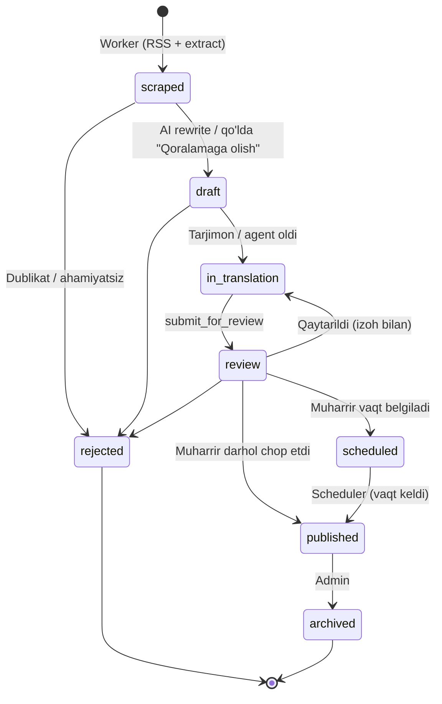
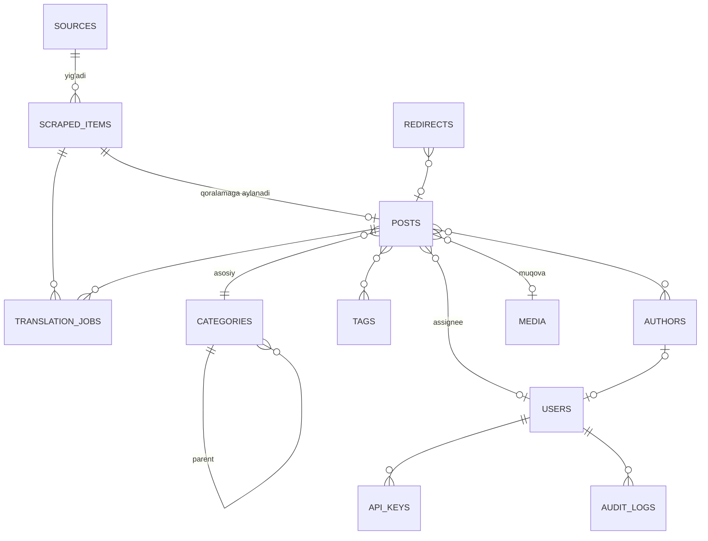

# Texnik vazifa (TZ) — OBLOG "Yangiliklar O'zbek tilida"

| Parametr | Qiymat |
|---|---|
| Loyiha kodi | OBLOG |
| Hujjat versiyasi | 1.0 (qoralama) |
| Sana | 2026-09-23 |
| Holat | Egasi tasdiqlashi kutilmoqda |
| Bog'liq hujjatlar | [PLAN.md](PLAN.md), [QUESTIONS.md](QUESTIONS.md) |

> Hujjatdagi `[Taxmin]` belgisi — egasi hali javob bermagan savol bo'yicha qabul qilingan standart qaror. Barcha taxminlar [QUESTIONS.md](QUESTIONS.md) da ro'yxatlangan.

---

## 1. Maqsad va kontekst

### 1.1. Biznes maqsadi
O'zbek tilida (lotin yozuvida) AI, IT, texnologiya va kibersport yo'nalishlari bo'yicha **O'zbekistondagi 1-raqamli onlayn nashrni** yaratish. Kontent jahon yetakchi IT-nashrlaridan har kuni avtomatik yig'iladi, AI yordamida o'zbek tiliga **qayta yoziladi (rewrite)**, muharrir tomonidan tekshiriladi va SEO-optimallashtirilgan holda chop etiladi.

### 1.2. Auditoriya
| Segment | Tavsif | Kanal |
|---|---|---|
| IT mutaxassislar, dasturchilar | 20–35 yosh, texnik yangiliklarga qiziqadi | Google qidiruv, Telegram |
| Talabalar va o'quvchilar | IT o'rganayotganlar, AI-ga qiziquvchilar | Telegram, Instagram, Google |
| Geymerlar / kibersport muxlislari | 14–30 yosh, CS2, Dota 2, PUBG Mobile, MLBB | Telegram, YouTube, Google |
| Biznes va qaror qabul qiluvchilar | AI/texnologiya trendlari | Google, Telegram, LinkedIn |

Asosiy qurilma — **mobil (taxminan 80%+)**, internet tezligi har xil → ishlash tezligi (performance) kritik.

### 1.3. KPI (maqsadli ko'rsatkichlar)
| Ko'rsatkich | 3 oy | 6 oy | 12 oy |
|---|---|---|---|
| Kunlik chop etilgan maqolalar | 5–10 | 10–20 | 20–30 |
| Google'da indekslangan sahifalar | 300+ | 1 500+ | 5 000+ |
| Oylik organik tashriflar (GSC clicks) | 5 000 | 30 000 | 150 000 |
| Top-10 o'rindagi kalit so'zlar (uz) | 50 | 300 | 1 000+ |
| Telegram kanal obunachilari | 1 000 | 5 000 | 20 000 |
| Core Web Vitals (mobil, "Good" URL ulushi) | ≥ 90% | ≥ 90% | ≥ 95% |
| Scraping → qoralama muvaffaqiyati | ≥ 95% | ≥ 97% | ≥ 98% |
| Qoralamadan publishgacha o'rtacha vaqt | < 24 soat | < 8 soat | < 4 soat |

`[Taxmin]` Raqamlar dastlabki mo'ljal; 1-oy oxirida haqiqiy ma'lumot asosida qayta ko'rib chiqiladi.

### 1.4. Scope (loyiha doirasida)
- Manbalardan yangiliklarni har kuni avtomatik yig'ish (RSS + to'liq matn scraping), to'liq manba nusxasini bazada saqlash.
- AI yordamida o'zbek tilida qayta yozish (rewrite), SEO meta-ma'lumotlarini generatsiya qilish.
- Tahririyat jarayoni: qoralama → tarjima → tekshiruv → rejalashtirish → chop etish.
- WordPress'ga o'xshash CMS funksiyalari (postlar, kategoriyalar, teglar, mualliflar, media, menyular, revisiyalar va h.k.).
- Ommaviy sayt (Next.js) — tez, SEO-optimallashtirilgan, mobil-birinchi.
- Admin panel, REST API (API kalitlar bilan), MCP server (AI agentlar uchun).
- Media saqlash: MinIO (S3) + rasm optimizatsiyasi + CDN.
- Telegram kanalga avtomatik post.
- Monitoring, backup, CI/CD.

### 1.5. Out-of-scope (1-bosqichda qilinmaydi)
- Mobil ilova (iOS/Android).
- Foydalanuvchi ro'yxatdan o'tishi, shaxsiy kabinet, pullik obuna (paywall).
- O'zimizning reklama tarmog'i (faqat Google AdSense / Yandex RSYA / to'g'ridan-to'g'ri banner joylari uchun joy qoldiriladi).
- Rus tili va kirill yozuvi versiyasi (arxitektura i18n'ga tayyor bo'ladi, lekin kontent keyinroq).
- Video/podkast ishlab chiqarish.
- Izohlar (comments) — MVP'da yo'q, 3-bosqichda qaror qilinadi.

---

## 2. Manbalarni tanlash

### 2.1. Tanlash mezonlari
1. Yo'nalish bo'yicha qamrov (AI, IT/gadjetlar, kibersport).
2. Obro' va tezkorlik (breaking news birinchi chiqadigan joylar).
3. RSS mavjudligi (qonuniy va texnik jihatdan eng xavfsiz kirish yo'li).
4. Kunlik hajm (3–5 manbadan kuniga ~100–200 ta material — saralash uchun yetarli).
5. Paywall yo'qligi.

### 2.2. Tavsiya etilgan manbalar (asosiy 5 ta)
| # | Manba | Til | Yo'nalish | RSS | Kunlik hajm (taxm.) | Kontent turi | Izoh |
|---|---|---|---|---|---|---|---|
| 1 | **The Verge** (theverge.com) | EN | IT, gadjetlar, AI, platformalar | Bor (`/rss/index.xml`, bo'limlar bo'yicha) | 30–50 | Yangilik, sharh, review | Keng auditoriya uchun eng yaxshi "general tech" |
| 2 | **TechCrunch** (techcrunch.com) | EN | AI, startaplar, investitsiya, big tech | Bor (`/feed/`, kategoriya feedlari, masalan `/category/artificial-intelligence/feed/`) | 30–40 | Yangilik, tahlil | AI va startap yangiliklari uchun eng tezkor |
| 3 | **Habr** (habr.com/ru) | RU | Dasturlash, AI, IT-industriya | Bor (`/ru/rss/news/`, hub feedlari) | 20–40 (faqat yangiliklar) | Yangiliklar, texnik maqolalar | Rus tilidan tarjima o'zbek o'quvchiga yaqin kontekst beradi. **Faqat "Новости" bo'limi** — mualliflik maqolalari (UGC) olinmaydi |
| 4 | **iXBT / 3DNews** (ixbt.com/news, 3dnews.ru) | RU | Hardware, gadjetlar, o'yinlar | Bor (`ixbt.com/export/news.rss`, `3dnews.ru/news/rss/`) | 50–80 | Qisqa yangiliklar | Hardware va smartfonlar bo'yicha kuchli; ikkalasidan bittasini tanlash mumkin |
| 5 | **Dexerto (Esports) / HLTV** | EN | Kibersport (CS2, Valorant, Dota 2, MLBB) | Dexerto — bor (`/feed/`, esports bo'limi); HLTV — bor (`hltv.org/rss/news`) | 20–40 | Turnir natijalari, transferlar | Kibersport uchun. HLTV faqat CS2; Dexerto kengroq |

**Zaxira / kelajakdagi manbalar:** Ars Technica (chuqur texnik, EN), Wired (EN), VentureBeat AI (EN), Tom's Hardware (EN), Esports Insider (kibersport biznesi, EN), Cybersport.ru (RU), OpenAI / Anthropic / Google AI bloglari (rasmiy press-relizlar — **eng xavfsiz manba**, chunki press-reliz qayta nashr uchun mo'ljallangan).

> Tizim manbalarni **konfiguratsiya orqali** qo'shish/o'chirish imkonini beradi (admin paneldagi `Source` kolleksiyasi) — kod o'zgartirmasdan.

### 2.3. MUHIM: Mualliflik huquqi va huquqiy xavf

> **⚠ Egasi qaror qabul qilishi shart bo'lgan xavf.**

1. **To'liq matnni nusxalash va so'zma-so'z tarjima qilish — mualliflik huquqini buzish hisoblanadi.** Tarjima — "hosila asar" (derivative work); uni muallif ruxsatisiz chop etish Bern konvensiyasi (O'zbekiston a'zo), O'zbekiston Respublikasining "Mualliflik huquqi va turdosh huquqlar to'g'risida"gi qonuni, AQSh DMCA bo'yicha taqiqlangan. Oqibat: DMCA shikoyatlari, Google'dan sahifalarni o'chirish, hosting blokirovkasi, AdSense ban, sud da'vosi.
2. **Google SEO xavfi:** Google "scaled content abuse" va "site reputation abuse" siyosatlari bo'yicha boshqa saytlardan avtomatik olingan/tarjima qilingan, qo'shimcha qiymatsiz kontentni jazolaydi. Ya'ni "shunchaki tarjima" strategiyasi **SEO maqsadiga ham zid**.
3. **Tavsiya etilgan qonuniy model (TZ shu model asosida yozilgan):**
   - **Fakt — mualliflik huquqi bilan himoyalanmaydi, matn — himoyalanadi.** Shuning uchun biz manbadagi **faktlarni** olib, **o'z matnimizni** yozamiz (rewrite), manbani **ko'rsatamiz**.
   - Har bir postda: "Manba: [The Verge](havola)" — aniq, bosiladigan, `rel="nofollow"` emas (ochiq atributsiya).
   - Maqola hajmi manbadan qisqaroq yoki o'z kontekstimiz bilan boyitilgan bo'lishi: "O'zbekiston uchun bu nimani anglatadi", narxlar so'mda, mahalliy analogiyalar, izohlar.
   - Bir nechta manbani birlashtirish (agregatsiya) — bitta mavzu bo'yicha 2–3 manbadan umumlashtirish.
   - Iqtiboslar — qisqa (1–2 jumla), qo'shtirnoq ichida, manba bilan.
   - **Rasmlar**: manba rasmlarini qayta nashr qilish **mumkin emas** (eng ko'p shikoyat aynan rasmlar uchun keladi). Faqat: press-kit rasmlari, rasmiy press-relizlar, Unsplash/Pexels, Wikimedia Commons (litsenziyaga qarab), o'zimiz yaratgan/AI generatsiya qilgan rasmlar, skrinshotlar (fair use doirasida).
   - Manba rasmlari faqat **ichki arxiv** sifatida saqlanadi (muharrirga kontekst uchun), ommaga chiqarilmaydi.
4. **Texnik muvofiqlik:** `robots.txt` va ToS tekshiriladi va hurmat qilinadi; RSS birinchi navbatda; o'z User-Agent'imiz (`OblogBot/1.0 (+https://<domain>/bot)`), so'rovlar tezligi cheklangan (1 so'rov / 5–10 soniya / domen), paywall yoki login orqali kirish **taqiqlanadi**.
5. **"To'liq manba saqlash"** (full source) — ichki tahririyat ehtiyoji uchun ruxsat etiladi (ichki arxiv, ommaga ochiq emas), lekin ToS'da scraping taqiqlangan manbalar uchun faqat RSS'dagi matn saqlanadi.
6. **Ideal variant:** manbalar bilan hamkorlik / litsenziya kelishuvi (masalan, Habr, 3DNews bilan tarjima ruxsati). Bu biznes vazifasi — egasiga taklif.

---

## 3. Arxitektura

### 3.1. Texnologik stek (qaror)

| Qatlam | Tanlov | Sabab |
|---|---|---|
| Frontend (ommaviy sayt) | **Next.js 15/16 (App Router)**, React Server Components, TypeScript, Tailwind CSS, shadcn/ui | Talab; ISR/SSG, `next/image`, `generateMetadata`, sitemap — hammasi ichida |
| CMS / Backend | **Payload CMS 3.x** (Next.js ichida ishlaydi) | Pastda 3.2 bo'limda asoslangan |
| Ma'lumotlar bazasi | **PostgreSQL 16+** (`@payloadcms/db-postgres`, Drizzle) | Ishonchli, FTS, JSONB, `pg_trgm` |
| Media saqlash | **MinIO** (S3-mos, self-hosted) + `@payloadcms/storage-s3` | Talab; keyin AWS S3/Cloudflare R2 ga o'tish — bitta env o'zgarishi |
| Rasm qayta ishlash | **sharp** (Payload ichida) + `next/image` (AVIF/WebP) | Variantlar: thumbnail, card, og (1200×630), hero |
| CDN | **Cloudflare** (bepul/Pro tarif) | Kesh, DDoS himoya, WAF, rasm keshi |
| Scraper / Worker | **Node.js + TypeScript**: Crawlee, `rss-parser`, `@mozilla/readability` + `jsdom`, `playwright` (faqat kerak bo'lsa) | Bitta til (TS) — monorepo, umumiy tiplar |
| Navbat / Scheduler | **BullMQ + Redis 7** (repeatable jobs = cron) | Retry, backoff, concurrency, Bull Board UI |
| Qidiruv | MVP: **PostgreSQL FTS** (`tsvector` + `pg_trgm`); 3-bosqich: **Meilisearch** | MVP'da qo'shimcha servis kerak emas |
| AI | **Anthropic Claude API** (`@anthropic-ai/sdk`): `claude-sonnet-5` — asosiy rewrite; `claude-opus-5-5` — murakkab/uzun maqolalar va sifat tekshiruvi; kichik vazifalar (klassifikatsiya, teglar) uchun eng arzon model | Structured output (JSON), prompt caching (glossariy + stil qo'llanma keshlanadi) |
| MCP server | `@modelcontextprotocol/sdk` (Streamable HTTP transport), Payload Local API orqali | AI agentlar tahririyatda ishlashi uchun |
| Telegram | `grammY` (Bot API) | Kanalga avtopost |
| Monorepo | **pnpm workspaces + Turborepo** | `apps/web`, `apps/worker`, `apps/mcp`, `packages/shared` |
| Infratuzilma | **Docker Compose** VPS'da, **Traefik** (Let's Encrypt avtomatik) | Oddiy, arzon, bitta server yetarli |
| CI/CD | **GitHub Actions** → GHCR (Docker image) → SSH deploy | |
| Monitoring | **Sentry** (xatolar), **Uptime Kuma** (uptime), **Grafana + Prometheus + Loki** (2-bosqich) | |
| Analitika | **Google Analytics 4** + **Yandex Metrica** + Google Search Console + Yandex Webmaster | O'zbekistonda Yandex ulushi sezilarli |

### 3.2. Nima uchun Payload CMS 3 (taqqoslash)

| Mezon | **Payload 3** | Strapi 5 | Directus 11 | Headless WordPress |
|---|---|---|---|---|
| Next.js bilan integratsiya | **Bir ilova ichida** (`/admin` va sayt bitta deploy) | Alohida servis | Alohida servis | Alohida PHP servis |
| Til | TypeScript (bitta stek) | TS/JS | TS (lekin konfiguratsiya UI orqali) | PHP |
| Local API (HTTP'siz, to'g'ridan-to'g'ri) | **Bor** — RSC'da tez, MCP/worker uchun qulay | Yo'q | Yo'q (SDK HTTP orqali) | Yo'q |
| Drafts, versiyalar, autosave, scheduled publish | **Ichida bor** | Draft & Publish bor, versiyalar — pullik/cheklangan | Bor (content versioning) | Bor |
| Rollar va field-level access control | Kod orqali, juda moslashuvchan | Bor (RBAC, ba'zisi Enterprise) | Bor, kuchli | Rollar bor, API uchun plagin kerak |
| S3/MinIO | Rasmiy `@payloadcms/storage-s3` | Plagin | Ichida | Plagin (WP Offload Media — pullik) |
| SEO | Rasmiy `@payloadcms/plugin-seo` | Plagin | Qo'lda | Yoast/RankMath (eng kuchli) |
| Redirects, nested docs, search, form-builder | Rasmiy plaginlar | Qisman | Qo'lda | Plaginlar |
| REST + GraphQL | Ikkalasi avtomatik | Ikkalasi | Ikkalasi | REST + WPGraphQL plagin |
| Lexical rich-text editor | Bor, zamonaviy | Bor (blocks) | WYSIWYG/Markdown | Gutenberg |
| Litsenziya | MIT | MIT (CE) | BSL (katta daromadda pullik) | GPL |
| Xavf | Nisbatan yosh (v3 — 2024 oxiri) | Yetuk | Yetuk | Xavfsizlik plaginlari, PHP + JS ikki stek |

**Qaror:** **Payload CMS 3**. Sabablar: (1) Next.js talabi bilan bitta ilova va bitta til — AI agentlar uchun kodbazani tushunish oson; (2) WordPress funksiyalarining aksariyati (drafts, versiyalar, scheduled publish, media, rollar, SEO, redirects, search) rasmiy plaginlar sifatida tayyor; (3) Local API — worker va MCP server ma'lumotlar bazasiga xavfsiz, tez, access control bilan kiradi; (4) MIT litsenziya.

**Muqobil (agar egasi WordPress ekotizimini xohlasa):** Headless WordPress + WPGraphQL + Yoast + Next.js. Kamchiligi — ikki stek (PHP+JS), plaginlar xavfsizligi, MCP/avtomatlashtirish qiyinroq. Tavsiya etilmaydi.

### 3.3. Umumiy arxitektura diagrammasi



### 3.4. Repozitoriy tuzilmasi

```
blog_odya/
├── apps/
│   ├── web/            # Next.js + Payload CMS (sayt + admin + REST/GraphQL)
│   ├── worker/         # BullMQ: scraping, extraction, AI rewrite, telegram, sitemap ping
│   └── mcp/            # MCP server (Streamable HTTP), Payload Local API orqali
├── packages/
│   ├── shared/         # umumiy tiplar (payload-types.ts), utils, slugify (uz)
│   └── prompts/        # AI promptlar, glossariy, stil qo'llanma (versiyalangan)
├── infra/
│   ├── docker-compose.yml
│   ├── docker-compose.dev.yml
│   ├── traefik/
│   └── backup/
├── docs/               # TZ.md, PLAN.md, QUESTIONS.md, ADR/
└── .github/workflows/
```

### 3.5. Scraper / Parser servisi

**Pipeline bosqichlari (har biri alohida BullMQ navbati):**

| # | Navbat | Vazifa | Chastota / trigger |
|---|---|---|---|
| 1 | `feed.poll` | Har bir faol `Source` RSS'ini o'qish, yangi URL'larni topish | Har 15 daqiqada (manba bo'yicha sozlanadi) |
| 2 | `item.fetch` | Sahifani yuklab olish (HTTP; kerak bo'lsa Playwright), `robots.txt` tekshiruvi, rate limit | Yangi URL paydo bo'lganda |
| 3 | `item.extract` | Readability bilan asosiy matnni ajratish; sarlavha, muallif, sana, teglar, asosiy rasm, `og:*` metadatalarini olish | fetch'dan keyin |
| 4 | `item.dedupe` | `url_hash` (normallashtirilgan URL SHA-256) + `content_hash` (SimHash — boshqa manbalardagi bir xil mavzuni topish) | extract'dan keyin |
| 5 | `item.classify` | Kategoriya, teglar, "muhimlik bali" (0–100) — arzon LLM chaqiruvi | dedupe'dan keyin |
| 6 | `item.rewrite` | AI rewrite → `Post` (status `draft`) | Avtomatik (ball ≥ chegara) yoki qo'lda |
| 7 | `post.publish-hooks` | ISR revalidate, sitemap yangilash, IndexNow ping, Telegram post | Post published bo'lganda |

**Saqlanadigan "to'liq manba" (`ScrapedItem`):**
- `raw_html` — MinIO'da (`raw/{source}/{yyyy}/{mm}/{id}.html.gz`), bazada faqat kalit.
- `extracted_text` (Markdown) va `extracted_html` (tozalangan).
- Asl rasmlar — MinIO `archive/` bucket'ida (ommaviy emas).
- Metadata: asl URL, canonical, sarlavha, muallif, chop etilgan sana, til, teglar, `og:image`, so'zlar soni.
- HTTP metadata: status kod, `ETag`/`Last-Modified` (qayta yuklamaslik uchun), yuklash vaqti.

**Ishonchlilik:** retry (3 marta, exponential backoff), manba bo'yicha concurrency = 1, global concurrency = 5, har bir manba uchun "parse muvaffaqiyati" metrikasi; 3 marta ketma-ket xato → admin'ga Telegram ogohlantirish. Manba uchun maxsus CSS-selektorlar (`Source.selectors`) — Readability ishlamagan hollar uchun.

**Saqlash muddati:** `raw_html` — 90 kun (keyin o'chiriladi), `extracted_text` — doimiy. `rejected` elementlar — 30 kundan keyin tozalanadi.

---

## 4. Kontent jarayoni (workflow)

### 4.1. Statuslar

| Status | Kim/nima o'tkazadi | Tavsif |
|---|---|---|
| `scraped` | Worker | `ScrapedItem` yaratildi, to'liq manba saqlandi |
| `draft` (qoralama) | Worker / muharrir | `Post` yaratildi (AI rewrite yoki bo'sh), hali ishlanmagan |
| `in_translation` | Tarjimon / AI agent | Tarjimon yoki agent "oldi" (lock, `assignee`) |
| `review` | Tarjimon → muharrir | Tekshiruvga yuborildi |
| `scheduled` | Muharrir | Chop etish vaqti belgilangan |
| `published` | Muharrir / scheduler | Saytda ochiq |
| `rejected` | Muharrir | Rad etildi (sabab majburiy) |
| `archived` | Admin | Saytdan olib tashlangan (410 yoki redirect) |

`review` dan `in_translation` ga qaytarish mumkin (izoh bilan).



### 4.2. Rollar va huquqlar

| Amal | admin | editor (muharrir) | translator (tarjimon) | author (muallif) | ai_agent (API/MCP) |
|---|---|---|---|---|---|
| Manbalarni boshqarish | ✅ | ❌ | ❌ | ❌ | ❌ |
| ScrapedItem ko'rish | ✅ | ✅ | ✅ | ✅ | ✅ |
| Qoralama yaratish | ✅ | ✅ | ✅ | ✅ | ✅ |
| O'z qoralamasini tahrirlash | ✅ | ✅ | ✅ | ✅ | ✅ |
| `review` ga yuborish | ✅ | ✅ | ✅ | ✅ | ✅ |
| Boshqaning postini tahrirlash | ✅ | ✅ | ❌ | ❌ | ❌ |
| Publish / schedule | ✅ | ✅ | ❌ | ❌ | ❌ (default) |
| Kategoriya/teg/menyu boshqarish | ✅ | ✅ | ❌ | ❌ | ❌ |
| Foydalanuvchilar, API kalitlar | ✅ | ❌ | ❌ | ❌ | ❌ |
| Audit log ko'rish | ✅ | ✅ (faqat postlar) | ❌ | ❌ | ❌ |

`[Taxmin]` **Inson tekshiruvisiz chop etish taqiqlangan.** `ai_agent` roliga `publish` huquqi faqat admin alohida yoqsa beriladi (feature flag `AGENT_CAN_PUBLISH=false`).

---

## 5. AI tarjima va qayta yozish (rewrite)

### 5.1. Jarayon
1. **Kirish:** `ScrapedItem.extracted_text` + metadata + (agar bo'lsa) shu mavzudagi boshqa manbalar (SimHash klaster).
2. **Model:** `claude-sonnet-5` — standart; `claude-opus-5-5` — uzun (>2 000 so'z), texnik murakkab yoki "muhimlik bali" ≥ 80 bo'lgan maqolalar uchun; eng arzon model — klassifikatsiya/teglar uchun. Model nomlari env'da (`AI_MODEL_REWRITE`, `AI_MODEL_PREMIUM`, `AI_MODEL_CLASSIFY`) — yangi model chiqsa kod o'zgarmaydi.
3. **Chiqish (structured JSON, schema bilan validatsiya — Zod):**
   - `title` (≤ 70 belgi, kalit so'z boshida), `seo_title` (≤ 60), `meta_description` (140–160), `slug` (lotin, ≤ 60, stop-so'zlarsiz)
   - `excerpt` / lid (1–2 jumla), `body` (Markdown → Lexical), 400–900 so'z
   - `tags[]` (3–7), `category`, `focus_keyword`, `secondary_keywords[]`
   - `faq[]` (2–4 savol-javob, FAQ schema uchun — ixtiyoriy)
   - `image_prompt` / `image_alt` (uz)
   - `uz_context` — "O'zbekiston uchun ahamiyati" bloki (ixtiyoriy)
   - `confidence` va `notes_for_editor` (noaniq faktlar, tarjima qilinmagan atamalar)
4. **Qoidalar (system prompt, `packages/prompts` da versiyalanadi):**
   - O'zbek tili, **lotin yozuvi**, 1995-yilgi rasmiy imlo (oʻ, gʻ — `ʻ` U+02BB belgisi; `'` apostrof ham qabul qilinadi — `[Taxmin]` saytda `ʻ` ishlatiladi, slug'da `o`, `g`).
   - **So'zma-so'z tarjima emas — qayta yozish**: jumla tuzilishi, tartib, sarlavha o'zgaradi; faktlar, raqamlar, nomlar, iqtiboslar saqlanadi.
   - Manba iqtiboslari — qisqa va qo'shtirnoqda.
   - Clickbait taqiqlanadi; faktlarni o'ylab topish taqiqlanadi (hallucination) — noaniq bo'lsa `notes_for_editor` ga.
   - Valyuta: asl + taxminiy so'mda (kurs — kunlik CBU API'dan).
5. **Glossariy** (`Glossary` kolleksiyasi): EN/RU atama → UZ tarjima (masalan, "machine learning" → "mashinaviy o'rganish", "GPU" → "GPU (grafik protsessor)"), "tarjima qilinmaydigan" atamalar ro'yxati (brendlar, mahsulot nomlari). Promptga qo'shiladi va **prompt caching** bilan keshlanadi.
6. **Stil qo'llanma** (`docs/STYLE_GUIDE.md` — alohida vazifa): ohang, murojaat shakli ("siz"), raqamlar yozilishi, sana formati.
7. **Sifat nazorati:** avtomatik tekshiruvlar — kirill harflari yo'qligi, uzunlik chegaralari, slug unikalligi, manbadan n-gram o'xshashligi (tarjima emas, rewrite ekanini tekshirish — past bo'lishi kerak), taqiqlangan so'zlar.
8. **Inson tekshiruvi majburiy** — `review` statusidan o'tmasdan publish bo'lmaydi.

### 5.2. Xarajatni baholash yondashuvi
- O'rtacha kirish: ~2 500 token (manba) + ~3 000 token (system prompt + glossariy, keshlanadi) → chiqish ~1 800 token.
- Formula: `oylik_xarajat = maqola_soni × (in_tokens × narx_in + cached_tokens × narx_cache + out_tokens × narx_out)`.
- Har bir chaqiruv `TranslationJob` da token soni va narxi bilan loglanadi → admin panelda kunlik/oylik xarajat grafigi.
- Byudjet himoyasi: `AI_DAILY_BUDGET_USD` — oshsa, avtomatik rewrite to'xtaydi, faqat qo'lda ishga tushiriladi.
- Tejash: faqat "muhimlik bali" yuqori elementlar avtomatik rewrite qilinadi; Batch API (50% arzon) — shoshilinch bo'lmagan elementlar uchun; prompt caching.
- `[Taxmin]` Kuniga 20 ta maqola × 30 kun = 600 rewrite/oy; aniq narx joriy Anthropic narxlari bo'yicha 1-bosqichda hisoblanadi va QUESTIONS.md dagi byudjet savoliga javob sifatida egasiga taqdim etiladi (mo'ljal: oyiga taxminan $30–150 oralig'ida, model tanloviga qarab).

---

## 6. Kirish kanallari

### 6.1. Admin panel (`/admin`)
Payload admin (React), o'zbek tilidagi interfeys (`@payloadcms/translations` — uz mavjud bo'lmasa, custom tarjima). Maxsus ko'rinishlar:
- **"Qoralamalar navbati"** dashboard: bugungi yangi `ScrapedItem`lar, muhimlik bo'yicha saralangan, manba/kategoriya filtri, "Qoralamaga olish" / "Rad etish" tugmalari.
- **Yonma-yon tahrirlash**: chapda asl manba (read-only), o'ngda o'zbekcha post.
- "AI bilan qayta yozish" tugmasi (post ichida), "SEO ball" paneli.
- Kalendar ko'rinishi (scheduled postlar).

### 6.2. REST API
- Payload avtomatik REST (`/api/{collection}`) + GraphQL (`/api/graphql`).
- Maxsus endpointlar: `POST /api/scraped-items/:id/to-draft`, `POST /api/posts/:id/rewrite`, `POST /api/posts/:id/submit`, `POST /api/posts/:id/publish`.
- **Autentifikatsiya:** foydalanuvchi — JWT (cookie); mashina — **API kalit** (`Authorization: users API-Key <key>`, Payload `useAPIKey`), har bir kalit alohida "servis foydalanuvchi"ga bog'langan (rol bilan), kalitlar ro'yxati, oxirgi ishlatilgan vaqti, bekor qilish.
- Rate limit: API kalit bo'yicha 60 so'rov/daqiqa (Traefik middleware yoki ilova darajasida).
- OpenAPI hujjati (`/api/docs`) — `payload-oapi` plagini yoki qo'lda.

### 6.3. MCP server (`apps/mcp`)
AI agentlar (Claude Code, Claude Desktop, boshqa MCP mijozlari) tahririyat ishini bajarishi uchun.

| Tool | Tavsif | Kerakli rol |
|---|---|---|
| `list_sources` | Faol manbalar | ai_agent |
| `list_scraped` | Yangi `ScrapedItem`lar (filtr: sana, manba, kategoriya, min_score) | ai_agent |
| `get_source` | `ScrapedItem`ning to'liq matni va metadatasi | ai_agent |
| `create_draft` | ScrapedItem'dan qoralama yaratish | ai_agent |
| `list_drafts` | Qoralamalar (status, assignee filtri) | ai_agent |
| `claim_draft` | Qoralamani o'ziga olish (`in_translation`, lock 2 soat) | ai_agent |
| `get_glossary` | Glossariy va stil qo'llanma | ai_agent |
| `save_translation` | Sarlavha, matn, SEO maydonlari, teglarni saqlash (validatsiya bilan) | ai_agent |
| `submit_for_review` | `review` ga o'tkazish | ai_agent |
| `publish` | Chop etish / rejalashtirish | editor (yoki flag yoqilgan agent) |
| `search_posts` | Chop etilgan postlar (ichki havola qo'yish uchun) | ai_agent |
| `list_categories` / `list_tags` | Taksonomiya | ai_agent |

- Transport: Streamable HTTP (`https://<domain>/mcp`), autentifikatsiya — API kalit (Bearer), keyinchalik OAuth.
- Har bir tool chaqiruvi `AuditLog` ga yoziladi (kim, qaysi kalit, qaysi tool, qaysi hujjat, oldin/keyin diff).

### 6.4. Audit log
Barcha o'zgarishlar (admin, API, MCP, worker): `actor` (user / api_key / system), `action`, `collection`, `doc_id`, `diff` (JSON), `ip`, `user_agent`, `timestamp`. Payload `afterChange`/`afterDelete` hooklar orqali. Saqlash — 1 yil.

---

## 7. WordPress'ga o'xshash funksiyalar

| Funksiya | Amalga oshirish | Bosqich |
|---|---|---|
| Postlar (drafts, autosave, versiyalar/revisiyalar) | Payload `versions: { drafts: { autosave: true }, maxPerDoc: 50 }` | MVP |
| Scheduled publish | Payload `schedulePublish` (jobs queue) | MVP |
| Kategoriyalar (ierarxik) | `Categories` + `@payloadcms/plugin-nested-docs` | MVP |
| Teglar | `Tags` kolleksiyasi | MVP |
| Mualliflar (profil, bio, avatar, ijtimoiy tarmoqlar) | `Authors` (Users'dan alohida — E-E-A-T uchun ommaviy profil) | MVP |
| Sahifalar (Biz haqimizda, Aloqa, Maxfiylik siyosati, Tahririyat siyosati) | `Pages` + bloklar | MVP |
| Media kutubxona (alt, caption, kredit/litsenziya, fokus nuqta) | `Media` + storage-s3, `imageSizes`, `focalPoint` | MVP |
| Menyular | `Header`/`Footer` globals | MVP |
| Qidiruv | Postgres FTS → Meilisearch | MVP / 3 |
| Redirects (301/302) | `@payloadcms/plugin-redirects` + Next.js middleware | MVP |
| RSS feed chiqishi | `/rss.xml`, `/category/{slug}/rss.xml` (route handler, `feed` kutubxonasi) | MVP |
| Sitemap, news sitemap, robots.txt | Next.js `app/sitemap.ts`, `robots.ts` | MVP |
| O'xshash postlar | Teg/kategoriya kesishmasi (MVP), keyin embedding (pgvector) | MVP / 3 |
| Telegram kanalga avtopost | Worker + grammY | 2 |
| Newsletter (email) | Listmonk (self-hosted) yoki Resend | 3 |
| Izohlar | Qaror kerak: yo'q / Telegram comments (kanal postiga bog'lash) / Remark42 (self-hosted) | 3 |
| Ko'p tillilik (ru) | Payload `localization` + Next.js `[locale]` segmenti, `hreflang` | 4 |
| Reklama joylari | `AdSlots` global (joy, kod, faol/nofaol) | 3 |
| Mashhur postlar (ko'rishlar soni) | Plausible/GA4 API yoki oddiy counter (Redis) | 2 |
| Rollar va huquqlar | Payload access control | MVP |
| Import/eksport | Payload import-export plagini | 3 |

---

## 8. SEO talablari

### 8.1. URL sxemasi
| Sahifa | URL | Izoh |
|---|---|---|
| Bosh sahifa | `/` | |
| Post | `/{category}/{slug}` (masalan `/ai/openai-yangi-model-taqdim-etdi`) | ID URL'da yo'q; slug o'zgarsa — avtomatik 301 redirect |
| Kategoriya | `/{category}`, sahifalash `/{category}?page=2` → `/{category}/page/2` | |
| Teg | `/tag/{slug}` | Kam postli teglar (<3) — `noindex` |
| Muallif | `/author/{slug}` | |
| Sahifa | `/{slug}` (faqat statik sahifalar, kategoriyalar bilan to'qnashmaslik validatsiyasi) | |
| Qidiruv | `/search?q=` | `noindex` |

**Slug:** lotin transliteratsiya (`oʻ`→`o`, `gʻ`→`g`, `sh`, `ch` saqlanadi, kirill→lotin), kichik harf, `-` bilan, ≤ 60 belgi, stop-so'zlar olib tashlanadi. Umumiy funksiya `packages/shared/slugify-uz.ts` (unit testlar bilan).

### 8.2. Meta va structured data
- `<title>`: `{seo_title} — {BrandName}`; `meta description`; `canonical` (o'z URL'imiz — **manbaga canonical qo'yilmaydi**, chunki kontent qayta yozilgan; manba — ko'rinadigan havola va `isBasedOn` JSON-LD orqali).
- OpenGraph (`og:type=article`, `article:published_time`, `article:modified_time`, `article:section`, `article:tag`), Twitter Card (`summary_large_image`).
- **OG rasm**: 1200×630, avtomatik generatsiya (`next/og` — sarlavha + brend) agar muqova yo'q bo'lsa.
- `hreflang`: `uz` (+ `x-default`); ru qo'shilganda `ru`.
- `<html lang="uz-Latn">`.
- **JSON-LD:** `NewsArticle` (headline, image[3 nisbat], datePublished, dateModified, author→Person URL, publisher→Organization+logo, `isBasedOn` → manba URL), `BreadcrumbList`, `Organization` + `WebSite` (`SearchAction`) bosh sahifada, `FAQPage` (agar FAQ bo'lsa), `Person` muallif sahifasida.
- Google Rich Results Test va Schema validator — CI'da (e2e) tekshiriladi.

### 8.3. Indekslash
- `sitemap.xml` (index) → `sitemap-posts-{yyyy-mm}.xml`, `sitemap-categories.xml`, `sitemap-pages.xml`.
- **Google News sitemap** (`news-sitemap.xml`) — oxirgi 48 soat postlari, `<news:publication>` bilan.
- `robots.txt` — `/admin`, `/api`, `/search` yopiq; sitemap havolalari.
- **IndexNow** (Yandex, Bing) — publish bo'lganda ping.
- Google Search Console va **Google News Publisher Center** ga ro'yxatdan o'tish; **Yandex Webmaster** + Yandex Dzen (ixtiyoriy).
- E-E-A-T: muallif sahifalari, "Tahririyat siyosati", "Biz haqimizda", aloqa ma'lumotlari, tuzatishlar siyosati — Google News uchun muhim.

### 8.4. Performance (Core Web Vitals)
| Metrika | Maqsad (mobil, p75) |
|---|---|
| LCP | < 2.0 s (talab < 2.5 s) |
| INP | < 200 ms |
| CLS | < 0.1 |
| TTFB (CDN kesh) | < 200 ms |
| Lighthouse Performance (mobil) | ≥ 90 |
| Birinchi yuklash JS hajmi | < 150 KB gzip |

Usullar: ISR (`revalidate` + on-demand `revalidateTag` publish'da), RSC (minimal client JS), `next/image` (AVIF/WebP, `sizes`, LCP rasm `priority`), `next/font` (self-hosted, `display: swap`, lotin + kengaytirilgan lotin subset), Cloudflare kesh, uchinchi tomon skriptlar (analitika, reklama) — `next/script` `lazyOnload`.

### 8.5. Kontent SEO
- Har bir postda: focus keyword sarlavhada va lidda, H2/H3 tuzilma, 2–5 ichki havola (AI `search_posts` orqali taklif qiladi), 1 ta tashqi havola (manba), rasm alt matni.
- Kategoriya sahifalarida — tavsif matni (150–300 so'z, SEO uchun).
- Admin'da "SEO ball" — uzunliklar, kalit so'z, alt, ichki havolalar tekshiruvi.
- Ingliz atamalari uchun o'zbekcha qidiruv so'rovlari tadqiqoti (Google Keyword Planner, Yandex Wordstat) — alohida marketing vazifasi.

---

## 9. Nofunksional talablar

### 9.1. Ishlash va masshtab
- 1-yil: 100 000 sahifa ko'rish/kun gacha — bitta VPS (8 vCPU, 16 GB RAM, 200 GB NVMe) + Cloudflare yetarli.
- Keshlangan sahifa ulushi ≥ 95%.
- Worker: kuniga 500+ element qayta ishlash.

### 9.2. Xavfsizlik
- HTTPS hamma joyda (Traefik + Let's Encrypt, Cloudflare Full Strict).
- `/admin` — 2FA (`[Taxmin]` Payload plagini yoki custom TOTP), kuchli parol siyosati, login urinishlari cheklovi (Payload `maxLoginAttempts`, `lockTime`).
- Ixtiyoriy: `/admin` ni Cloudflare Access / IP allowlist ortiga yashirish.
- API kalitlar — hash holida saqlanadi, rol bilan cheklangan, bekor qilinadi.
- Sirlar — `.env` (repo'da emas), GitHub Actions secrets.
- Security headers (CSP, HSTS, X-Frame-Options, Referrer-Policy) — `next.config` / Traefik.
- Postgres, Redis, MinIO — faqat ichki Docker tarmog'ida; MinIO konsoli ommaga ochiq emas.
- Bog'liqliklar: Dependabot/Renovate, `pnpm audit` CI'da.
- Scraped HTML — sanitizatsiya (DOMPurify / `sanitize-html`), ommaga hech qachon to'g'ridan-to'g'ri chiqarilmaydi.
- LLM prompt injection: manba matni "ma'lumot" sifatida (XML teglar ichida) beriladi, AI chiqishi schema bilan validatsiya qilinadi, HTML sifatida emas, Markdown → Lexical orqali.

### 9.3. Backup va tiklash
- PostgreSQL: har kuni `pg_dump` (yoki WAL-G bilan PITR — 2-bosqich), 7 kunlik + 4 haftalik + 6 oylik saqlash.
- MinIO: kunlik `mc mirror` tashqi joyga (boshqa server / Backblaze B2 / Cloudflare R2).
- Backup'lar shifrlanadi (`age`/`restic`) va **boshqa joyda** saqlanadi.
- **RPO ≤ 24 soat, RTO ≤ 4 soat**; oyiga bir marta tiklash sinovi (runbook `docs/runbooks/restore.md`).

### 9.4. Monitoring va loglar
- **Sentry** (web, worker, mcp) — xatolar va performance.
- **Uptime Kuma** — sayt, admin, API, MCP, har 1 daqiqada; ogohlantirish Telegram guruhga.
- Worker metrikalari: manba bo'yicha scrape muvaffaqiyati, navbat uzunligi, AI xarajati — Bull Board + admin dashboard (MVP), Prometheus/Grafana (2-bosqich).
- Strukturali loglar (JSON, `pino`), Docker log rotation; 2-bosqichda Loki.

### 9.5. Analitika
- GA4 + Yandex Metrica (Webvisor o'chirilgan yoki cookie roziligi bilan) + Google Search Console + Yandex Webmaster.
- Server-side hodisalar: publish soni, vaqt, AI xarajati — admin dashboard.

### 9.6. Huquqiy va mahalliy talablar
- **OAV sifatida ro'yxatdan o'tish**: O'zbekistonda veb-saytni ommaviy axborot vositasi sifatida ro'yxatdan o'tkazish (AOKA — Axborot va ommaviy kommunikatsiyalar agentligi) — egasi hal qiladi (QUESTIONS.md).
- **Shaxsiy ma'lumotlar**: O'zbekiston "Shaxsga doir ma'lumotlar to'g'risida"gi qonuni — O'zbekiston fuqarolarining shaxsiy ma'lumotlari (masalan, newsletter emaillari, izohlar) **O'zbekiston hududidagi serverlarda** saqlanishi talabi. MVP'da foydalanuvchi ma'lumotlari yig'ilmaydi (faqat analitika cookie). Newsletter/izohlar qo'shilganda — DB'ni UZ'da joylashtirish.
- Cookie banner (GA4/Metrica uchun), Maxfiylik siyosati, Foydalanish shartlari, Tahririyat siyosati, "Mualliflik huquqi / shikoyatlar" (DMCA-ga o'xshash) sahifasi — takedown so'rovlarini 48 soat ichida ko'rib chiqish.
- AI yordamida tayyorlangan kontent haqida shaffoflik: post oxirida "Material AI yordamida tayyorlangan va muharrir tomonidan tekshirilgan" (`[Taxmin]`).

### 9.7. Hosting va deploy
- `[Taxmin]` **VPS O'zbekistonda** (masalan, UZINFOCOM, Beeline Cloud, Uztelecom data-markazlari) — mahalliy auditoriya uchun past ping va shaxsiy ma'lumotlar qonuni; yoki yaqin region (Hetzner Helsinki / Frankfurt) + Cloudflare. Ikkalasi ham Docker Compose bilan bir xil ishlaydi.
- Muhitlar: `dev` (lokal, `docker-compose.dev.yml`), `staging` (xuddi shu server, alohida subdomen `staging.`, `noindex`), `production`.
- **CI (GitHub Actions)**: lint, typecheck, unit testlar, build, Playwright e2e (smoke), Lighthouse CI (performance budget).
- **CD**: `main` ga merge → Docker image GHCR'ga → staging'ga avto-deploy; production — tag (`v*`) yoki qo'lda tasdiq.
- Payload migratsiyalari (`payload migrate`) deploy vaqtida avtomatik.
- Git: `gitMode = PR` — har bir vazifa alohida branch va PR, `main` himoyalangan.

---

## 10. Ma'lumotlar modeli

> Payload kolleksiyalari. Barcha kolleksiyalarda `id`, `createdAt`, `updatedAt` avtomatik.

### 10.1. `sources` — Manbalar
| Maydon | Tip | Izoh |
|---|---|---|
| name | text | "The Verge" |
| slug | text, unique | |
| homepageUrl | text | |
| feeds | array { url, category (rel), isActive } | Bir manbada bir nechta RSS |
| language | select: en, ru, uz | |
| fetchMode | select: rss_only, rss_plus_page, sitemap | Qonuniy cheklovga qarab |
| selectors | json | Maxsus CSS selektorlar (title, body, remove[]) |
| pollIntervalMin | number | default 15 |
| rateLimitSec | number | default 10 |
| robotsCheckedAt, tosNotes | date, textarea | Huquqiy tekshiruv qaydi |
| defaultCategory | relationship → categories | |
| priority | number | Muhimlik baliga ta'sir |
| isActive | checkbox | |
| stats | json | Oxirgi muvaffaqiyat/xato, 24 soatlik soni |

### 10.2. `scraped-items` — Yig'ilgan xom materiallar
| Maydon | Tip | Izoh |
|---|---|---|
| source | rel → sources | |
| url, canonicalUrl | text | |
| urlHash | text, unique, index | SHA-256 normallashtirilgan URL |
| contentHash | text, index | SimHash (64-bit hex) |
| clusterId | text, index | Bir xil mavzudagi elementlar guruhi |
| title, author, publishedAt, language | | Asl metadata |
| excerpt | textarea | RSS description |
| extractedText | textarea (Markdown) | To'liq matn |
| extractedHtml | textarea | Tozalangan HTML |
| rawHtmlKey | text | MinIO kaliti |
| images | array { originalUrl, archiveKey, alt, width, height } | Ichki arxiv |
| ogImageUrl | text | |
| sourceTags | array text | |
| wordCount | number | |
| score | number 0–100 | Muhimlik |
| suggestedCategory | rel → categories | AI klassifikatsiya |
| status | select: scraped, drafted, rejected, duplicate, error | |
| error | textarea | |
| fetchMeta | json | httpStatus, etag, lastModified, fetchedAt, durationMs |
| post | rel → posts | Yaratilgan qoralama |

### 10.3. `posts` — Maqolalar (drafts + versions yoqilgan)
| Maydon | Tip | Izoh |
|---|---|---|
| title | text, required | |
| slug | text, unique, index | uz slugify, o'zgarsa redirect yaratiladi |
| excerpt | textarea | Lid |
| content | richText (Lexical) | Bloklar: rasm, iqtibos, embed (YouTube/X/Telegram), kod, jadval, FAQ |
| coverImage | upload → media | |
| category | rel → categories, required | Asosiy kategoriya (URL'da) |
| tags | rel → tags, hasMany | |
| authors | rel → authors, hasMany | Ommaviy muallif(lar) |
| workflowStatus | select: draft, in_translation, review, scheduled, published, rejected, archived | Payload `_status` bilan sinxron |
| assignee | rel → users | Kim ishlayapti |
| lockedUntil | date | claim lock |
| reviewNotes | array { user, note, createdAt } | |
| rejectReason | textarea | |
| sources | array { scrapedItem (rel), url, name } | Atributsiya (bir nechta) |
| meta | group (plugin-seo): title, description, image, focusKeyword, noindex | |
| faq | array { question, answer } | |
| publishedAt | date | |
| scheduledAt | date | |
| aiGenerated | checkbox | |
| aiModel, aiPromptVersion | text | |
| readingTime | number | Avtomatik |
| isFeatured, isBreaking | checkbox | Bosh sahifa uchun |
| relatedPosts | rel → posts, hasMany | Qo'lda (bo'sh bo'lsa — avtomatik) |
| telegramMessageId | text | Avtopost natijasi |
| views | number | 2-bosqich |

### 10.4. `categories`
`name`, `slug` (unique), `description` (richText, SEO matn), `parent` (nested-docs), `meta` (SEO), `color`, `icon`, `order`, `isInMenu`.
`[Taxmin]` Boshlang'ich kategoriyalar: **Sun'iy intellekt** (`ai`), **Texnologiyalar** (`texnologiya`), **Gadjetlar** (`gadjetlar`), **Dasturlash** (`dasturlash`), **Kibersport** (`kibersport`), **O'yinlar** (`oyinlar`), **Kiberxavfsizlik** (`kiberxavfsizlik`), **Biznes va startaplar** (`startaplar`).

### 10.5. `tags`
`name`, `slug` (unique), `description`, `meta`, `postCount` (hisoblangan), `synonyms[]` (dublikat teglarni birlashtirish uchun).

### 10.6. `authors`
`name`, `slug`, `user` (rel → users, ixtiyoriy), `bio`, `avatar`, `role` (matn: "Muharrir"), `socials` { telegram, x, linkedin }, `isActive`.

### 10.7. `media`
Payload upload: `alt` (required), `caption`, `credit` (muallif/manba), `license` (select: own, press_kit, unsplash, pexels, cc_by, ai_generated, other), `licenseUrl`, `focalPoint`. `imageSizes`: `thumb` 320w, `card` 640w, `hero` 1280w, `og` 1200×630, `full` 1920w; format WebP (+ `next/image` AVIF). Storage — MinIO bucket `media` (public-read, CDN orqali).

### 10.8. `translation-jobs` — AI chaqiruvlari
`scrapedItem`, `post`, `type` (classify, rewrite, seo, qa), `model`, `promptVersion`, `status` (queued, running, done, failed), `inputTokens`, `cachedTokens`, `outputTokens`, `costUsd`, `durationMs`, `output` (json), `error`, `triggeredBy` (user/api_key/system).

### 10.9. `glossary`
`term`, `language` (en/ru), `translation` (uz), `doNotTranslate` (checkbox), `note`, `category`.

### 10.10. `redirects` (plugin-redirects)
`from`, `to` (URL yoki rel → posts/pages/categories), `type` (301/302), `hits`.

### 10.11. `users`
Payload auth: `email`, `name`, `roles` (admin, editor, translator, author, ai_agent), `author` (rel), `enableAPIKey`/`apiKey` (servis foydalanuvchilar uchun), `twoFactorEnabled`, `lastLoginAt`.

### 10.12. `api-keys` (agar Payload `useAPIKey` yetarli bo'lmasa — alohida kolleksiya)
`name`, `keyHash`, `prefix` (ko'rsatish uchun), `user` (rel → users, servis foydalanuvchi), `scopes[]` (read, write, publish, mcp), `expiresAt`, `lastUsedAt`, `revokedAt`.

### 10.13. `audit-logs` (faqat yozish, o'zgartirib bo'lmaydi)
`actorType` (user, api_key, system), `actor` (rel → users), `apiKeyPrefix`, `channel` (admin, rest, graphql, mcp, worker), `action` (create, update, delete, publish, login, tool_call), `collection`, `docId`, `diff` (json), `ip`, `userAgent`, `createdAt`.

### 10.14. `pages`
`title`, `slug`, `layout` (bloklar), `meta`, `_status`.

### 10.15. Globals
`site-settings` (brend nomi, logo, ijtimoiy tarmoqlar, default OG, analitika ID'lari), `header` (menyu), `footer` (menyu, huquqiy matn), `ad-slots`, `ai-settings` (avtomatik rewrite chegarasi, kunlik byudjet, modellar), `telegram-settings` (kanal ID, shablon, faol/nofaol).

### 10.16. ER diagramma (soddalashtirilgan)



---

## 11. Qabul qilish mezonlari (MVP uchun umumiy)
1. 5 ta manbadan har kuni avtomatik yig'ish ishlaydi, 24 soatda ≥ 95% muvaffaqiyat, dublikatlar yo'q.
2. Muharrir admin paneldan qoralamani ochib, AI rewrite'ni tahrirlab, 10 daqiqadan kam vaqtda chop eta oladi.
3. MCP orqali Claude agenti `list_drafts → get_source → save_translation → submit_for_review` zanjirini bajara oladi; hammasi audit logda.
4. Chop etilgan post: to'g'ri meta, OG, JSON-LD (Rich Results Test — xatosiz), sitemap va news sitemap'da 1 daqiqa ichida paydo bo'ladi.
5. Lighthouse mobil Performance ≥ 90, SEO = 100, Accessibility ≥ 90 (post va bosh sahifada).
6. Rasmlar MinIO'da, CDN orqali AVIF/WebP bilan beriladi.
7. Kunlik backup ishlaydi va tiklash sinovdan o'tgan.
8. Staging va production CI/CD orqali deploy qilinadi.
